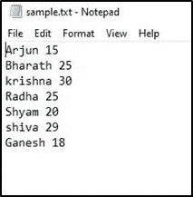
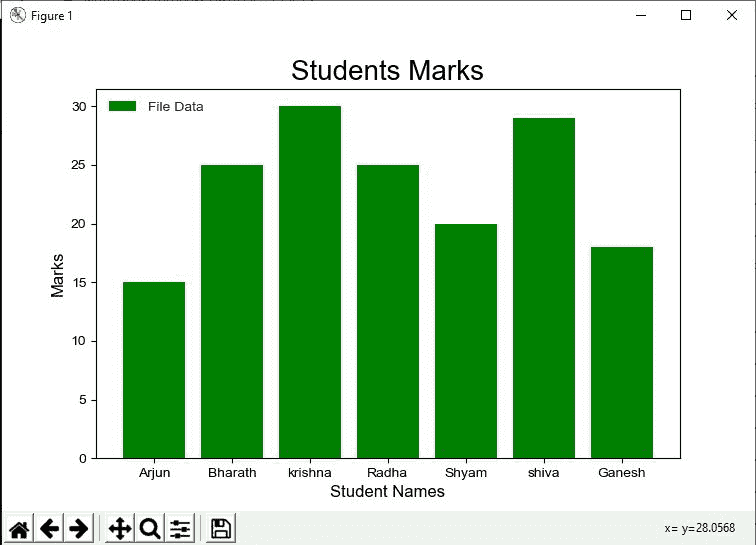
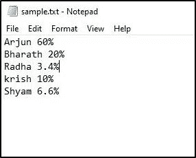
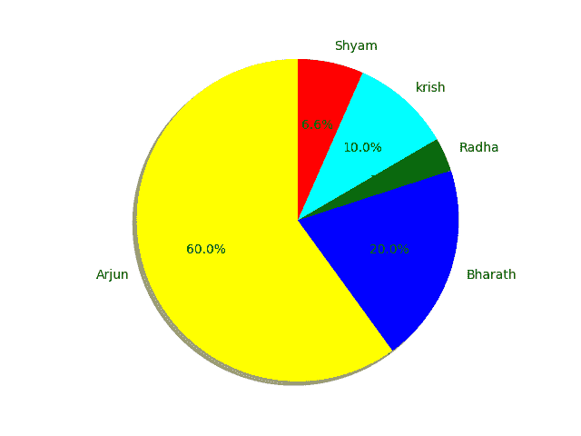
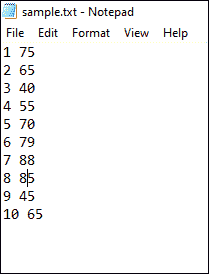
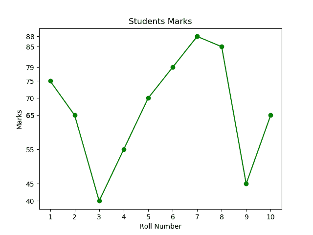

# Python–从文本文件创建图形

> 原文:[https://www . geesforgeks . org/python-create-graph-from-text-file/](https://www.geeksforgeeks.org/python-create-graph-from-text-file/)

[**Python 中的 Matplotlib**](https://www.geeksforgeeks.org/matplotlib-tutorial/) 库是一个非常流行的数据可视化库。从这个库中可以绘制不同的图形，如条形图、饼图、直方图、散点图、线图等。数据源可以是任何文件，如 CSV(逗号分隔文件)、文本文件等。在本文中，图形是基于从文本文件中获取的数据创建的。在我们的程序中使用 Matplotlib 库之前，请确保它安装在系统中。

**所需步骤:**

1.  创建扩展名为. txt 的文本文件
2.  在程序中使用与文本文件相同的名称
3.  保存并运行程序以获得图表

**示例 1:** 创建条形图。

这是一个“sample.txt”文件，包含学生数据以及学生姓名和他们在某一科目中的分数。



**进场:**

1.  导入 [matplotlib.pyplot](https://www.geeksforgeeks.org/pyplot-in-matplotlib/) 模块进行可视化。
2.  使用 Open()函数以读取模式“r”打开文件。
3.  使用 for 循环遍历文件中的每一行。
4.  根据我们可视化的需要，将文件中的每一行添加到列表中。
5.  使用 plt.bar()函数在 X 轴绘制学生姓名，在 Y 轴绘制学生成绩。

**下面是实现:**

## 蟒蛇 3

```
import matplotlib.pyplot as plt

names = []
marks = []

f = open('sample.txt','r')
for row in f:
    row = row.split(' ')
    names.append(row[0])
    marks.append(int(row[1]))

plt.bar(names, marks, color = 'g', label = 'File Data')

plt.xlabel('Student Names', fontsize = 12)
plt.ylabel('Marks', fontsize = 12)

plt.title('Students Marks', fontsize = 20)
plt.legend()
plt.show()
```

**输出:**



**示例 2:** 创建饼图。

让我们来看另一个文本文件(sample.txt)，它包含了公司员工在一个项目中完成的工作量。



**程序方法:**

1.  导入 matplotlib.pyplot 模块进行可视化。
2.  使用 file open()函数以读取模式“r”打开 sample.txt 文件。
3.  使用 for 循环遍历文件中的每一行。
4.  根据我们可视化的需要，将文件中的每一行追加到列表中。
5.  使用 plt.pie()函数，绘制公司员工在项目中完成的工作的饼图。

**下面是实现:**

## 蟒蛇 3

```
import matplotlib.pyplot as plt

names = []
work = []

for line in open('sample.txt', 'r'):
    Data = [i for i in line.split()]
    names.append(Data[0])
    New_Data= [ j for j in Data[1].split('%')]

    work.append(New_Data[0])
colors = ['yellow', 'b', 'green', 'cyan','red'] 

# plotting pie chart 
plt.pie(work, labels = names, colors = colors, startangle = 90,
        shadow = True, radius = 1.2, autopct = '%1.1f%%') 
plt.show()
```

**输出:**



**例 3 :**

本示例包含一个文本文件，其中包含学生的学号及其在某一科目中的分数。



**程序方法:**

1.  导入 matplotlib.pyplot 模块进行可视化。
2.  使用 file open()函数以读取模式“r”打开文件。
3.  使用 for 循环遍历文件中的每一行。
4.  根据我们可视化的需要，将文件中的每一行添加到列表中。
5.  使用 PLT . PLT . PLT()函数，在 X 轴上绘制学生人数，在 Y 轴上绘制学生分数。
6.  plt.yticks()用于获取所有 Y 轴刻度。
7.  最后，绘制包含学生卷编号及其在科目中的分数的文本文件的线图。

**下面是实现:**

## 蟒蛇 3

```
import matplotlib.pyplot as plt

x = []
y = []
for line in open('sample.txt', 'r'):
    lines = [i for i in line.split()]
    x.append(lines[0])
    y.append(int(lines[1]))

plt.title("Students Marks")
plt.xlabel('Roll Number')
plt.ylabel('Marks')
plt.yticks(y)
plt.plot(x, y, marker = 'o', c = 'g')

plt.show()
```

**输出:**

