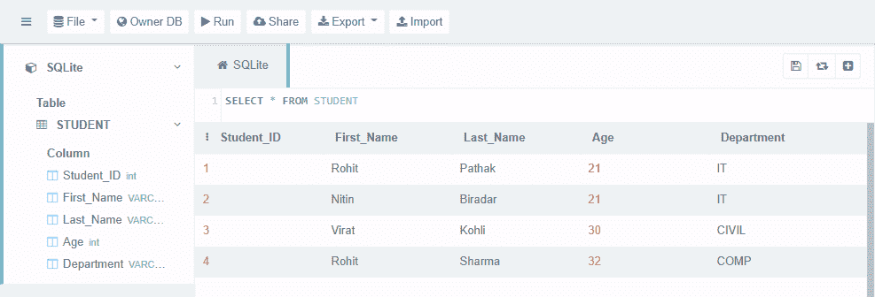

# Python–创建或重新定义 SQLite 函数

> 原文:[https://www . geesforgeks . org/python-create-or-redefine-SQLite-functions/](https://www.geeksforgeeks.org/python-create-or-redefine-sqlite-functions/)

SQLite 没有像 MySQL 那样的函数或存储过程语言。我们不能在 SQLite 中创建存储函数或存储过程。这意味着创建函数或创建过程在 SQLite 中不起作用。在 SQLite 中，我们有 SQLite 的 C API，它允许我们创建自己的用户定义函数，或者我们可以通过使用预定义函数的名称来重新定义现有的 SQL 函数。

要使用 SQLite 的 C API 我们不需要任何特殊的模块来导入 python sqlite3 模块包含这个 C API，它允许我们在 python 中创建和重新定义 SQL 函数。

这里使用的表格可以使用本文创建- [这里](https://www.geeksforgeeks.org/python-sqlite-where-clause/#:~:text=Let%E2%80%99s%20Creates%20Database%20(geekforgeeks_student.db)%20and%20a%20Table%20(STUDENT).)。



### **新建**自定义**功能**

有时，我们需要多次执行特定的任务，因此创建一组称为函数的任务总是更好，这样当我们执行一条 SQL 语句时，我们就可以直接调用该函数。在这种情况下，我们需要创建自己的函数，称为用户定义函数。

为了在 python 中创建用户定义的函数，使用了 SQLite **create_function()** 。

> **语法:**
> 
> create_function(name，no_of_params，func)
> 
> **参数:**
> 
> *   名称:我们要给出的函数名
> *   参数个数:函数接受的参数个数。如果 no_of_params 设置为-1，函数可以接受任意数量的参数。
> *   func:它是一个 Python 可调用函数，在查询中被称为 SQL 函数。
> 
> **返回:**
> 
> create_function()可以返回 bytes、str、int、float 和 None 任何 SQLite 支持的类型。

首先，创建一个用户定义的函数，然后调用 create _()，这是一个连接类，只需传递上面语法中提供的三个参数——函数名、“_customFun”接受的参数数量，以及作为查询中的 SQL 函数调用的 Python 可调用函数。在执行操作并使用 cursor.fetchone()获取结果之后。我们得到用户定义的函数想要的输出。

**示例:**

## 蟒蛇 3

```
import sqlite3

# define user defined function
def _customFun(fstring, dept):
    result = 'Welcome ' + fstring + ' your dept is ' + dept
    return result

# define connection and cursor
connection = sqlite3.connect('geekforgeeks_student.db')
cursor = connection.cursor()

# create the user defined function
connection.create_function("ROHACK", 2, _customFun)

# create and execute sql query
sqlQuery = "select ROHACK(First_Name,Department) from \
STUDENT where Student_ID = 1"
cursor.execute(sqlQuery)
print(*cursor.fetchone())

# close cursor and connection
cursor.close()
connection.close()
```

**输出:**

> 欢迎罗希特你的部门是信息技术

### 重新定义现有的 SQLite 函数

在某些情况下，我们需要重新定义 SQLite 函数的现有工作。例如，让我们更改 SQLite 内置函数“length()”，这样每当您从 SQL 查询中调用该函数时，它都会计算字符串的长度，并将 10 添加到该计数中，而不仅仅是给出正常的计数。

**示例:**

## 蟒蛇 3

```
import sqlite3

# re-define existing SQLite function with 
# new defination
def length(data):
    result = len(data) + 10
    return result

# define connection and cursor
connection = sqlite3.connect('geekforgeeks_student.db')
cursor = connection.cursor()

# create the function with same name as existing function
connection.create_function("length", 1, length)

# create and execute sql query
sqlQuery = "select length(First_Name) from STUDENT where Student_ID = 1"
cursor.execute(sqlQuery)
print(*cursor.fetchone())

# close cursor and connection
cursor.close()
connection.close()
```

**输出:**

> Fifteen