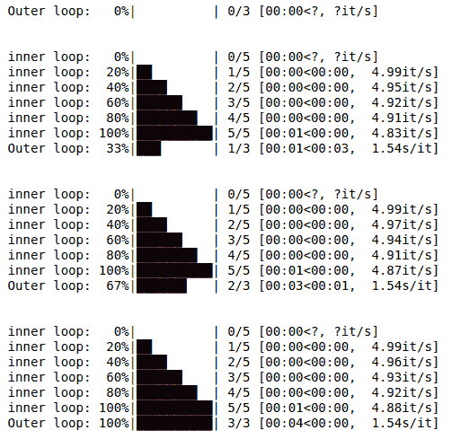

# Python–使用 tqdm 模块

创建进度条

> 原文:[https://www . geesforgeks . org/python-create-progress-bar-use-tqdm-module/](https://www.geeksforgeeks.org/python-create-progress-bar-using-tqdm-module/)

在本文中，我们将看到如何借助 tqdm 模块制作进度条。一个**进度条**是一个图形控制元素，用于可视化扩展计算机操作的进程，如下载、文件传输或安装。有时，图形伴随着以百分比格式表示的进度文本。

**所需模块:**

> **Tqdm :** Tqdm 包是 python 中进度条的更全面的包之一，对于那些您想要构建脚本以让用户了解您的应用程序状态的情况来说非常方便。
> 
> ```
> pip install tqdm
> ```
> 
> **时间:**这个模块提供了各种与时间相关的功能，它是 python 标准库的一部分。

**Example 1:**

```
# importing modules
from tqdm import trange
from time import sleep

# creating loop
for i in trange(10, desc ="loop "):

        # slowing the for loop
        sleep(0.1)
```

**输出:**

<video class="wp-video-shortcode" id="video-398527-1" width="665" height="360" preload="metadata" controls=""><source type="video/mp4" src="https://media.geeksforgeeks.org/wp-content/uploads/20200415235822/Untitled4-Jupyter-Notebook-Google-Chrome-15-04-2020-23_56_34.mp4?_=1">[https://media.geeksforgeeks.org/wp-content/uploads/20200415235822/Untitled4-Jupyter-Notebook-Google-Chrome-15-04-2020-23_56_34.mp4](https://media.geeksforgeeks.org/wp-content/uploads/20200415235822/Untitled4-Jupyter-Notebook-Google-Chrome-15-04-2020-23_56_34.mp4)</video>

**例 2:**

```
# importing modules
from tqdm import tnrange
from time import sleep

# creating loop
for i in tnrange(2, desc ="loop 1"):

    # creating nested loop
    for j in tnrange(5, desc ="loop 2"):

        # slowing the for loop
        sleep(0.2)
```

**输出:**

<video class="wp-video-shortcode" id="video-398527-2" width="665" height="360" preload="metadata" controls=""><source type="video/mp4" src="https://media.geeksforgeeks.org/wp-content/uploads/20200320004545/Untitled2-Jupyter-Notebook-Google-Chrome-20-03-2020-00_40_08.mp4?_=2">[https://media.geeksforgeeks.org/wp-content/uploads/20200320004545/Untitled2-Jupyter-Notebook-Google-Chrome-20-03-2020-00_40_08.mp4](https://media.geeksforgeeks.org/wp-content/uploads/20200320004545/Untitled2-Jupyter-Notebook-Google-Chrome-20-03-2020-00_40_08.mp4)</video>

**例 3:**

```
# importing modules
import time
import sys
from tqdm import trange

# random function
def random_task():
    time.sleep(0.5)    

# another random function
def another_random_task():
    time.sleep(0.2)

# Outer loop
for i in trange(3, file=sys.stdout, desc='Outer loop'):
    random_task()

    # inner loop
    for j in trange(5,file=sys.stdout, desc='Inner loop'):
        another_random_task()
```

**输出:**
