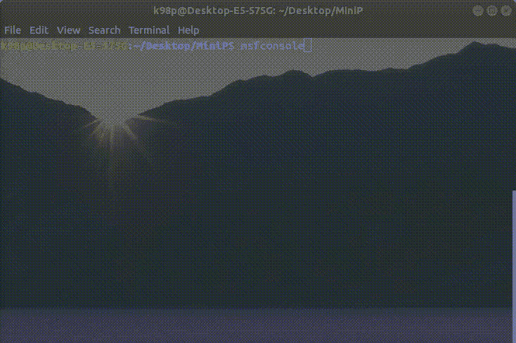
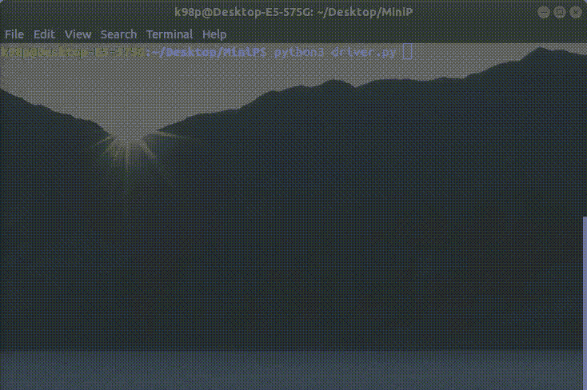

# Python |为基于控制台的应用程序创建简单动画

> 原文:[https://www . geesforgeks . org/python-create-simple-animation-for-console-application/](https://www.geeksforgeeks.org/python-create-simple-animation-for-console-based-application/)

众所周知，Python 是一种脚本语言，可以很容易地用于自动化简单的任务。在本文中，我们将学习如何创建一个简单的基于控制台的动画，它可以在开发基于控制台的项目作为实用程序时使用。

我们将尝试复制如下所示的加载动画:


我们将使用以下模块–

```py
sys module
os module
time module 
```

下面是 Python 实现:

```py
# importing the necessary packages
import time
import sys
import os

# Function for implementing the loading animation
def load_animation():

    # String to be displayed when the application is loading
    load_str = "starting your console application..."
    ls_len = len(load_str)

    # String for creating the rotating line
    animation = "|/-\\"
    anicount = 0

    # used to keep the track of
    # the duration of animation
    counttime = 0        

    # pointer for travelling the loading string
    i = 0                     

    while (counttime != 100):

        # used to change the animation speed
        # smaller the value, faster will be the animation
        time.sleep(0.075) 

        # converting the string to list
        # as string is immutable
        load_str_list = list(load_str) 

        # x->obtaining the ASCII code
        x = ord(load_str_list[i])

        # y->for storing altered ASCII code
        y = 0                             

        # if the character is "." or " ", keep it unaltered
        # switch uppercase to lowercase and vice-versa 
        if x != 32 and x != 46:             
            if x>90:
                y = x-32
            else:
                y = x + 32
            load_str_list[i]= chr(y)

        # for storing the resultant string
        res =''             
        for j in range(ls_len):
            res = res + load_str_list[j]

        # displaying the resultant string
        sys.stdout.write("\r"+res + animation[anicount])
        sys.stdout.flush()

        # Assigning loading string
        # to the resultant string
        load_str = res

        anicount = (anicount + 1)% 4
        i =(i + 1)% ls_len
        counttime = counttime + 1

    # for windows OS
    if os.name =="nt":
        os.system("cls")

    # for linux / Mac OS
    else:
        os.system("clear")

# Driver program
if __name__ == '__main__': 
    load_animation()

    # Your desired code continues from here 
    # s = input("Enter your name: ")
    s ="David"
    sys.stdout.write("Hello "+str(s)+"\n")
```

**输出:**
