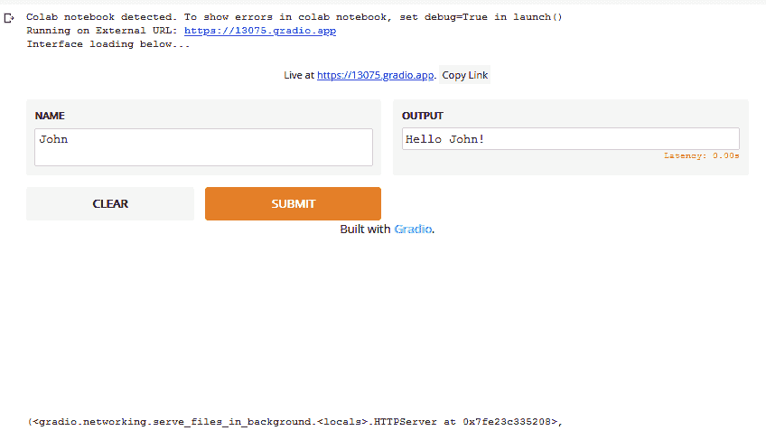
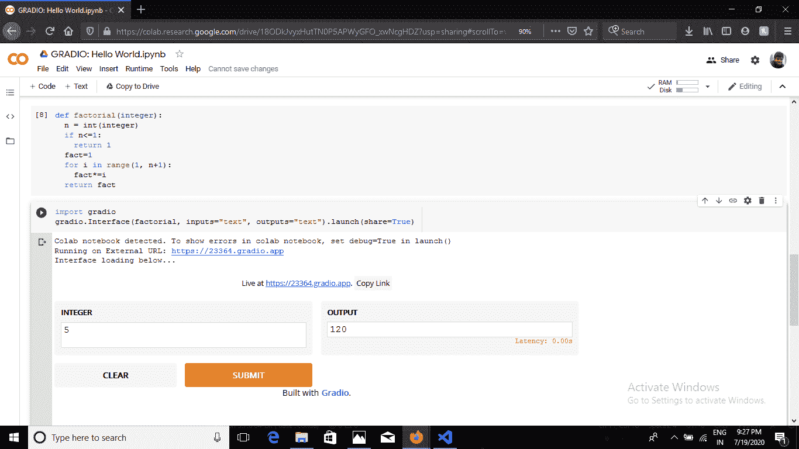
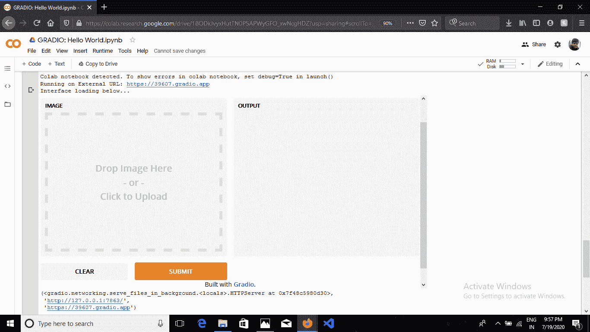
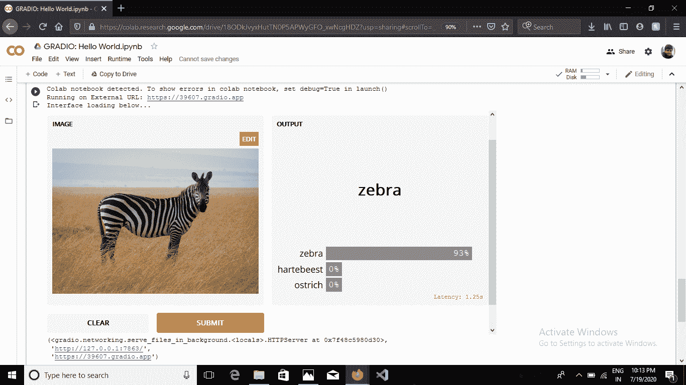
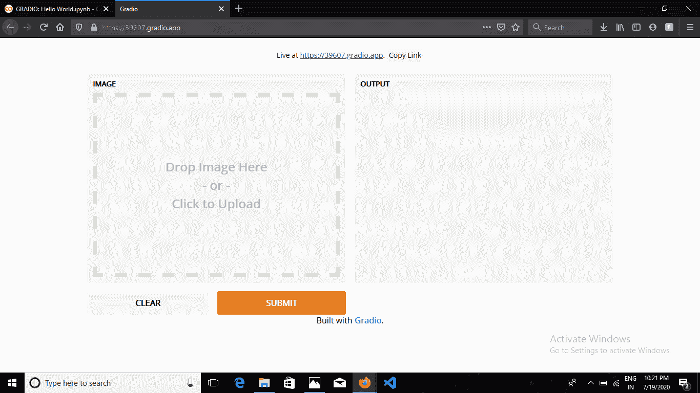

# Python–使用 Gradio 创建原型机器学习模型的用户界面

> 原文:[https://www . geesforgeks . org/python-create-UIS-for-prototype-machine-learning-model-with-gradio/](https://www.geeksforgeeks.org/python-create-uis-for-prototyping-machine-learning-model-with-gradio/)

**Gradio** 是一个开源的 python 库，它允许您在短短几行代码中为您的 ML 模型、任何 API 或任何任意函数快速创建易于使用、可定制的 UI 组件。您可以将图形用户界面直接集成到您的 Python 笔记本中，也可以将链接共享给任何人。
**要求:**

**例:**



我们可以使用 gradio 创建与 Gradio 的接口。接口()函数。
gradio。接口(self，fn，输入，输出，示例=无，live =假，
capture _ session =假，title =无，description =无)
**参数:**

*   **fn:** (可调用)包装接口的函数。
*   **输入:** (Union[str，List[Union[str，AbstractInput]])单个 Gradio 输入组件，或 Gradio 输入组件列表。
*   **输出:** (Union[str，List[Union[str，AbstractOutput]])单个 Gradio 输出组件，或 Gradio 输出组件列表。
*   **live:** (bool)界面是否应在更改时自动重新加载。
*   **capture_session:** (bool)如果为 True，则捕获默认图形和会话(Tensorflow 1.x 需要)
*   **标题:** (str)界面的标题；如果提供，则显示在输入和输出组件的上方。
*   **描述:** (str)接口的描述；如果提供，则显示在输入和输出组件的上方。
*   **示例:**(列表[列表[任意]])函数的示例输入；如果提供的话，会出现在 UI 组件的下方，并可用于填充界面。应该是嵌套列表，其中外部列表由样本组成，每个内部列表由对应于每个输入组件的输入组成。

界面的用户界面可以由 gradio 生成。接口，启动()功能。
gradio。
**参数:**

```
share: (bool) - whether to create a publicly shareable link from your computer for the interface.
```

梯度的输入和输出参数有几个输入和输出分量。接口()。

<figure class="table">

| **输入组件** | **输出组件** |
| 麦克风文本框滑块复选框复选框组单选下拉图像草图向下网络摄像头 | 文本框 标签 图像 图像 键值 |

</figure>

**代码:返回一个数的阶乘的函数。**

## 蟒蛇 3

```
def factorial(integer):
    """ Returns factorial of the given integer"""
    n = int(integer)
    if n<=1:
        return 1
    fact=1
    for i in range(1, n+1):
        fact*=i
    return fact
```

现在，要用 gradio 接口包装这个函数，请在同一个文件中编写以下代码。

## 蟒蛇 3

```
import gradio
gradio.Interface(factorial, inputs="text", outputs="text").launch(share=True)
```

当你在 jupyter 笔记本上运行上述代码单元时。它会生成这样一个 UI:



你也可以复制链接并分享给任何人，它会在浏览器中打开相同的用户界面。现在，我们将向您展示如何为机器学习模型制作界面。
为了演示，我们将加载一个预训练的带有张量流的[初始网络](https://arxiv.org/abs/1409.4842)图像分类模型。由于这是一个图像分类模型，我们将使用图像输入界面。我们将使用标签输出界面输出标签字典及其相应的置信度得分。
**代码:**

## 蟒蛇 3

```
# imported necessary libraries
import gradio as gr
import tensorflow as tf
import numpy as np
import requests

# loading the model
inception_net = tf.keras.applications.InceptionV3()

# Download human-readable labels.
response = requests.get("https://git.io/JJkYN")
labels = response.text.split("\n")

def classify_image(image):
    """ Returns a dictionary with key as label and values
    as the predicted confidence for that label"""
    # reshaping the image
    image = image.reshape((-1, 299, 299, 3))
    # preprocessing the image for inception_v3
    image = tf.keras.applications.inception_v3.preprocess_input(image)
    # predicting the output
    prediction = inception_net.predict(image).flatten()
    return {labels[i]: float(prediction[i]) for i in range(1000)}

# initializing the input component
image = gr.inputs.Image(shape = (299, 299, 3))
# initializing the output component
label = gr.outputs.Label(num_top_classes = 3)

# launching the interface
gr.Interface(fn = classify_image, inputs = image,
             outputs = label, capture_session = True).launch()
```

当您运行上述代码单元时，它将生成如下用户界面:



在这里你可以将图片拖放到 UI 的左边部分，点击提交，你会得到如下结果:



同样如果你复制链接并粘贴到你的浏览器中，你的界面会是这样的:



它不是本地主机，因此您可以在任何设备上打开相同的链接。
有关输入和输出组件的更多信息，请查看 Gradio 的[文档](https://www.gradio.app/docs#interface)。
**资源:** [格拉迪欧的文档](https://www.gradio.app/docs#interface)