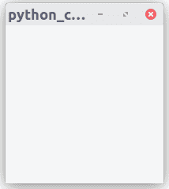

# Python–在 GTK+ 3 中创建窗口按钮

> 原文:[https://www . geesforgeks . org/python-create-window-button-in-GTK-3/](https://www.geeksforgeeks.org/python-create-window-button-in-gtk-3/)

GTK+ 3 是一个免费的开源跨平台小部件工具包，用于创建图形用户界面(GUI)。它是根据 GNU 小通用公共许可证的条款许可的。与 Qt 一起，它是 Wayland 和 X11 窗口系统最受欢迎的工具包之一。让我们看看如何使用 GTK+ 3 创建窗口和按钮。
**遵循** **以下步骤:**

1.  导入 GTK+ 3 模块
2.  创建主窗口。
3.  创建按钮。

我们必须导入 Gtk 模块才能访问 GTK+的类和函数。
**注意:**在像 Pycharm 这样的 ide 中，为了使用 GTK+ 3，我们可以安装一个名为 PyGObject 的包。
**代码#1:** 创建一个 200 x 200 像素的空窗口。

## 蟒蛇 3

```
import gi

# Since a system can have multiple versions
# of GTK + installed, we want to make
# sure that we are importing GTK + 3.
gi.require_version("Gtk", "3.0")

from gi.repository import Gtk

# Creates an empty window.
window = Gtk.Window()

# Connecting to the window’s delete event
# to ensure that the application is terminated
# whenever we click close button

window.connect("destroy", Gtk.main_quit)
# Display the window.
window.show_all()

Gtk.main()
```

**输出:**



**代码#2:** 创建按钮

## 蟒蛇 3

```
import gi

gi.require_version("Gtk", "3.0")
from gi.repository import Gtk

# Define our own newWindow class.
class newWindow(Gtk.Window):
    def __init__(self):

        # Call the constructor of the super class.
        # Set the value of the property title to Geeks for Geeks.
        Gtk.Window.__init__(self, title ="Geeks for Geeks")

        # Create a button widget, connect to its clicked signal
        # and add it as child to the top-level window.
        self.button = Gtk.Button(label ="Click Here")
        self.button.connect("clicked", self.on_button_clicked)
        self.add(self.button)

    # When we click on the button this method
    # will be called
    def on_button_clicked(self, widget):
        print("Geeks for Geeks")

win = newWindow()
win.connect("destroy", Gtk.main_quit)
win.show_all()
Gtk.main()
```

**输出:**

