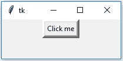
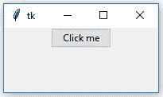

# Python |在 tkinter 中创建按钮

> 原文:[https://www . geesforgeks . org/python-creating-a-button-in-tkinter/](https://www.geeksforgeeks.org/python-creating-a-button-in-tkinter/)

Tkinter 是 Python 的标准 GUI(图形用户界面)包。它是 Python 本身附带的图形用户界面应用程序最常用的包之一。让我们看看如何使用 Tkinter 创建一个按钮。

**按照以下步骤操作:**

1.  导入 Python 2.x 中的 tkinter module # Tkinter(注:Capital T)
2.  创建主窗口(root = Tk())
3.  添加任意多的小部件。

导入 tkinter 模块与导入任何其他模块相同。

```py
import tkinter   # In Python 3.x

import Tkinter   # In python 2.x. (Note Capital T)
```

**tkinter.ttk** 模块提供了对 tk 8.5 中引入的 Tk 主题小部件集的访问。如果 Python 还没有针对 Tk 8.5 进行编译，那么如果已经安装了 *Tile* ，这个模块还是可以访问的。使用 Tk 8.5 的前一种方法提供了额外的好处，包括 X11 下的抗锯齿字体渲染和窗口透明度。
tkinter . ttk 的基本思想是尽可能将实现小部件行为的代码与实现其外观的代码分开。 **tkinter.ttk** 用于创建现代 GUI(图形用户界面)应用程序，这是 *tkinter* 本身无法实现的。

**代码#1:** 使用 Tkinter 创建按钮。

## 蟒蛇 3

```py
# import everything from tkinter module
from tkinter import *   

# create a tkinter window
root = Tk()             

# Open window having dimension 100x100
root.geometry('100x100')

# Create a Button
btn = Button(root, text = 'Click me !', bd = '5',
                          command = root.destroy)

# Set the position of button on the top of window.  
btn.pack(side = 'top')   

root.mainloop()
```

**输出:**



<video class="wp-video-shortcode" id="video-282579-1" width="640" height="360" preload="metadata" controls=""><source type="video/mp4" src="https://media.geeksforgeeks.org/wp-content/uploads/20210216123330/FreeOnlineScreenRecorderProject3.mp4?_=1">[https://media.geeksforgeeks.org/wp-content/uploads/20210216123330/FreeOnlineScreenRecorderProject3.mp4](https://media.geeksforgeeks.org/wp-content/uploads/20210216123330/FreeOnlineScreenRecorderProject3.mp4)</video>

**不使用** ***tk*** **主题小部件创建按钮。**

使用 **tk** 主题小部件(tkinter.ttk)创建按钮。这会给你现代图形的效果。效果会从一个操作系统改变到另一个，因为它基本上是为了外观。

**代码#2:**

## 蟒蛇 3

```py
# import tkinter module
from tkinter import *       

# Following will import tkinter.ttk module and
# automatically override all the widgets
# which are present in tkinter module.
from tkinter.ttk import *

# Create Object
root = Tk()

# Initialize tkinter window with dimensions 100x100            
root.geometry('100x100')    

btn = Button(root, text = 'Click me !',
                command = root.destroy)

# Set the position of button on the top of window
btn.pack(side = 'top')    

root.mainloop()
```

**输出:**



<video class="wp-video-shortcode" id="video-282579-2" width="640" height="360" preload="metadata" controls=""><source type="video/mp4" src="https://media.geeksforgeeks.org/wp-content/uploads/20210216123333/FreeOnlineScreenRecorderProject4.mp4?_=2">[https://media.geeksforgeeks.org/wp-content/uploads/20210216123333/FreeOnlineScreenRecorderProject4.mp4](https://media.geeksforgeeks.org/wp-content/uploads/20210216123333/FreeOnlineScreenRecorderProject4.mp4)</video>

**注意:**请参见两个代码的输出，因为 **tkinter.ttk** 不支持边框，所以第二个输出中不存在边框。此外，当您将鼠标悬停在两个按钮 ttk 上时。按钮将改变其颜色并变成浅蓝色(效果可能因操作系统而异)，因为它支持现代图形，而对于简单的按钮，它不会改变颜色，因为它不支持现代图形。