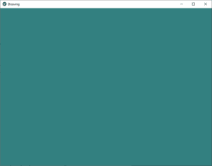
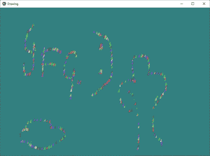

# Python |在 kivy 中创建简单绘图应用程序

> 原文:[https://www . geesforgeks . org/python-creating-a-simple-drawing-app-in-kivy/](https://www.geeksforgeeks.org/python-creating-a-simple-drawing-app-in-kivy/)

Kivy 是 Python 中独立于平台的 GUI 工具。因为它可以在安卓、IOS、Linux 和视窗等平台上运行。它基本上是用来开发安卓应用的，但并不意味着它不能在桌面应用上使用。

> [Kivy 教程–通过示例学习 Kivy](https://www.geeksforgeeks.org/kivy-tutorial/)。

### 绘图应用程序:

在这里，我们将在 kivy 的帮助下创建一个简单的绘图应用程序。最初，我们只是制作一个画布和一个画笔，这样通过移动光标，您就可以感觉像一个绘图应用程序。
在这种情况下，小部件是动态添加的。如果要在运行时动态添加小部件，根据用户交互，它们只能在 Python 文件中添加。
我们是用小部件，布局，随机来让它好看。

```py
Now Basic Approach of the App:

1) import kivy
2) import kivy App
3) import Relativelayout
4) import widget
5) set minimum version(optional)
6) Create widget class as needed
7) Create Layout class
8) create the App class
9) create .kv file
10) return the widget/layout etc class
11) Run an instance of the class
```

### **守则的实施:**

**#。py 文件:**

## 蟒蛇 3

```py
# Program to explain how to create drawing App in kivy 

# import kivy module    
import kivy  

# base Class of your App inherits from the App class.    
# app:always refers to the instance of your application   
from kivy.app import App 

# this restrict the kivy version i.e  
# below this kivy version you cannot  
# use the app or software  
kivy.require('1.9.0') 

# Widgets are elements of a
# graphical user interface that
# form part of the User Experience.
from kivy.uix.widget import Widget

# This layout allows you to set relative coordinates for children.
from kivy.uix.relativelayout import RelativeLayout

# Create the Widget class
class Paint_brush(Widget):
    pass

# Create the layout class
# where you are defining the working of
# Paint_brush() class
class Drawing(RelativeLayout):

    # On mouse press how Paint_brush behave
    def on_touch_down(self, touch):
        pb = Paint_brush()
        pb.center = touch.pos
        self.add_widget(pb)

    # On mouse movement how Paint_brush behave
    def on_touch_move(self, touch):
        pb = Paint_brush()
        pb.center = touch.pos
        self.add_widget(pb)

# Create the App class       
class DrawingApp(App):
    def build(self):
        return Drawing()

DrawingApp().run()
```

**#。ky 文件:**

## 蟒蛇 3

```py
# Drawing.kv implementation

# for assigning random color to the brush
#:import rnd random

# Paint brush coding
<Paint_brush>:
    size_hint: None, None
    size: 25, 50
    canvas:
        Color:
            rgb: rnd.random(), rnd.random(), rnd.random()
        Triangle:
            points:
                (self.x, self.y, self.x + self.width / 4, self.y,
                self.x + self.width / 4, self.y + self.height / 4)

# Drawing pad creation           
<Drawing>:
    canvas:
        Color:
            rgb: .2, .5, .5
        Rectangle:
            size: root.size
            pos: root.pos
```

**输出:**





<video class="wp-video-shortcode" id="video-339706-1" width="640" height="360" preload="metadata" controls=""><source type="video/mp4" src="https://media.geeksforgeeks.org/wp-content/uploads/20210131135309/FreeOnlineScreenRecorderProject3.mp4?_=1">[https://media.geeksforgeeks.org/wp-content/uploads/20210131135309/FreeOnlineScreenRecorderProject3.mp4](https://media.geeksforgeeks.org/wp-content/uploads/20210131135309/FreeOnlineScreenRecorderProject3.mp4)</video>