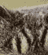

# Python |使用枕头裁剪图像

> 原文:[https://www . geeksforgeeks . org/python-crop-image-use-pizzle/](https://www.geeksforgeeks.org/python-crop-image-using-pillow/)

在本文中，我们将学习使用枕头库裁剪图像。裁剪图像意味着选择图像内部的矩形区域，并移除矩形以外的所有内容。为了裁剪图像，我们在图像对象上使用 **`crop()`** 方法。

> **语法:** *IMG* 。作物( *box_tuple* )
> 
> **参数:**
> **Image_path-** 图像的位置
> **IMG-** 图像要裁剪的图像
> **box_tuple-** 要裁剪的图像的【左、上、右、下】
> 
> **返回:**代表裁剪图像的图像对象。

**例 1:**

```py
# import Image module
from PIL import Image

# open the image
Image1 = Image.open('D:/cat.jpg')

# crop the image
croppedIm = Image1.crop((130, 120, 200, 200))

# show the image
croppedIm.show()
```

**输入图像:**


**输出:**


**例 2:**

```py
# import Image module
from PIL import Image

# open the image
Image1 = Image.open('D:/cat.jpg')

# crop the image
croppedIm = Image1.crop((130, 50, 250, 150))

# show the image
croppedIm.show()
```

**输入图像:**


**输出:**
