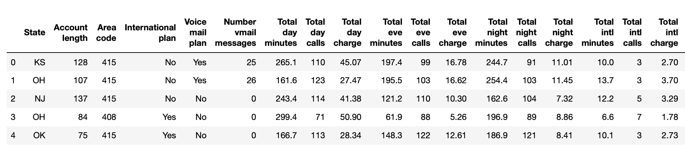
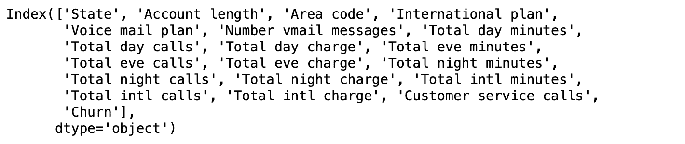
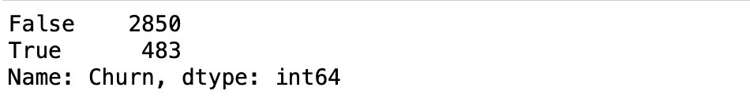
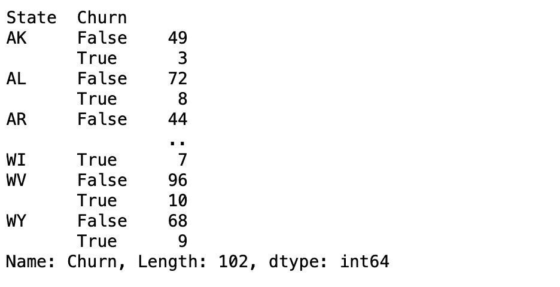
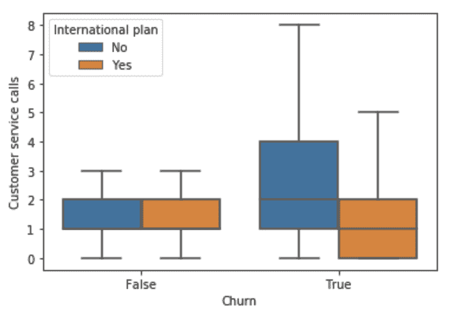

# Python |客户流失分析预测

> 原文:[https://www . geesforgeks . org/python-客户-流失-分析-预测/](https://www.geeksforgeeks.org/python-customer-churn-analysis-prediction/)

**客户流失**
指现有客户、用户、订户或任何类型的退货客户停止营业或终止与公司的关系。

**客户流失类型–**

*   **合同流失:**当客户签订服务合同并决定取消服务时，例如 SaaS 有线电视。
*   **自愿流失:**当用户自愿取消服务时，例如蜂窝连接。
*   **非合同流失:**当客户没有服务合同，决定取消服务时，例如零售店的消费者忠诚度。
*   **非自愿流失:**在客户没有任何要求的情况下发生流失，例如信用卡到期。

**自愿流失原因**

*   缺乏使用
*   服务差
*   更好的价格

**代码:导入电信客户流失数据集**

```
# Import required libraries
import numpy as np
import pandas as pd

# Import the dataset
dataset = pd.read_csv('telcochurndata.csv')

# Glance at the first five records
dataset.head()

# Print all the features of the data
dataset.columns
```

**输出:**





**电信客户流失数据集的探索性数据分析**

**代码:**要查找数据集中搅拌子和非搅拌子的数量:

```
# Churners vs Non-Churners
dataset['Churn'].value_counts()
```

**输出:**


**代码:**通过*搅拌*对数据进行分组，并计算*的平均值*，以确定搅拌工是否比非搅拌工拨打更多的客户服务电话:

```
# Group data by 'Churn' and compute the mean
print(dataset.groupby('Churn')['Customer service calls'].mean())
```

**输出:**


没错。也许不出所料，搅拌工似乎比非搅拌工打更多的客服电话。

**代码:**找出一个*州*是否比另一个州有更多的搅拌器。

```
# Count the number of churners and non-churners by State
print(dataset.groupby('State')['Churn'].value_counts())
```

**输出:**


虽然加州是美国人口最多的州，但我们的数据集中来自加州的客户却没有那么多。例如，亚利桑那州(AZ)有 64 名客户，其中 4 人最终大赚一笔。相比之下，加州搅拌咖啡的顾客数量(和比例)更高。这是对公司有用的信息。

**探索数据可视化:**了解变量如何分布。

```
# Import matplotlib and seaborn
import matplotlib.pyplot as plt
import seaborn as sns

# Visualize the distribution of 'Total day minutes'
plt.hist(dataset['Total day minutes'], bins = 100)

# Display the plot
plt.show()
```

**输出:**


**代码:可视化搅拌工和非搅拌工**之间*客服电话*的差异

```
# Create the box plot
sns.boxplot(x = 'Churn',
            y = 'Customer service calls',
            data = dataset,
            sym = "",                  
            hue = "International plan") 
# Display the plot
plt.show()
```

**输出:**


看起来确实流失的客户最终会留下更多的客户服务电话，除非这些客户也有国际计划，在这种情况下，他们留下的客户服务电话会更少。这类信息对于更好地理解流失的驱动因素非常有用。现在是时候学习如何在建模之前对数据进行预处理了。

**电信客户流失数据集的数据预处理**

许多机器学习模型对数据如何分布做出了某些假设。一些假设如下:

*   特征是正态分布的
*   这些特征在同一尺度上
*   要素的数据类型是数字

在*电信公司搅动*数据、*搅动*、*语音邮件计划*和，*国际计划*尤其是二进制特征，可以很容易地转换成 0 和 1

```
# Features and Labels
X = dataset.iloc[:, 0:19].values
y = dataset.iloc[:, 19].values # Churn

# Encoding categorical data in X
from sklearn.preprocessing import LabelEncoder

labelencoder_X_1 = LabelEncoder()
X[:, 3] = labelencoder_X_1.fit_transform(X[:, 3])

labelencoder_X_2 = LabelEncoder()
X[:, 4] = labelencoder_X_2.fit_transform(X[:, 4])

# Encoding categorical data in y
labelencoder_y = LabelEncoder()
y = labelencoder_y.fit_transform(y)
```

**编码:使用一次热编码的编码状态特征**

```
# Removing extra column to avoid dummy variable trap
X_State = pd.get_dummies(X[:, 0], drop_first = True)

# Converting X to a dataframe
X = pd.DataFrame(X)

# Dropping the 'State' column
X = X.drop([0], axis = 1)

# Merging two dataframes
frames = [X_State, X]
result = pd.concat(frames, axis = 1, ignore_index = True)

# Final dataset with all numeric features
X = result
```

**代码:创建训练和测试集**

```
# Splitting the dataset into the Training and Test sets
from sklearn.model_selection import train_test_split
X_train, X_test, y_train, y_test = train_test_split(X, y, 
                                                    test_size = 0.2, 
                                                    random_state = 0)
```

**代码:缩放训练和测试集的特征**

```
# Feature Scaling
from sklearn.preprocessing import StandardScaler
sc = StandardScaler()
X_train = sc.fit_transform(X_train)
X_test = sc.transform(X_test)
```

**代码:在训练集上训练一个*随机森林分类器*模型。**

```
# Import RandomForestClassifier
from sklearn.ensemble import RandomForestClassifier

# Instantiate the classifier
clf = RandomForestClassifier()

# Fit to the training data
clf.fit(X_train, y_train)
```

**代码:进行预测**

```
# Predict the labels for the test set
y_pred = clf.predict(X_test)
```

**代码:评估模型性能**

```
# Compute accuracy
from sklearn.metrics import accuracy_score

accuracy_score(y_test, y_pred)
```

**输出:**


**代码:混淆矩阵**

```
from sklearn.metrics import confusion_matrix
print(confusion_matrix(y_test, y_pred))
```

**输出:**


从混淆矩阵中，我们可以计算出以下指标:

*   true positive(TP)= 51
*   真底片(总氮)= 575
*   假阳性(FP) = 4
*   假阴性(FN) = 37
*   精度= TP/(TP+FP) = 0.92
*   回忆= TP/(TP+FN) = 0.57
*   精度= (TP+TN)/(TP+TN+FP+FN) = 0.9385