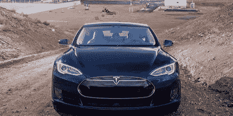
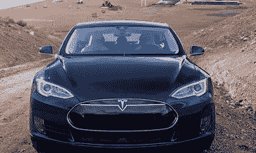
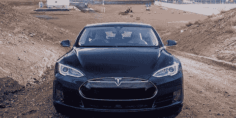
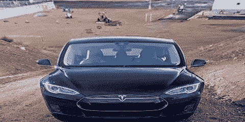
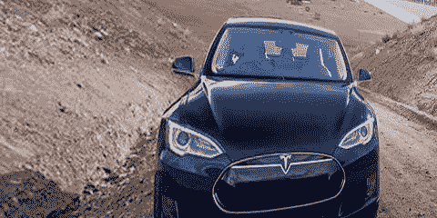

# Python |数据增长

> 哎哎哎:# t0]https://www . geeksforgeeks . org/python-data-increasing/

数据扩充是增加数据数量和多样性的过程。我们不收集新数据，而是转换已经存在的数据。在本文中，我将具体讨论图像数据增强。
那么我们就来看看各种变换和扩充图像数据的方法。
本文涵盖以下文章–

1.  数据扩充的需求
2.  数据扩充操作
3.  喀拉斯的数据扩充
4.  使用增强器进行数据增强

**1。数据扩增的需求**
数据扩增是深度学习中不可或缺的过程，因为在深度学习中我们需要大量的数据，在某些情况下，收集数千或数百万张图像是不可行的，所以数据扩增来拯救我们。

它帮助我们增加数据集的大小，并在数据集中引入可变性。

**2。数据扩充中的操作**
最常用的操作有-

1.  旋转
2.  剪羊毛
3.  变焦
4.  种植
5.  轻弹
6.  更改亮度级别

现在我们将详细了解所有这些操作。我还将在本文后面提供数据扩充的代码。

**我将用于插图的原图**


**旋转**
旋转操作顾名思义，就是将图像旋转一定的指定程度。
在下面的例子中，我将旋转度指定为 40。


**剪切**
剪切也用于变换图像的方向。
剪切操作的结果如下–



**缩放**
缩放操作允许我们放大或缩小。
结果如下–


**裁剪**
裁剪允许我们裁剪图像或从图像中选择特定区域。



**翻转**
翻转允许我们翻转图像的方向。我们可以使用水平或垂直翻转。
您应该小心使用此功能，因为在某些情况下，此操作可能没有多大意义，例如，假设您正在设计面部识别系统，那么一个人倒立在摄像机前的可能性极小，因此您可以避免使用垂直翻转操作。



**改变亮度等级**
这个功能帮助我们对抗光照变化。您可能会遇到这样一种情况，即您的数据集的大部分由具有相似亮度级别的图像组成，例如，收集员工进入办公室的图像，通过增强图像，我们确保我们的模型是稳健的，即使在不同的环境中也能够检测到人。


**3。Keras**
中的数据扩充 Keras 是建立在 TensorFlow 之上的高级机器学习框架。我不会详细介绍 Keras 的工作原理，我只想介绍 Keras 中数据扩充的概念。
我们可以通过使用 ImageDataGenerator 类来执行数据扩充。
它接受各种参数，如旋转范围、亮度范围、剪切范围、缩放范围等。

**代码:实现数据扩充的 Python 代码**

```py
# Importing necessary functions
from keras.preprocessing.image import ImageDataGenerator, 
array_to_img, img_to_array, load_img

# Initialising the ImageDataGenerator class.
# We will pass in the augmentation parameters in the constructor.
datagen = ImageDataGenerator(
        rotation_range = 40,
        shear_range = 0.2,
        zoom_range = 0.2,
        horizontal_flip = True,
        brightness_range = (0.5, 1.5))

# Loading a sample image 
img = load_img('image.jpg') 
# Converting the input sample image to an array
x = img_to_array(img)
# Reshaping the input image
x = x.reshape((1, ) + x.shape) 

# Generating and saving 5 augmented samples 
# using the above defined parameters. 
i = 0
for batch in datagen.flow(x, batch_size = 1,
                          save_to_dir ='preview', 
                          save_prefix ='image', save_format ='jpeg'):
    i += 1
    if i > 5:
        break
```

上面的代码片段允许您生成 5 个具有不同缩放、旋转、亮度等的增强图像。

**增强图像**


**4。使用增强器**进行数据增强

```py
# Importing necessary library
import Augmentor
# Passing the path of the image directory
p = Augmentor.Pipeline("image_folder")

# Defining augmentation parameters and generating 5 samples
p.flip_left_right(0.5)
p.black_and_white(0.1)
p.rotate(0.3, 10, 10)
p.skew(0.4, 0.5)
p.zoom(probability = 0.2, min_factor = 1.1, max_factor = 1.5)
p.sample(5)
```

上面的代码片段允许您基于上面定义的特征生成 5 个增强图像。

**增强图像**






您可以查看[增强器](https://github.com/mdbloice/Augmentor) github 存储库了解更多信息。

参考文献–

[https://keras.io/preprocessing/image/](https://keras.io/preprocessing/image/)

[https://github . com/mdbloice/aug mentor](https://github.com/mdbloice/Augmentor)