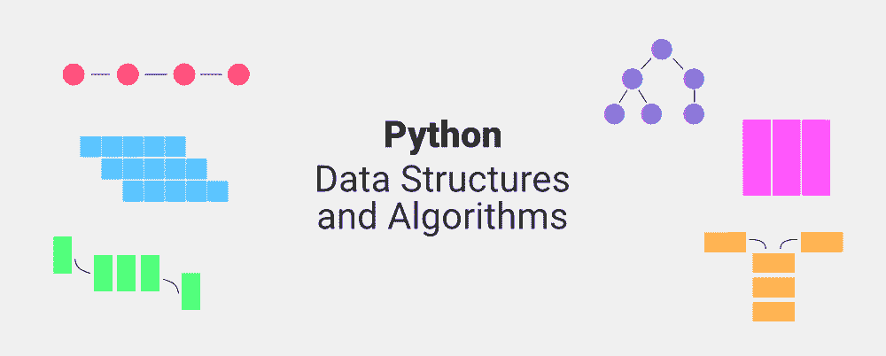

# Python 数据结构和算法

> 原文:[https://www . geesforgeks . org/python-数据结构和算法/](https://www.geeksforgeeks.org/python-data-structures-and-algorithms/)

本教程是一个初学者友好的使用 Python 学习数据结构和算法的指南。在本文中，我们将讨论内置的数据结构，如列表、元组、字典等，以及一些用户定义的数据结构，如链表、树、图等，并借助于良好且解释清楚的例子和练习题，讨论遍历以及搜索和排序算法。



## 列表

[Python 列表](https://www.geeksforgeeks.org/python-list/)是有序的数据集合，就像其他编程语言中的数组一样。它允许列表中有不同类型的元素。Python 列表的实现类似于 C++中的 Vectors 或者 JAVA 中的 ArrayList。代价高昂的操作是从列表的开头插入或删除元素，因为需要移动所有元素。在预分配的内存变满的情况下，列表末尾的插入和删除也会变得昂贵。

### 示例:创建 Python 列表

## 蟒蛇 3

```py
List = [1, 2, 3, "GFG", 2.3]
print(List)
```

**Output**

```py
[1, 2, 3, 'GFG', 2.3]
```

列表元素可以通过分配的索引来访问。在 python 中，列表的起始索引是 0，结束索引是(如果有 N 个元素)N-1。


### 示例:Python 列表操作

## 蟒蛇 3

```py
# Creating a List with
# the use of multiple values
List = ["Geeks", "For", "Geeks"]
print("\nList containing multiple values: ")
print(List)

# Creating a Multi-Dimensional List
# (By Nesting a list inside a List)
List2 = [['Geeks', 'For'], ['Geeks']]
print("\nMulti-Dimensional List: ")
print(List2)

# accessing a element from the
# list using index number
print("Accessing element from the list")
print(List[0])
print(List[2])

# accessing a element using
# negative indexing
print("Accessing element using negative indexing")

# print the last element of list
print(List[-1])

# print the third last element of list
print(List[-3])
```

**Output**

```py
List containing multiple values: 
['Geeks', 'For', 'Geeks']

Multi-Dimensional List: 
[['Geeks', 'For'], ['Geeks']]
Accessing element from the list
Geeks
Geeks
Accessing element using negative indexing
Geeks
Geeks
```

## 元组

[Python 元组](https://www.geeksforgeeks.org/python-tuples/)类似于列表，但是元组本质上是[不可变的](https://www.geeksforgeeks.org/why-do-we-need-immutables-in-python/)，即一旦创建就不能修改。就像列表一样，元组也可以包含各种类型的元素。

在 Python 中，元组是通过放置由“逗号”分隔的值序列来创建的，使用或不使用括号来对数据序列进行分组。

**注意:**要创建一个元素的元组，必须有一个尾随逗号。例如，(8，)将创建一个包含 8 作为元素的元组。

### 示例:Python 元组操作

## 蟒蛇 3

```py
# Creating a Tuple with
# the use of Strings
Tuple = ('Geeks', 'For')
print("\nTuple with the use of String: ")
print(Tuple)

# Creating a Tuple with
# the use of list
list1 = [1, 2, 4, 5, 6]
print("\nTuple using List: ")
Tuple = tuple(list1)

# Accessing element using indexing
print("First element of tuple")
print(Tuple[0])

# Accessing element from last
# negative indexing
print("\nLast element of tuple")
print(Tuple[-1])

print("\nThird last element of tuple")
print(Tuple[-3])
```

**Output**

```py
Tuple with the use of String: 
('Geeks', 'For')

Tuple using List: 
First element of tuple
1

Last element of tuple
6

Third last element of tuple
4
```

## 一组

[Python 集](http://www.geeksforgeeks.org/sets-in-python/)是一个不允许任何重复的可变数据集合。集合基本上用于包括成员资格测试和消除重复条目。这里使用的数据结构是哈希(Hashing)，这是一种在 O(1)中平均执行插入、删除和遍历的流行技术。

如果多个值出现在同一个索引位置，则该值被追加到该索引位置，以形成一个链表。在中，CPython 集合使用带有虚拟变量的字典来实现，其中键是对时间复杂度进行了更大优化的成员集合。

**设置实现:**


**对单个哈希表进行多次操作的集合:**


### 示例:Python 集合操作

## 蟒蛇 3

```py
# Creating a Set with
# a mixed type of values
# (Having numbers and strings)
Set = set([1, 2, 'Geeks', 4, 'For', 6, 'Geeks'])
print("\nSet with the use of Mixed Values")
print(Set)

# Accessing element using
# for loop
print("\nElements of set: ")
for i in Set:
    print(i, end =" ")
print()

# Checking the element
# using in keyword
print("Geeks" in Set)
```

**Output**

```py
Set with the use of Mixed Values
{1, 2, 4, 6, 'For', 'Geeks'}

Elements of set: 
1 2 4 6 For Geeks 
True
```

## 冻结集

[Python 中的冻结集](https://www.geeksforgeeks.org/frozenset-in-python/)是不可变的对象，它们只支持产生结果的方法和运算符，而不影响应用它们的一个或多个冻结集。虽然集合的元素可以随时修改，但冻结集合的元素在创建后保持不变。

### 示例:Python 冻结集

## 蟒蛇 3

```py
# Same as {"a", "b","c"}
normal_set = set(["a", "b","c"])

print("Normal Set")
print(normal_set)

# A frozen set
frozen_set = frozenset(["e", "f", "g"])

print("\nFrozen Set")
print(frozen_set)

# Uncommenting below line would cause error as
# we are trying to add element to a frozen set
# frozen_set.add("h")
```

**Output**

```py
Normal Set
{'a', 'b', 'c'}

Frozen Set
frozenset({'f', 'g', 'e'})
```

## 线

[Python 字符串](https://www.geeksforgeeks.org/python-strings/)是表示 Unicode 字符的不可变字节数组。Python 没有字符数据类型，单个字符只是长度为 1 的字符串。

**注意:**由于字符串是不可变的，修改字符串将导致创建新的副本。


### 示例:Python 字符串操作

## 蟒蛇 3

```py
String = "Welcome to GeeksForGeeks"
print("Creating String: ")
print(String)

# Printing First character
print("\nFirst character of String is: ")
print(String[0])

# Printing Last character
print("\nLast character of String is: ")
print(String[-1])
```

**Output**

```py
Creating String: 
Welcome to GeeksForGeeks

First character of String is: 
W

Last character of String is: 
s
```

## 词典

[Python 字典](https://www.geeksforgeeks.org/python-dictionary/)是一个无序的数据集合，以键:值对的格式存储数据。它就像任何其他语言的哈希表，时间复杂度为 O(1)。Python 字典的索引是在键的帮助下完成的。这些都是任何可散列的类型，即一个对象，它永远不会像字符串、数字、元组等那样改变。我们可以使用花括号({})或字典理解来创建字典。

### 示例:Python 字典操作

## 蟒蛇 3

```py
# Creating a Dictionary
Dict = {'Name': 'Geeks', 1: [1, 2, 3, 4]}
print("Creating Dictionary: ")
print(Dict)

# accessing a element using key
print("Accessing a element using key:")
print(Dict['Name'])

# accessing a element using get()
# method
print("Accessing a element using get:")
print(Dict.get(1))

# creation using Dictionary comprehension
myDict = {x: x**2 for x in [1,2,3,4,5]}
print(myDict)
```

**Output**

```py
Creating Dictionary: 
{'Name': 'Geeks', 1: [1, 2, 3, 4]}
Accessing a element using key:
Geeks
Accessing a element using get:
[1, 2, 3, 4]
{1: 1, 2: 4, 3: 9, 4: 16, 5: 25}
```

## [数]矩阵

矩阵是一个 2D 阵列，其中每个元素的大小完全相同。为了创建矩阵，我们将使用 [NumPy 包](https://www.geeksforgeeks.org/python-numpy/)。

### 示例:Python NumPy 矩阵运算

## 蟒蛇 3

```py
import numpy as np

a = np.array([[1,2,3,4],[4,55,1,2],
              [8,3,20,19],[11,2,22,21]])
m = np.reshape(a,(4, 4))
print(m)

# Accessing element
print("\nAccessing Elements")
print(a[1])
print(a[2][0])

# Adding Element
m = np.append(m,[[1, 15,13,11]],0)
print("\nAdding Element")
print(m)

# Deleting Element
m = np.delete(m,[1],0)
print("\nDeleting Element")
print(m)
```

**输出**

```py
[[ 1  2  3  4]
 [ 4 55  1  2]
 [ 8  3 20 19]
 [11  2 22 21]]

Accessing Elements
[ 4 55  1  2]
8

Adding Element
[[ 1  2  3  4]
 [ 4 55  1  2]
 [ 8  3 20 19]
 [11  2 22 21]
 [ 1 15 13 11]]

Deleting Element
[[ 1  2  3  4]
 [ 8  3 20 19]
 [11  2 22 21]
 [ 1 15 13 11]]
```

## 字联

Python Bytearray 给出了范围为 0 <= x < 256 的可变整数序列。

### 示例:Python 字节数组操作

## 蟒蛇 3

```py
# Creating bytearray
a = bytearray((12, 8, 25, 2))
print("Creating Bytearray:")
print(a)

# accessing elements
print("\nAccessing Elements:", a[1])

# modifying elements
a[1] = 3
print("\nAfter Modifying:")
print(a)

# Appending elements
a.append(30)
print("\nAfter Adding Elements:")
print(a)
```

**Output**

```py
Creating Bytearray:
bytearray(b'\x0c\x08\x19\x02')

Accessing Elements: 8

After Modifying:
bytearray(b'\x0c\x03\x19\x02')

After Adding Elements:
bytearray(b'\x0c\x03\x19\x02\x1e')
```

## 链接列表

一个[链表](https://www.geeksforgeeks.org/linked-list-set-1-introduction/)是一个线性数据结构，其中元素不存储在连续的存储位置。链表中的元素使用指针进行链接，如下图所示:


链表由指向链表第一个节点的指针表示。第一个节点称为头部。如果链表为空，则头的值为空。列表中的每个节点至少由两部分组成:

*   数据
*   指向下一个节点的指针(或引用)

### 示例:在 Python 中定义链表

## 蟒蛇 3

```py
# Node class
class Node:

    # Function to initialize the node object
    def __init__(self, data):
        self.data = data # Assign data
        self.next = None # Initialize
                        # next as null

# Linked List class
class LinkedList:

    # Function to initialize the Linked
    # List object
    def __init__(self):
        self.head = None
```

让我们创建一个有 3 个节点的简单链表。

## 蟒蛇 3

```py
# A simple Python program to introduce a linked list

# Node class
class Node:

    # Function to initialise the node object
    def __init__(self, data):
        self.data = data # Assign data
        self.next = None # Initialize next as null

# Linked List class contains a Node object
class LinkedList:

    # Function to initialize head
    def __init__(self):
        self.head = None

# Code execution starts here
if __name__=='__main__':

    # Start with the empty list
    llist = LinkedList()

    llist.head = Node(1)
    second = Node(2)
    third = Node(3)

    '''
    Three nodes have been created.
    We have references to these three blocks as head,
    second and third

    llist.head     second             third
        |             |                 |
        |             |                 |
    +----+------+     +----+------+     +----+------+
    | 1 | None |     | 2 | None |     | 3 | None |
    +----+------+     +----+------+     +----+------+
    '''

    llist.head.next = second; # Link first node with second

    '''
    Now next of first Node refers to second. So they
    both are linked.

    llist.head     second             third
        |             |                 |
        |             |                 |
    +----+------+     +----+------+     +----+------+
    | 1 | o-------->| 2 | null |     | 3 | null |
    +----+------+     +----+------+     +----+------+
    '''

    second.next = third; # Link second node with the third node

    '''
    Now next of second Node refers to third. So all three
    nodes are linked.

    llist.head     second             third
        |             |                 |
        |             |                 |
    +----+------+     +----+------+     +----+------+
    | 1 | o-------->| 2 | o-------->| 3 | null |
    +----+------+     +----+------+     +----+------+
    '''
```

### 链表遍历

在之前的程序中，我们创建了一个简单的三节点链表。让我们遍历创建的列表并打印每个节点的数据。对于遍历，让我们编写一个通用函数 printList()，打印任何给定的列表。

## 蟒蛇 3

```py
# A simple Python program for traversal of a linked list

# Node class
class Node:

    # Function to initialise the node object
    def __init__(self, data):
        self.data = data # Assign data
        self.next = None # Initialize next as null

# Linked List class contains a Node object
class LinkedList:

    # Function to initialize head
    def __init__(self):
        self.head = None

    # This function prints contents of linked list
    # starting from head
    def printList(self):
        temp = self.head
        while (temp):
            print (temp.data)
            temp = temp.next

# Code execution starts here
if __name__=='__main__':

    # Start with the empty list
    llist = LinkedList()

    llist.head = Node(1)
    second = Node(2)
    third = Node(3)

    llist.head.next = second; # Link first node with second
    second.next = third; # Link second node with the third node

    llist.printList()
```

**Output**

```py
1
2
3
```

### 更多链接列表文章

*   [链表插入](http://www.geeksforgeeks.org/linked-list-set-2-inserting-a-node/)
*   [链表删除(删除给定键)](http://www.geeksforgeeks.org/linked-list-set-3-deleting-node/)
*   [链表删除(删除给定位置的键)](http://www.geeksforgeeks.org/delete-a-linked-list-node-at-a-given-position/)
*   [查找链表的长度(迭代和递归)](http://www.geeksforgeeks.org/find-length-of-a-linked-list-iterative-and-recursive/)
*   [在链表中搜索元素(迭代和递归)](http://www.geeksforgeeks.org/search-an-element-in-a-linked-list-iterative-and-recursive/)
*   [链表末尾的第 n 个节点](https://www.geeksforgeeks.org/nth-node-from-the-end-of-a-linked-list/)
*   [反向链表](https://www.geeksforgeeks.org/write-a-function-to-reverse-the-nodes-of-a-linked-list/)

[**> > >更**](https://www.geeksforgeeks.org/data-structures/linked-list/singly-linked-list/)

## 堆

一个[栈](https://www.geeksforgeeks.org/stack-in-python/)是一个线性数据结构，以后进先出(LIFO)或先进先出(FILO)的方式存储项目。在堆栈中，在一端添加一个新元素，并且只从该端移除一个元素。插入和删除操作通常称为推送和弹出。


**与栈相关联的功能有:**

*   **空()–**返回堆栈是否为空–时间复杂度:O(1)
*   **大小()–**返回堆栈的大小–时间复杂度:O(1)
*   **top()–**返回对堆栈最顶层元素的引用–时间复杂度:O(1)
*   **推(a)–**将元素‘a’插入堆栈顶部–时间复杂度:O(1)
*   **pop()–**删除堆栈的最顶层元素–时间复杂度:O(1)

## 蟒蛇 3

```py
stack = []

# append() function to push
# element in the stack
stack.append('g')
stack.append('f')
stack.append('g')

print('Initial stack')
print(stack)

# pop() function to pop
# element from stack in
# LIFO order
print('\nElements popped from stack:')
print(stack.pop())
print(stack.pop())
print(stack.pop())

print('\nStack after elements are popped:')
print(stack)

# uncommenting print(stack.pop())
# will cause an IndexError
# as the stack is now empty
```

**Output**

```py
Initial stack
['g', 'f', 'g']

Elements popped from stack:
g
f
g

Stack after elements are popped:
[]
```

### 堆栈上的更多文章

*   [使用堆栈进行中缀到后缀的转换](https://www.geeksforgeeks.org/stack-set-2-infix-to-postfix/)
*   [前缀到中缀的转换](https://www.geeksforgeeks.org/prefix-infix-conversion/)
*   [前缀到后缀的转换](https://www.geeksforgeeks.org/prefix-postfix-conversion/)
*   [后缀到前缀的转换](https://www.geeksforgeeks.org/postfix-prefix-conversion/)
*   [后缀到中缀](https://www.geeksforgeeks.org/postfix-to-infix/)
*   [检查表达式中的平衡括号](https://www.geeksforgeeks.org/check-for-balanced-parentheses-in-an-expression/)
*   [后缀表达式的评估](https://www.geeksforgeeks.org/stack-set-4-evaluation-postfix-expression/)

[**> > >更**](https://www.geeksforgeeks.org/stack-data-structure/)

## 长队

作为堆栈，[队列](https://www.geeksforgeeks.org/queue-in-python/)是以先进先出(FIFO)方式存储项目的线性数据结构。有了队列，最近添加最少的项目将首先被删除。队列的一个很好的例子是资源的任何消费者队列，其中先到的消费者先被服务。


**与队列关联的操作有:**

*   **入队:**向队列中添加一个项目。如果队列已满，则称其为溢出情况–时间复杂性:0(1)
*   **出列:**从队列中移除一个项目。项目按推送的相同顺序弹出。如果队列为空，则称其为下溢条件-时间复杂度:0(1)
*   **前置:**从队列中获取前置项目–时间复杂度:O(1)
*   **后方:**从队列中获取最后一个项目–时间复杂度:O(1)

## 蟒蛇 3

```py
# Initializing a queue
queue = []

# Adding elements to the queue
queue.append('g')
queue.append('f')
queue.append('g')

print("Initial queue")
print(queue)

# Removing elements from the queue
print("\nElements dequeued from queue")
print(queue.pop(0))
print(queue.pop(0))
print(queue.pop(0))

print("\nQueue after removing elements")
print(queue)

# Uncommenting print(queue.pop(0))
# will raise and IndexError
# as the queue is now empty
```

**Output**

```py
Initial queue
['g', 'f', 'g']

Elements dequeued from queue
g
f
g

Queue after removing elements
[]
```

### 关于队列的更多文章

*   [使用堆栈实现队列](https://www.geeksforgeeks.org/queue-using-stacks/)
*   [使用队列实现堆栈](https://www.geeksforgeeks.org/implement-stack-using-queue/)
*   [使用单个队列实现堆栈](https://www.geeksforgeeks.org/implement-a-stack-using-single-queue/)

## 优先级队列

[优先级队列](https://www.geeksforgeeks.org/priority-queue-in-python/)是抽象的数据结构，队列中的每个数据/值都有一定的优先级。例如，在航空公司，标题为“商务”或“头等舱”的行李比其他行李更早到达。优先级队列是队列的扩展，具有以下属性。

*   优先级高的元素在优先级低的元素之前出队。
*   如果两个元素具有相同的优先级，则根据它们在队列中的顺序提供服务。

## 蟒蛇 3

```py
# A simple implementation of Priority Queue
# using Queue.
class PriorityQueue(object):
    def __init__(self):
        self.queue = []

    def __str__(self):
        return ' '.join([str(i) for i in self.queue])

    # for checking if the queue is empty
    def isEmpty(self):
        return len(self.queue) == 0

    # for inserting an element in the queue
    def insert(self, data):
        self.queue.append(data)

    # for popping an element based on Priority
    def delete(self):
        try:
            max = 0
            for i in range(len(self.queue)):
                if self.queue[i] > self.queue[max]:
                    max = i
            item = self.queue[max]
            del self.queue[max]
            return item
        except IndexError:
            print()
            exit()

if __name__ == '__main__':
    myQueue = PriorityQueue()
    myQueue.insert(12)
    myQueue.insert(1)
    myQueue.insert(14)
    myQueue.insert(7)
    print(myQueue)        
    while not myQueue.isEmpty():
        print(myQueue.delete())
```

**Output**

```py
12 1 14 7
14
12
7
1
```

## 许多

[Python 中的 heapq 模块](https://www.geeksforgeeks.org/heap-queue-or-heapq-in-python/)提供了堆数据结构，主要用于表示优先级队列。这种数据结构的属性是，每当弹出元素时，它总是给出最小的元素(最小堆)。每当元素被推送或弹出时，堆结构都会得到维护。堆[0]元素每次也返回最小的元素。它支持在 O(log n)次中提取和插入最小的元素。

通常，堆可以有两种类型:

*   **最大堆:**在最大堆中，根节点上的键必须是所有子节点上的键中最大的。对于该二叉树中的所有子树，相同的属性必须递归为真。
*   **最小堆:**在最小堆中，根节点上的键必须是所有子节点上的键中最小的。对于该二叉树中的所有子树，相同的属性必须递归为真。


## 蟒蛇 3

```py
# importing "heapq" to implement heap queue
import heapq

# initializing list
li = [5, 7, 9, 1, 3]

# using heapify to convert list into heap
heapq.heapify(li)

# printing created heap
print ("The created heap is : ",end="")
print (list(li))

# using heappush() to push elements into heap
# pushes 4
heapq.heappush(li,4)

# printing modified heap
print ("The modified heap after push is : ",end="")
print (list(li))

# using heappop() to pop smallest element
print ("The popped and smallest element is : ",end="")
print (heapq.heappop(li))
```

**Output**

```py
The created heap is : [1, 3, 9, 7, 5]
The modified heap after push is : [1, 3, 4, 7, 5, 9]
The popped and smallest element is : 1
```

### 堆上的更多文章

*   [二进制堆](http://geeksquiz.com/binary-heap/)
*   [数组中的第 K 个最大元素](https://www.geeksforgeeks.org/k-largestor-smallest-elements-in-an-array/)
*   [未排序数组中第 K 个最小/最大元素](https://www.geeksforgeeks.org/kth-smallestlargest-element-unsorted-array/)
*   [排序一个几乎排序的数组](https://www.geeksforgeeks.org/nearly-sorted-algorithm/)
*   [第 K 个最大和连续子阵列](https://www.geeksforgeeks.org/k-th-largest-sum-contiguous-subarray/)
*   [由一个数组的数字组成的两个数的最小和](https://www.geeksforgeeks.org/minimum-sum-two-numbers-formed-digits-array-2/)

[**> > >更**](https://www.geeksforgeeks.org/heap-data-structure/)

## 二叉树

树是一种分层数据结构，如下图所示–

```py
     tree
    ----
     j    <-- root
   /   \
  f      k  
/   \      \
a     h      z    <-- leaves
```

树的最上面的节点称为根，而最下面的节点或没有子节点的节点称为叶节点。节点正下方的节点称为其子节点，正上方的节点称为父节点。

A [二叉树](https://www.geeksforgeeks.org/binary-tree-set-1-introduction/)是元素几乎可以有两个子的树。由于二叉树中的每个元素只能有两个子元素，我们通常将它们命名为左右子元素。二叉树节点包含以下部分。

*   数据
*   指向左边孩子的指针
*   指向右边孩子的指针

### 示例:定义节点类

## 蟒蛇 3

```py
# A Python class that represents an individual node
# in a Binary Tree
class Node:
    def __init__(self,key):
        self.left = None
        self.right = None
        self.val = key
```

现在让我们用 Python 创建一个包含 4 个节点的树。让我们假设树形结构如下所示–

```py
     tree
    ----
     1    <-- root
   /   \
  2     3  
 /  
4
```

### 示例:向树中添加数据

## 蟒蛇 3

```py
# Python program to introduce Binary Tree

# A class that represents an individual node in a
# Binary Tree
class Node:
    def __init__(self,key):
        self.left = None
        self.right = None
        self.val = key

# create root
root = Node(1)
''' following is the tree after above statement
        1
    / \
    None None'''

root.left     = Node(2);
root.right     = Node(3);

''' 2 and 3 become left and right children of 1
        1
        / \
        2     3
    / \ / \
None None None None'''

root.left.left = Node(4);
'''4 becomes left child of 2
        1
    /     \
    2         3
    / \     / \
4 None None None
/ \
None None'''
```

## 树遍历

[树木可以通过不同的方式穿越](https://www.geeksforgeeks.org/tree-traversals-inorder-preorder-and-postorder/)。以下是遍历树的常用方法。让我们考虑下面的树–

```py
     tree
    ----
     1    <-- root
   /   \
  2     3  
 / \
4   5
```

**深度第一次穿越:**

*   中间(左，根，右):4 2 5 1 3
*   前序(根，左，右):1 2 4 5 3
*   后序(左、右、根):4 5 2 3 1

**算法节点(树)**

*   遍历左子树，即调用 Inorder(左子树)
*   访问根。
*   遍历右子树，即调用 Inorder(右子树)

**算法预排序(树)**

*   访问根。
*   遍历左子树，即调用 Preorder(左子树)
*   遍历右子树，即调用 Preorder(右子树)

**算法后置(树)**

*   遍历左子树，即调用 Postorder(左子树)
*   遍历右子树，即调用 Postorder(右子树)
*   访问根。

## 蟒蛇 3

```py
# Python program to for tree traversals

# A class that represents an individual node in a
# Binary Tree
class Node:
    def __init__(self, key):
        self.left = None
        self.right = None
        self.val = key

# A function to do inorder tree traversal
def printInorder(root):

    if root:

        # First recur on left child
        printInorder(root.left)

        # then print the data of node
        print(root.val),

        # now recur on right child
        printInorder(root.right)

# A function to do postorder tree traversal
def printPostorder(root):

    if root:

        # First recur on left child
        printPostorder(root.left)

        # the recur on right child
        printPostorder(root.right)

        # now print the data of node
        print(root.val),

# A function to do preorder tree traversal
def printPreorder(root):

    if root:

        # First print the data of node
        print(root.val),

        # Then recur on left child
        printPreorder(root.left)

        # Finally recur on right child
        printPreorder(root.right)

# Driver code
root = Node(1)
root.left = Node(2)
root.right = Node(3)
root.left.left = Node(4)
root.left.right = Node(5)
print("Preorder traversal of binary tree is")
printPreorder(root)

print("\nInorder traversal of binary tree is")
printInorder(root)

print("\nPostorder traversal of binary tree is")
printPostorder(root)
```

**Output**

```py
Preorder traversal of binary tree is
1
2
4
5
3

Inorder traversal of binary tree is
4
2
5
1
3

Postorder traversal of binary tree is
4
5
2
3
1
```

时间复杂性–O(n)

**广度优先或层次顺序遍历**

[树的级序遍历](https://www.geeksforgeeks.org/level-order-tree-traversal/)是树的广度优先遍历。上述树的水平顺序遍历是 1 2 3 4 5。

对于每个节点，首先访问该节点，然后将其子节点放入先进先出队列。以下是相同的算法–

*   创建一个空队列 q
*   temp _ node = root/*从 root*开始/
*   当临时节点不为空时循环
    *   打印 temp_node->数据。
    *   将 temp_node 的子节点(先左后右的子节点)排队到 q
    *   将节点从队列中取出

## 蟒蛇 3

```py
# Python program to print level
# order traversal using Queue

# A node structure
class Node:

    # A utility function to create a new node
    def __init__(self ,key):
        self.data = key
        self.left = None
        self.right = None

# Iterative Method to print the
# height of a binary tree
def printLevelOrder(root):

    # Base Case
    if root is None:
        return

    # Create an empty queue
    # for level order traversal
    queue = []

    # Enqueue Root and initialize height
    queue.append(root)

    while(len(queue) > 0):

        # Print front of queue and
        # remove it from queue
        print (queue[0].data)
        node = queue.pop(0)

        # Enqueue left child
        if node.left is not None:
            queue.append(node.left)

        # Enqueue right child
        if node.right is not None:
            queue.append(node.right)

# Driver Program to test above function
root = Node(1)
root.left = Node(2)
root.right = Node(3)
root.left.left = Node(4)
root.left.right = Node(5)

print ("Level Order Traversal of binary tree is -")
printLevelOrder(root)
```

**Output**

```py
Level Order Traversal of binary tree is -
1
2
3
4
5
```

时间复杂度:0(n)

### 关于二叉树的更多文章

*   [插入二叉树](https://www.geeksforgeeks.org/insertion-binary-tree/)
*   [二叉树中的删除](https://www.geeksforgeeks.org/deletion-binary-tree/)
*   [无递归的有序树遍历](https://www.geeksforgeeks.org/inorder-tree-traversal-without-recursion/)
*   [无递归无栈有序树遍历！](https://www.geeksforgeeks.org/inorder-tree-traversal-without-recursion-and-without-stack/)
*   [从给定的顺序遍历和顺序遍历中打印顺序遍历](https://www.geeksforgeeks.org/print-postorder-from-given-inorder-and-preorder-traversals/)
*   [从前序遍历](https://www.geeksforgeeks.org/find-postorder-traversal-of-bst-from-preorder-traversal/)找到 BST 的后序遍历

[**> > >更**](https://www.geeksforgeeks.org/binary-tree-data-structure/)

## **二叉查找树**

[二叉查找树](https://www.geeksforgeeks.org/binary-search-tree-set-1-search-and-insertion/)是基于节点的二叉树数据结构，具有以下属性:

*   节点的左子树只包含键小于节点键的节点。
*   节点的右子树只包含键大于节点键的节点。
*   左右子树也必须是二叉查找树树。


二叉查找树的上述属性提供了键之间的排序，因此像搜索、最小值和最大值这样的操作可以快速完成。如果没有顺序，那么我们可能必须比较每个键来搜索给定的键。

### 搜索元素

*   从根开始。
*   将搜索元素与根进行比较，如果小于根，则向左递归，否则向右递归。
*   如果要搜索的元素在任何地方都找到，则返回 true，否则返回 false。

## 蟒蛇 3

```py
# A utility function to search a given key in BST
def search(root,key):

    # Base Cases: root is null or key is present at root
    if root is None or root.val == key:
        return root

    # Key is greater than root's key
    if root.val < key:
        return search(root.right,key)

    # Key is smaller than root's key
    return search(root.left,key)
```

### 钥匙插入

*   从根开始。
*   将插入元素与根元素进行比较，如果小于根元素，则向左递归，否则向右递归。
*   到达终点后，只需在左侧(如果小于当前值)或右侧插入该节点。

## 蟒蛇 3

```py
# Python program to demonstrate
# insert operation in binary search tree

# A utility class that represents
# an individual node in a BST
class Node:
    def __init__(self, key):
        self.left = None
        self.right = None
        self.val = key

# A utility function to insert
# a new node with the given key
def insert(root, key):
    if root is None:
        return Node(key)
    else:
        if root.val == key:
            return root
        elif root.val < key:
            root.right = insert(root.right, key)
        else:
            root.left = insert(root.left, key)
    return root

# A utility function to do inorder tree traversal
def inorder(root):
    if root:
        inorder(root.left)
        print(root.val)
        inorder(root.right)

# Driver program to test the above functions
# Let us create the following BST
# 50
# /     \
# 30     70
# / \ / \
# 20 40 60 80

r = Node(50)
r = insert(r, 30)
r = insert(r, 20)
r = insert(r, 40)
r = insert(r, 70)
r = insert(r, 60)
r = insert(r, 80)

# Print inoder traversal of the BST
inorder(r)
```

**Output**

```py
20
30
40
50
60
70
80
```

### 更多关于二叉查找树的文章

*   [二叉查找树–删除键](https://www.geeksforgeeks.org/binary-search-tree-set-2-delete/)
*   [从给定的前序遍历|集合 1](https://www.geeksforgeeks.org/construct-bst-from-given-preorder-traversa/) 构建 BST
*   [二叉树到二叉查找树的转换](https://www.geeksforgeeks.org/binary-tree-to-binary-search-tree-conversion/)
*   [在二叉查找树找到最小值的节点](https://www.geeksforgeeks.org/find-the-minimum-element-in-a-binary-search-tree/)
*   [检查二叉树是否为 BST 的程序](https://www.geeksforgeeks.org/a-program-to-check-if-a-binary-tree-is-bst-or-not/)

[**> > >更**](https://www.geeksforgeeks.org/binary-search-tree-data-structure/)

## 图形

A [图](https://www.geeksforgeeks.org/graph-and-its-representations/)是由节点和边组成的非线性数据结构。节点有时也称为顶点，边是连接图中任意两个节点的直线或圆弧。更正式地说，图可以定义为由一组有限的顶点(或节点)和一组连接一对节点的边组成的图。


在上图中，顶点集 V = {0，1，2，3，4}和边集 E = {01，12，23，34，04，14，13}。以下两个是最常用的图形表示。

*   邻接矩阵
*   邻接表

### 邻接矩阵

邻接矩阵是一个大小为 V×V 的 2D 数组，其中 V 是图中的顶点数。设 2D 数组为 adj[][]，槽 adj[i][j] = 1 表示从顶点 I 到顶点 j 有一条边，无向图的邻接矩阵总是对称的。邻接矩阵也用于表示加权图。如果 adj[i][j] = w，那么从顶点 I 到顶点 j 有一条边，权重为 w。

## 蟒蛇 3

```py
# A simple representation of graph using Adjacency Matrix
class Graph:
    def __init__(self,numvertex):
        self.adjMatrix = [[-1]*numvertex for x in range(numvertex)]
        self.numvertex = numvertex
        self.vertices = {}
        self.verticeslist =[0]*numvertex

    def set_vertex(self,vtx,id):
        if 0<=vtx<=self.numvertex:
            self.vertices[id] = vtx
            self.verticeslist[vtx] = id

    def set_edge(self,frm,to,cost=0):
        frm = self.vertices[frm]
        to = self.vertices[to]
        self.adjMatrix[frm][to] = cost

        # for directed graph do not add this
        self.adjMatrix[to][frm] = cost

    def get_vertex(self):
        return self.verticeslist

    def get_edges(self):
        edges=[]
        for i in range (self.numvertex):
            for j in range (self.numvertex):
                if (self.adjMatrix[i][j]!=-1):
                    edges.append((self.verticeslist[i],self.verticeslist[j],self.adjMatrix[i][j]))
        return edges

    def get_matrix(self):
        return self.adjMatrix

G =Graph(6)
G.set_vertex(0,'a')
G.set_vertex(1,'b')
G.set_vertex(2,'c')
G.set_vertex(3,'d')
G.set_vertex(4,'e')
G.set_vertex(5,'f')
G.set_edge('a','e',10)
G.set_edge('a','c',20)
G.set_edge('c','b',30)
G.set_edge('b','e',40)
G.set_edge('e','d',50)
G.set_edge('f','e',60)

print("Vertices of Graph")
print(G.get_vertex())

print("Edges of Graph")
print(G.get_edges())

print("Adjacency Matrix of Graph")
print(G.get_matrix())
```

**输出**

> 图的顶点
> 
> ['a '，' b '，' c '，' d '，' e '，' f '
> 
> 图的边
> 
> [('a '，' c '，20)、(' a '，' e '，10)、(' b '，' c '，30)、(' b '，' e '，40)、(' c '，' a '，20)、(' c '，' b '，30)、(' d '，' e '，50)、(' e '，' a '，10)、(' e '，' b '，40)、(' e '，' d '，50)、(' e '，' f '，60)、(' f '，' e '，60)]
> 
> 图的邻接矩阵
> 
> [[-1, -1, 20, -1, 10, -1], [-1, -1, 30, -1, 40, -1], [20, 30, -1, -1, -1, -1], [-1, -1, -1, -1, 50, -1], [10, 40, -1, 50, -1, 60], [-1, -1, -1, -1, 60, -1]]

### 邻接表

使用列表数组。数组的大小等于顶点的数量。让数组成为数组[]。条目数组[i]表示与第 I 个顶点相邻的顶点列表。这种表示也可以用来表示加权图。边的权重可以表示成对的列表。下面是上图的邻接表表示。


## 蟒蛇 3

```py
# A class to represent the adjacency list of the node
class AdjNode:
    def __init__(self, data):
        self.vertex = data
        self.next = None

# A class to represent a graph. A graph
# is the list of the adjacency lists.
# Size of the array will be the no. of the
# vertices "V"
class Graph:
    def __init__(self, vertices):
        self.V = vertices
        self.graph = [None] * self.V

    # Function to add an edge in an undirected graph
    def add_edge(self, src, dest):

        # Adding the node to the source node
        node = AdjNode(dest)
        node.next = self.graph[src]
        self.graph[src] = node

        # Adding the source node to the destination as
        # it is the undirected graph
        node = AdjNode(src)
        node.next = self.graph[dest]
        self.graph[dest] = node

    # Function to print the graph
    def print_graph(self):
        for i in range(self.V):
            print("Adjacency list of vertex {}\n head".format(i), end="")
            temp = self.graph[i]
            while temp:
                print(" -> {}".format(temp.vertex), end="")
                temp = temp.next
            print(" \n")

# Driver program to the above graph class
if __name__ == "__main__":
    V = 5
    graph = Graph(V)
    graph.add_edge(0, 1)
    graph.add_edge(0, 4)
    graph.add_edge(1, 2)
    graph.add_edge(1, 3)
    graph.add_edge(1, 4)
    graph.add_edge(2, 3)
    graph.add_edge(3, 4)

    graph.print_graph()
```

**Output**

```py
Adjacency list of vertex 0
 head -> 4 -> 1 

Adjacency list of vertex 1
 head -> 4 -> 3 -> 2 -> 0 

Adjacency list of vertex 2
 head -> 3 -> 1 

Adjacency list of vertex 3
 head -> 4 -> 2 -> 1 

Adjacency list of vertex 4
 head -> 3 -> 1 -> 0 
```

## 图遍历

### 广度优先搜索 BFS

[图的广度优先遍历](https://www.geeksforgeeks.org/breadth-first-search-or-bfs-for-a-graph/)类似于树的广度优先遍历。这里唯一的问题是，与树不同，图可能包含循环，因此我们可能会再次来到同一个节点。为了避免多次处理一个节点，我们使用一个布尔访问数组。为简单起见，假设所有顶点都可以从起始顶点到达。

例如，在下图中，我们从顶点 2 开始遍历。当我们到达顶点 0 时，我们寻找它的所有相邻顶点。2 也是 0 的相邻顶点。如果我们不标记访问过的顶点，那么 2 将被再次处理，并且它将成为一个不终止的过程。下图的广度优先遍历是 2，0，3，1。


## 蟒蛇 3

```py
# Python3 Program to print BFS traversal
# from a given source vertex. BFS(int s)
# traverses vertices reachable from s.
from collections import defaultdict

# This class represents a directed graph
# using adjacency list representation
class Graph:

    # Constructor
    def __init__(self):

        # default dictionary to store graph
        self.graph = defaultdict(list)

    # function to add an edge to graph
    def addEdge(self,u,v):
        self.graph[u].append(v)

    # Function to print a BFS of graph
    def BFS(self, s):

        # Mark all the vertices as not visited
        visited = [False] * (max(self.graph) + 1)

        # Create a queue for BFS
        queue = []

        # Mark the source node as
        # visited and enqueue it
        queue.append(s)
        visited[s] = True

        while queue:

            # Dequeue a vertex from
            # queue and print it
            s = queue.pop(0)
            print (s, end = " ")

            # Get all adjacent vertices of the
            # dequeued vertex s. If a adjacent
            # has not been visited, then mark it
            # visited and enqueue it
            for i in self.graph[s]:
                if visited[i] == False:
                    queue.append(i)
                    visited[i] = True

# Driver code

# Create a graph given in
# the above diagram
g = Graph()
g.addEdge(0, 1)
g.addEdge(0, 2)
g.addEdge(1, 2)
g.addEdge(2, 0)
g.addEdge(2, 3)
g.addEdge(3, 3)

print ("Following is Breadth First Traversal"
                " (starting from vertex 2)")
g.BFS(2)
```

**Output**

```py
Following is Breadth First Traversal (starting from vertex 2)
2 0 3 1 
```

时间复杂度:O(V+E)，其中 V 是图中的顶点数，E 是图中的边数。

### 深度优先搜索

[图的深度优先遍历](https://www.geeksforgeeks.org/depth-first-search-or-dfs-for-a-graph/)类似于树的深度优先遍历。这里唯一的问题是，与树不同，图可能包含循环，一个节点可能被访问两次。为了避免多次处理节点，请使用布尔访问数组。

**算法:**

*   创建一个递归函数，获取节点的索引和访问过的数组。
*   将当前节点标记为已访问，并打印该节点。
*   遍历所有相邻和未标记的节点，并使用相邻节点的索引调用递归函数。

## 蟒蛇 3

```py
# Python3 program to print DFS traversal
# from a given given graph
from collections import defaultdict

# This class represents a directed graph using
# adjacency list representation
class Graph:

    # Constructor
    def __init__(self):

        # default dictionary to store graph
        self.graph = defaultdict(list)

    # function to add an edge to graph
    def addEdge(self, u, v):
        self.graph[u].append(v)

    # A function used by DFS
    def DFSUtil(self, v, visited):

        # Mark the current node as visited
        # and print it
        visited.add(v)
        print(v, end=' ')

        # Recur for all the vertices
        # adjacent to this vertex
        for neighbour in self.graph[v]:
            if neighbour not in visited:
                self.DFSUtil(neighbour, visited)

    # The function to do DFS traversal. It uses
    # recursive DFSUtil()
    def DFS(self, v):

        # Create a set to store visited vertices
        visited = set()

        # Call the recursive helper function
        # to print DFS traversal
        self.DFSUtil(v, visited)

# Driver code

# Create a graph given
# in the above diagram
g = Graph()
g.addEdge(0, 1)
g.addEdge(0, 2)
g.addEdge(1, 2)
g.addEdge(2, 0)
g.addEdge(2, 3)
g.addEdge(3, 3)

print("Following is DFS from (starting from vertex 2)")
g.DFS(2)
```

**Output**

```py
Following is DFS from (starting from vertex 2)
2 0 1 3 
```

### 图表上的更多文章

*   [使用集合和散列的图形表示](https://www.geeksforgeeks.org/graph-representations-using-set-hash/)
*   [在图形中找到母顶点](https://www.geeksforgeeks.org/find-a-mother-vertex-in-a-graph/)
*   [迭代深度优先搜索](https://www.geeksforgeeks.org/iterative-depth-first-traversal/)
*   [使用 BFS](https://www.geeksforgeeks.org/count-number-nodes-given-level-using-bfs/) 计算树中给定级别的节点数
*   [计算两个顶点之间所有可能的路径](https://www.geeksforgeeks.org/count-possible-paths-two-vertices/)

[**> > >更**](https://www.geeksforgeeks.org/graph-data-structure-and-algorithms/)

## 递归

函数直接或间接调用自身的过程称为递归，对应的函数称为[递归函数](https://www.geeksforgeeks.org/recursion-in-python/)。使用递归算法，某些问题可以很容易地解决。这类问题的例子有河内塔(TOH)，有序/前序/后序树遍历，图的 DFS 等。

### 递归的基本条件是什么？

在递归程序中，给出了基本情况的解，大问题的解用小问题表示。

```py
def fact(n):

    # base case
    if (n < = 1) 
        return 1
    else    
        return n*fact(n-1)
```

在上面的例子中，定义了 n < = 1 的基本情况，并且可以通过转换成较小的数值直到达到基本情况来解决较大的数值。

### 递归中不同的函数调用是如何分配内存的？

当从 main()调用任何函数时，内存将在堆栈上分配给它。递归函数调用自己，被调用函数的内存分配在分配给调用函数的内存之上，并且为每个函数调用创建不同的局部变量副本。当达到基本情况时，函数将其值返回给调用它的函数，内存被取消分配，过程继续。

让我们以一个简单的函数来举例说明递归是如何工作的。

## 蟒蛇 3

```py
# A Python 3 program to
# demonstrate working of
# recursion

def printFun(test):

    if (test < 1):
        return
    else:

        print(test, end=" ")
        printFun(test-1)  # statement 2
        print(test, end=" ")
        return

# Driver Code
test = 3
printFun(test)
```

**Output**

```py
3 2 1 1 2 3 
```

内存堆栈如下图所示。


### 更多关于递归的文章

*   [递归](https://www.geeksforgeeks.org/recursion/)
*   [Python 中的递归](https://www.geeksforgeeks.org/recursion-in-python/)
*   [递归练习题|第 1 集](https://www.geeksforgeeks.org/practice-questions-for-recursion/)
*   [递归练习题|第 2 集](https://www.geeksforgeeks.org/practice-questions-for-recursion-set-2/)
*   [递归练习题|第 3 集](https://www.geeksforgeeks.org/practice-questions-for-recursion-set-3/)
*   [递归练习题|第 4 集](https://www.geeksforgeeks.org/practice-questions-for-recursion-set-4/)
*   [递归练习题|第 5 集](https://www.geeksforgeeks.org/practice-questions-for-recursion-set-5/)
*   [递归练习题|第 6 集](https://www.geeksforgeeks.org/practice-questions-for-recursion-set-6/)
*   [递归练习题|第 7 集](https://www.geeksforgeeks.org/practice-questions-for-recursion-set-7/)

[**> > >更**](https://www.geeksforgeeks.org/tag/recursion/)

## **动态编程**

[动态规划](https://www.geeksforgeeks.org/dynamic-programming/)主要是对普通递归的优化。无论我们在哪里看到对相同输入重复调用的递归解决方案，我们都可以使用动态编程对其进行优化。这个想法是简单地存储子问题的结果，这样我们就不必在以后需要时重新计算它们。这种简单的优化减少了从指数到多项式的时间复杂性。例如，如果我们为斐波那契数编写简单的递归解，我们会得到指数时间复杂度，如果我们通过存储子问题的解来优化它，时间复杂度会降低到线性。


### 制表与记忆

有两种不同的方法来存储值，以便可以重用子问题的值。在这里，将讨论解决动态规划问题的两种模式:

*   **制表:**自下而上
*   **记忆化:**自上而下

### 表格

顾名思义，从底部开始，积累到顶部的答案。让我们从状态转换的角度来讨论。

让我们描述一个状态，我们的 DP 问题是 dp[x]，dp[0]作为基础状态，dp[n]作为我们的目的地状态。因此，我们需要找到目的地状态的值，即 dp[n]。

如果我们从基础状态(即 dp[0])开始我们的转换，并遵循我们的状态转换关系到达我们的目标状态 dp[n]，我们称之为自下而上的方法，因为很明显，我们从基础状态的底部开始转换，并到达了最高的期望状态。

为什么我们称之为制表法？

为了了解这一点，让我们首先编写一些代码来使用自下而上的方法计算一个数的阶乘。同样，作为我们解决 DP 的一般程序，我们首先定义一个状态。在这种情况下，我们将状态定义为 dp[x]，其中 dp[x]是求 x 的阶乘。

现在，很明显 dp[x+1] = dp[x] * (x+1)

```py
# Tabulated version to find factorial x.
dp = [0]*MAXN

# base case
dp[0] = 1;
for i in range(n+1):
   dp[i] = dp[i-1] * i
```

### 记忆化

我们再一次用状态转移来描述它。如果我们需要找到某个状态(比如 dp[n])的值，而不是从基本状态(即 dp[0])开始，我们会根据状态转换关系从可以到达目标状态 dp[n]的状态中询问答案，那么这就是 dp 的自上而下方式。

在这里，我们从最上面的目的地状态开始我们的旅程，并通过计算可以到达目的地状态的状态值来计算它的答案，直到我们到达最下面的基本状态。

再次，让我们以自上而下的方式编写阶乘问题的代码

```py
# Memoized version to find factorial x.
#  To speed up we store the values
# of calculated states

# initialized to -1
dp[0]*MAXN

# return fact x!
def solve(x):
   if (x==0)
       return 1
   if (dp[x]!=-1)
       return dp[x]
   return (dp[x] = x * solve(x-1))
```


### 更多关于动态编程的文章

*   [最佳子结构属性](https://www.geeksforgeeks.org/dynamic-programming-set-2-optimal-substructure-property/)
*   [重叠子问题属性](https://www.geeksforgeeks.org/dynamic-programming-set-1/)
*   [斐波那契数](https://www.geeksforgeeks.org/program-for-nth-fibonacci-number/)
*   [和可被 m 整除的子集](https://www.geeksforgeeks.org/subset-sum-divisible-m/)
*   [最大和增加子序列](https://www.geeksforgeeks.org/dynamic-programming-set-14-maximum-sum-increasing-subsequence/)
*   [最长公共子串](https://www.geeksforgeeks.org/longest-common-substring/)

[**> > >更**](https://www.geeksforgeeks.org/dynamic-programming/)

## 搜索算法

### 线性搜索

*   从 arr[]最左边的元素开始，逐一比较 x 和 arr[]的每个元素
*   如果 x 与元素匹配，则返回索引。
*   如果 x 与任何元素都不匹配，则返回-1。


## 蟒蛇 3

```py
# Python3 code to linearly search x in arr[].
# If x is present then return its location,
# otherwise return -1

def search(arr, n, x):

    for i in range(0, n):
        if (arr[i] == x):
            return i
    return -1

# Driver Code
arr = [2, 3, 4, 10, 40]
x = 10
n = len(arr)

# Function call
result = search(arr, n, x)
if(result == -1):
    print("Element is not present in array")
else:
    print("Element is present at index", result)
```

**Output**

```py
Element is present at index 3
```

上述算法的时间复杂度为 O(n)。

更多信息请参考[线性搜索](https://www.geeksforgeeks.org/linear-search/)。

### 二进位检索

通过重复将搜索间隔分成两半来搜索已排序的数组。从覆盖整个数组的间隔开始。如果搜索关键字的值小于间隔中间的项目，请将间隔缩小到下半部分。否则，缩小到上半部分。反复检查，直到找到值或间隔为空。


## 蟒蛇 3

```py
# Python3 Program for recursive binary search.

# Returns index of x in arr if present, else -1
def binarySearch (arr, l, r, x):

    # Check base case
    if r >= l:

        mid = l + (r - l) // 2

        # If element is present at the middle itself
        if arr[mid] == x:
            return mid

        # If element is smaller than mid, then it
        # can only be present in left subarray
        elif arr[mid] > x:
            return binarySearch(arr, l, mid-1, x)

        # Else the element can only be present
        # in right subarray
        else:
            return binarySearch(arr, mid + 1, r, x)

    else:
        # Element is not present in the array
        return -1

# Driver Code
arr = [ 2, 3, 4, 10, 40 ]
x = 10

# Function call
result = binarySearch(arr, 0, len(arr)-1, x)

if result != -1:
    print ("Element is present at index % d" % result)
else:
    print ("Element is not present in array")
```

**Output**

```py
Element is present at index  3
```

上述算法的时间复杂度为 O(log(n))。

更多信息请参考[二分搜索法](https://www.geeksforgeeks.org/binary-search/)。

## 排序算法

### 选择排序

[选择排序](https://www.geeksforgeeks.org/selection-sort/)算法通过从未排序的部分重复寻找最小元素(考虑升序)并将其放在开头来对数组进行排序。在选择排序的每次迭代中，来自未排序子阵列的最小元素(考虑升序)被挑选并移动到排序子阵列。

### 选择排序的流程图:


## 蟒蛇 3

```py
# Python program for implementation of Selection
# Sort
import sys

A = [64, 25, 12, 22, 11]

# Traverse through all array elements
for i in range(len(A)):

    # Find the minimum element in remaining
    # unsorted array
    min_idx = i
    for j in range(i+1, len(A)):
        if A[min_idx] > A[j]:
            min_idx = j

    # Swap the found minimum element with
    # the first element    
    A[i], A[min_idx] = A[min_idx], A[i]

# Driver code to test above
print ("Sorted array")
for i in range(len(A)):
    print("%d" %A[i]),
```

**Output**

```py
Sorted array
11
12
22
25
64
```

**时间复杂度:** O(n <sup>2</sup> )因为有两个嵌套循环。

**辅助空间:** O(1)

### 冒泡排序

[冒泡排序](https://www.geeksforgeeks.org/bubble-sort/)是最简单的排序算法，如果相邻元素顺序错误，可以通过重复交换相邻元素来工作。

插图:


## 蟒蛇 3

```py
# Python program for implementation of Bubble Sort

def bubbleSort(arr):
    n = len(arr)

    # Traverse through all array elements
    for i in range(n):

        # Last i elements are already in place
        for j in range(0, n-i-1):

            # traverse the array from 0 to n-i-1
            # Swap if the element found is greater
            # than the next element
            if arr[j] > arr[j+1] :
                arr[j], arr[j+1] = arr[j+1], arr[j]

# Driver code to test above
arr = [64, 34, 25, 12, 22, 11, 90]

bubbleSort(arr)

print ("Sorted array is:")
for i in range(len(arr)):
    print ("%d" %arr[i]),
```

**Output**

```py
Sorted array is:
11
12
22
25
34
64
90
```

**时间复杂度:** O(n <sup>2</sup>

### 插入排序

要使用[插入排序](https://www.geeksforgeeks.org/insertion-sort/)以升序对大小为 n 的数组进行排序:

*   在数组上从 arr[1]迭代到 arr[n]。
*   将当前元素(键)与其前身进行比较。
*   如果关键元素小于其前身，请将其与之前的元素进行比较。将较大的元素向上移动一个位置，为交换的元素腾出空间。

插图:


## 蟒蛇 3

```py
# Python program for implementation of Insertion Sort

# Function to do insertion sort
def insertionSort(arr):

    # Traverse through 1 to len(arr)
    for i in range(1, len(arr)):

        key = arr[i]

        # Move elements of arr[0..i-1], that are
        # greater than key, to one position ahead
        # of their current position
        j = i-1
        while j >= 0 and key < arr[j] :
                arr[j + 1] = arr[j]
                j -= 1
        arr[j + 1] = key

# Driver code to test above
arr = [12, 11, 13, 5, 6]
insertionSort(arr)
for i in range(len(arr)):
    print ("% d" % arr[i])
```

**Output**

```py
 5
 6
 11
 12
 13
```

**时间复杂度:** O(n <sup>2</sup> )

### 合并排序

像快速排序一样，[合并排序](https://www.geeksforgeeks.org/merge-sort/)是一种分治算法。它将输入数组分成两半，调用它自己的两半，然后合并这两个已排序的一半。merge()函数用于合并两半。合并(arr，l，m，r)是一个关键过程..m]和 arr[m+1..并且将两个排序的子阵列合并成一个。

```py
MergeSort(arr[], l,  r)
If r > l
     1\. Find the middle point to divide the array into two halves:  
             middle m = l+ (r-l)/2
     2\. Call mergeSort for first half:   
             Call mergeSort(arr, l, m)
     3\. Call mergeSort for second half:
             Call mergeSort(arr, m+1, r)
     4\. Merge the two halves sorted in step 2 and 3:
             Call merge(arr, l, m, r)
```


## 蟒蛇 3

```py
# Python program for implementation of MergeSort
def mergeSort(arr):
    if len(arr) > 1:

        # Finding the mid of the array
        mid = len(arr)//2

        # Dividing the array elements
        L = arr[:mid]

        # into 2 halves
        R = arr[mid:]

        # Sorting the first half
        mergeSort(L)

        # Sorting the second half
        mergeSort(R)

        i = j = k = 0

        # Copy data to temp arrays L[] and R[]
        while i < len(L) and j < len(R):
            if L[i] < R[j]:
                arr[k] = L[i]
                i += 1
            else:
                arr[k] = R[j]
                j += 1
            k += 1

        # Checking if any element was left
        while i < len(L):
            arr[k] = L[i]
            i += 1
            k += 1

        while j < len(R):
            arr[k] = R[j]
            j += 1
            k += 1

# Code to print the list

def printList(arr):
    for i in range(len(arr)):
        print(arr[i], end=" ")
    print()

# Driver Code
if __name__ == '__main__':
    arr = [12, 11, 13, 5, 6, 7]
    print("Given array is", end="\n")
    printList(arr)
    mergeSort(arr)
    print("Sorted array is: ", end="\n")
    printList(arr)
```

**Output**

```py
Given array is
12 11 13 5 6 7 
Sorted array is: 
5 6 7 11 12 13 
```

**时间复杂度:** O(n(logn))

### 快速分类

像合并排序一样，[快速排序](http://www.geeksforgeeks.org/quick-sort/)是一种分治算法。它选取一个元素作为透视，并围绕选取的透视对给定数组进行分区。快速排序有许多不同的版本，它们以不同的方式选取轴心。

始终选择第一个元素作为轴心。

*   始终选择最后一个元素作为轴心(在下面实现)
*   选择一个随机元素作为轴心。
*   选择中线作为枢轴。

快速排序中的关键过程是分区()。分区的目标是，给定一个数组和数组的元素 x 作为轴心，将 x 放在排序数组中正确的位置，将所有较小的元素(小于 x)放在 x 之前，将所有较大的元素(大于 x)放在 x 之后。所有这些都应该在线性时间内完成。

```py
/* low  --> Starting index,  high  --> Ending index */
quickSort(arr[], low, high)
{
    if (low < high)
    {
        /* pi is partitioning index, arr[pi] is now
           at right place */
        pi = partition(arr, low, high);

        quickSort(arr, low, pi - 1);  // Before pi
        quickSort(arr, pi + 1, high); // After pi
    }
}
```


**划分算法**

做分区的方法可以有很多种，下面的伪代码采用了 CLRS 书中给出的方法。逻辑很简单，我们从最左边的元素开始，跟踪较小(或等于)元素的索引作为 I，遍历时，如果找到较小的元素，我们用 arr[i]交换当前元素。否则我们忽略当前元素。

```py
/* low  --> Starting index,  high  --> Ending index */
quickSort(arr[], low, high)
{
    if (low < high)
    {
        /* pi is partitioning index, arr[pi] is now
           at right place */
        pi = partition(arr, low, high);

        quickSort(arr, low, pi - 1);  // Before pi
        quickSort(arr, pi + 1, high); // After pi
    }
}
```

## 蟒蛇 3

```py
# Python3 implementation of QuickSort

# This Function handles sorting part of quick sort
# start and end points to first and last element of
# an array respectively
def partition(start, end, array):

    # Initializing pivot's index to start
    pivot_index = start
    pivot = array[pivot_index]

    # This loop runs till start pointer crosses
    # end pointer, and when it does we swap the
    # pivot with element on end pointer
    while start < end:

        # Increment the start pointer till it finds an
        # element greater than pivot
        while start < len(array) and array[start] <= pivot:
            start += 1

        # Decrement the end pointer till it finds an
        # element less than pivot
        while array[end] > pivot:
            end -= 1

        # If start and end have not crossed each other,
        # swap the numbers on start and end
        if(start < end):
            array[start], array[end] = array[end], array[start]

    # Swap pivot element with element on end pointer.
    # This puts pivot on its correct sorted place.
    array[end], array[pivot_index] = array[pivot_index], array[end]

    # Returning end pointer to divide the array into 2
    return end

# The main function that implements QuickSort
def quick_sort(start, end, array):

    if (start < end):

        # p is partitioning index, array[p]
        # is at right place
        p = partition(start, end, array)

        # Sort elements before partition
        # and after partition
        quick_sort(start, p - 1, array)
        quick_sort(p + 1, end, array)

# Driver code
array = [ 10, 7, 8, 9, 1, 5 ]
quick_sort(0, len(array) - 1, array)

print(f'Sorted array: {array}')
```

**Output**

```py
Sorted array: [1, 5, 7, 8, 9, 10]
```

**时间复杂度:** O(n(logn))

### 外壳分类

[壳排序](https://www.geeksforgeeks.org/shellsort/)主要是插入排序的一种变体。在插入排序中，我们只将元素向前移动一个位置。当一个元素必须向前移动很远时，会涉及到许多移动。shellSort 的思想是允许远程项目的交换。在 shellSort 中，我们对数组 h 进行排序，得到一个大的 h 值。我们不断减少 h 的值，直到它变成 1。如果每个第 h <sup>个</sup>元素的所有子列表都被排序，那么一个数组被称为是 h 排序的。

## 蟒蛇 3

```py
# Python3 program for implementation of Shell Sort

def shellSort(arr):
    gap = len(arr) // 2 # initialize the gap

    while gap > 0:
        i = 0
        j = gap

        # check the array in from left to right
        # till the last possible index of j
        while j < len(arr):

            if arr[i] >arr[j]:
                arr[i],arr[j] = arr[j],arr[i]

            i += 1
            j += 1

            # now, we look back from ith index to the left
            # we swap the values which are not in the right order.
            k = i
            while k - gap > -1:

                if arr[k - gap] > arr[k]:
                    arr[k-gap],arr[k] = arr[k],arr[k-gap]
                k -= 1

        gap //= 2

# driver to check the code
arr2 = [12, 34, 54, 2, 3]
print("input array:",arr2)

shellSort(arr2)
print("sorted array",arr2)
```

**Output**

```py
input array: [12, 34, 54, 2, 3]
sorted array [2, 3, 12, 34, 54]
```

**时间复杂度:** O(n <sup>2</sup> )。