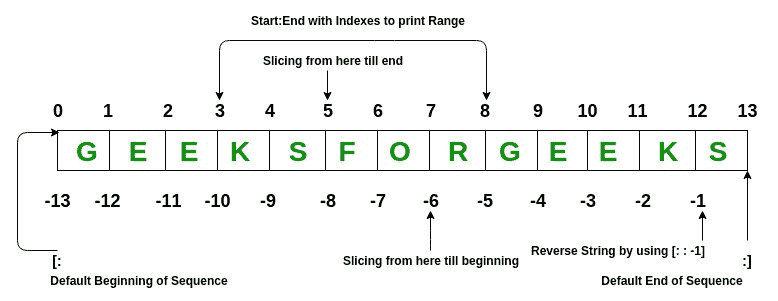
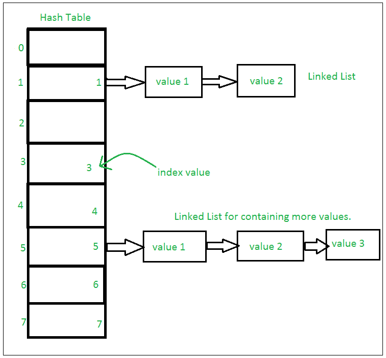
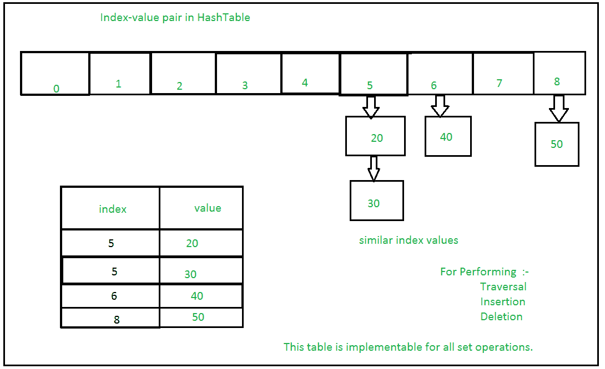
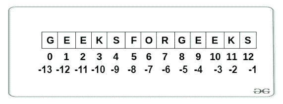

# Python 数据结构

> 原文:[https://www.geeksforgeeks.org/python-data-structures/](https://www.geeksforgeeks.org/python-data-structures/)

**数据结构**是一种组织方式，因此可以根据情况更有效地访问信息。数据结构是构建程序的任何编程语言的基础。与其他编程语言相比，Python 以更简单的方式帮助我们学习这些数据结构的基础。


在本文中，我们将讨论 Python 编程语言中的数据结构，以及它们如何与一些特定的 [Python 数据类型](https://www.geeksforgeeks.org/python-data-types/)相关联。我们将讨论所有的[内置数据结构](https://www.geeksforgeeks.org/inbuilt-data-structures-python/)，如列表元组、字典等。以及一些高级数据结构，如树、图等。

## 列表

[Python 列表](https://www.geeksforgeeks.org/python-list/)就像用其他语言声明的数组一样，是有序的数据集合。它非常灵活，因为列表中的项目不需要属于同一类型。

Python 列表的实现类似于 C++中的 Vectors 或者 JAVA 中的 ArrayList。代价高昂的操作是从列表的开头插入或删除元素，因为需要移动所有元素。在预分配的内存变满的情况下，列表末尾的插入和删除也会变得昂贵。

我们可以用 python 创建一个列表，如下所示。

### **示例:创建 Python 列表**

## 蟒蛇 3

```
List = [1, 2,  3, "GFG", 2.3]
print(List)
```

**Output**

```
[1, 2, 3, 'GFG', 2.3]
```

列表元素可以通过分配的索引来访问。在 python 中，列表的起始索引是 0，结束索引是(如果有 N 个元素)N-1。



### **示例:Python 列表操作**

## 蟒蛇 3

```
# Creating a List with
# the use of multiple values
List = ["Geeks", "For", "Geeks"]
print("\nList containing multiple values: ")
print(List)

# Creating a Multi-Dimensional List
# (By Nesting a list inside a List)
List2 = [['Geeks', 'For'], ['Geeks']]
print("\nMulti-Dimensional List: ")
print(List2)

# accessing a element from the 
# list using index number
print("Accessing element from the list")
print(List[0]) 
print(List[2])

# accessing a element using
# negative indexing
print("Accessing element using negative indexing")

# print the last element of list
print(List[-1])

# print the third last element of list 
print(List[-3])
```

**Output**

```
List containing multiple values: 
['Geeks', 'For', 'Geeks']

Multi-Dimensional List: 
[['Geeks', 'For'], ['Geeks']]
Accessing element from the list
Geeks
Geeks
Accessing element using negative indexing
Geeks
Geeks
```

## 词典

[Python 字典](https://www.geeksforgeeks.org/python-dictionary/)就像任何其他语言的哈希表，时间复杂度为 O(1)。它是一个无序的数据值集合，用于像映射一样存储数据值，与其他只保存单个值作为元素的数据类型不同，字典保存键:值对。字典中提供了键值，以使其更加优化。

Python 字典的索引是在键的帮助下完成的。这些都是任何可散列的类型，即一个对象，它永远不会像字符串、数字、元组等那样改变。我们可以用花括号({})或者[字典理解](https://www.geeksforgeeks.org/python-dictionary-comprehension/)来创建字典。

### **示例:Python 字典操作**

## 蟒蛇 3

```
# Creating a Dictionary
Dict = {'Name': 'Geeks', 1: [1, 2, 3, 4]}
print("Creating Dictionary: ")
print(Dict)

# accessing a element using key
print("Accessing a element using key:")
print(Dict['Name'])

# accessing a element using get()
# method
print("Accessing a element using get:")
print(Dict.get(1))

# creation using Dictionary comprehension
myDict = {x: x**2 for x in [1,2,3,4,5]}
print(myDict)
```

**Output**

```
Creating Dictionary: 
{'Name': 'Geeks', 1: [1, 2, 3, 4]}
Accessing a element using key:
Geeks
Accessing a element using get:
[1, 2, 3, 4]
{1: 1, 2: 4, 3: 9, 4: 16, 5: 25}
```

## 元组

[Python 元组](https://www.geeksforgeeks.org/python-tuples/)是 Python 对象的集合，很像一个列表，但是元组本质上是[不可变的](https://www.geeksforgeeks.org/why-do-we-need-immutables-in-python/)，即元组中的元素一旦创建就不能添加或移除。就像列表一样，元组也可以包含各种类型的元素。

在 Python 中，元组是通过放置由“逗号”分隔的值序列来创建的，使用或不使用括号来对数据序列进行分组。

**注意:**元组也可以用单个元素创建，但是有点棘手。括号中有一个元素是不够的，必须有一个尾随的“逗号”才能使它成为元组。

### 示例:Python 元组操作

## 蟒蛇 3

```
# Creating a Tuple with
# the use of Strings
Tuple = ('Geeks', 'For')
print("\nTuple with the use of String: ")
print(Tuple)

# Creating a Tuple with
# the use of list
list1 = [1, 2, 4, 5, 6]
print("\nTuple using List: ")
Tuple = tuple(list1)

# Accessing element using indexing
print("First element of tuple")
print(Tuple[0])

# Accessing element from last
# negative indexing
print("\nLast element of tuple")
print(Tuple[-1])

print("\nThird last element of tuple")
print(Tuple[-3])
```

**Output**

```
Tuple with the use of String: 
('Geeks', 'For')

Tuple using List: 
First element of tuple
1

Last element of tuple
6

Third last element of tuple
4
```

## 一组

[Python 集](https://www.geeksforgeeks.org/sets-in-python/)是一个有序的数据集合，它是可变的，不允许任何重复的元素。集合基本上用于包括成员资格测试和消除重复条目。这里使用的数据结构是哈希(Hashing)，这是一种在 O(1)中平均执行插入、删除和遍历的流行技术。

如果多个值出现在同一个索引位置，则该值被追加到该索引位置，以形成一个链表。在中，CPython 集合使用带有虚拟变量的字典来实现，其中键是对时间复杂度进行了更大优化的成员集合。

**设置实现:**



**对单个哈希表进行多次操作的集合:**



### 示例:Python 集合操作

## 蟒蛇 3

```
# Creating a Set with 
# a mixed type of values
# (Having numbers and strings)
Set = set([1, 2, 'Geeks', 4, 'For', 6, 'Geeks'])
print("\nSet with the use of Mixed Values")
print(Set)

# Accessing element using
# for loop
print("\nElements of set: ")
for i in Set:
    print(i, end =" ")
print()

# Checking the element
# using in keyword
print("Geeks" in Set)
```

**Output**

```
Set with the use of Mixed Values
{1, 2, 'Geeks', 4, 6, 'For'}

Elements of set: 
1 2 Geeks 4 6 For 
True
```

## 冻结集

[Python 中的冻结集](https://www.geeksforgeeks.org/frozenset-in-python/)是不可变的对象，它们只支持产生结果的方法和运算符，而不影响应用它们的一个或多个冻结集。虽然集合的元素可以随时修改，但冻结集合的元素在创建后保持不变。

如果没有传递任何参数，它将返回一个空的 frozenset。

## 蟒蛇 3

```
# Same as {"a", "b","c"}
normal_set = set(["a", "b","c"])

print("Normal Set")
print(normal_set)

# A frozen set
frozen_set = frozenset(["e", "f", "g"])

print("\nFrozen Set")
print(frozen_set)

# Uncommenting below line would cause error as
# we are trying to add element to a frozen set
# frozen_set.add("h")
```

**Output**

```
Normal Set
{'a', 'c', 'b'}

Frozen Set
frozenset({'g', 'e', 'f'})
```

## 线

[Python 字符串](https://www.geeksforgeeks.org/python-strings/)是表示 Unicode 字符的字节数组。简单来说，字符串是不可变的字符数组。Python 没有字符数据类型，单个字符只是长度为 1 的字符串。

**注意:**由于字符串是不可变的，修改字符串将导致创建新的副本。



### 示例:Python 字符串操作

## 蟒蛇 3

```
String = "Welcome to GeeksForGeeks"
print("Creating String: ")
print(String)

# Printing First character
print("\nFirst character of String is: ")
print(String[0])

# Printing Last character
print("\nLast character of String is: ")
print(String[-1])
```

**Output**

```
Creating String: 
Welcome to GeeksForGeeks

First character of String is: 
W

Last character of String is: 
s
```

## 字联

[Python Bytearray](https://www.geeksforgeeks.org/python-bytearray-function/) 给出了一个可变的整数序列，范围为 0 < = x < 256。

### 示例:Python 字节数组操作

## 蟒蛇 3

```
# Creating bytearray
a = bytearray((12, 8, 25, 2))
print("Creating Bytearray:")
print(a)

# accessing elements
print("\nAccessing Elements:", a[1])

# modifying elements
a[1] = 3
print("\nAfter Modifying:")
print(a)

# Appending elements
a.append(30)
print("\nAfter Adding Elements:")
print(a)
```

**Output**

```
Creating Bytearray:
bytearray(b'\x0c\x08\x19\x02')

Accessing Elements: 8

After Modifying:
bytearray(b'\x0c\x03\x19\x02')

After Adding Elements:
bytearray(b'\x0c\x03\x19\x02\x1e')
```

直到现在，我们已经研究了内置到核心 Python 中的所有数据结构。现在让我们更深入地研究 Python，看看集合模块，它提供了一些容器，这些容器在许多情况下都很有用，并且提供了比上面定义的函数更多的特性。

## 收藏模块

[Python 集合](https://www.geeksforgeeks.org/python-collections-module/)模块的引入是为了提高内置数据类型的功能。它提供了各种容器，让我们详细看看每一个。

### 计数器

A [计数器](https://www.geeksforgeeks.org/counters-in-python-set-1/)是字典的一个子类。它用于以无序字典的形式保存可迭代表中元素的计数，其中键表示可迭代表中的元素，值表示可迭代表中该元素的计数。这相当于一个包或多套其他语言。

### 示例:Python 计数器操作

## 蟒蛇 3

```
from collections import Counter

# With sequence of items
print(Counter(['B','B','A','B','C','A','B','B','A','C']))

# with dictionary
count = Counter({'A':3, 'B':5, 'C':2})
print(count)

count.update(['A', 1])
print(count)
```

**Output**

```
Counter({'B': 5, 'A': 3, 'C': 2})
Counter({'B': 5, 'A': 3, 'C': 2})
Counter({'B': 5, 'A': 4, 'C': 2, 1: 1})
```

### OrderedDict

一个[ordereddct](https://www.geeksforgeeks.org/ordereddict-in-python/)也是字典的一个子类，但是不像字典，它记住了键插入的顺序。

### 示例:Python 有序循环操作

## 蟒蛇 3

```
from collections import OrderedDict

print("Before deleting:\n")
od = OrderedDict()
od['a'] = 1
od['b'] = 2
od['c'] = 3
od['d'] = 4

for key, value in od.items():
    print(key, value)

print("\nAfter deleting:\n")
od.pop('c')
for key, value in od.items():
    print(key, value)

print("\nAfter re-inserting:\n")
od['c'] = 3
for key, value in od.items():
    print(key, value)
```

**Output**

```
Before deleting:

a 1
b 2
c 3
d 4

After deleting:

a 1
b 2
d 4

After re-inserting:

a 1
b 2
d 4
c 3
```

### DefaultDict(预设字典)

[DefaultDict](https://www.geeksforgeeks.org/defaultdict-in-python/) 用于为不存在且从不引发 KeyError 的键提供一些默认值。通过将数据类型作为参数传递，可以使用 DefaultDict()方法初始化其对象。

**注意:** default_factory 是为创建的字典提供默认值的函数。如果此参数不存在，则会引发键错误。

### 示例:Python 缺省字典操作

## 蟒蛇 3

```
from collections import defaultdict

# Defining the dict
d = defaultdict(int)

L = [1, 2, 3, 4, 2, 4, 1, 2]

# Iterate through the list
# for keeping the count
for i in L:

    # The default value is 0
    # so there is no need to
    # enter the key first
    d[i] += 1

print(d)
```

**Output**

```
defaultdict(<class 'int'>, {1: 2, 2: 3, 3: 1, 4: 2})
```

### 主席

A [ChainMap](https://www.geeksforgeeks.org/chainmap-in-python/) 将许多词典封装成一个单元，并返回一个词典列表。当需要找到一个关键字时，所有的字典都被逐个搜索，直到找到该关键字。

### 示例:Python 链图操作

## 蟒蛇 3

```
from collections import ChainMap

d1 = {'a': 1, 'b': 2}
d2 = {'c': 3, 'd': 4}
d3 = {'e': 5, 'f': 6}

# Defining the chainmap
c = ChainMap(d1, d2, d3)
print(c)

print(c['a'])
print(c['g'])
```

**输出**

```
ChainMap({'a': 1, 'b': 2}, {'c': 3, 'd': 4}, {'e': 5, 'f': 6})
1
```

```
KeyError: 'g'
```

### 名为双

一个[命名元组](https://www.geeksforgeeks.org/namedtuple-in-python/)返回一个元组对象，其中包含普通元组缺少的每个位置的名称。例如，考虑一个名为 student 的元组，其中第一个元素代表 fname，第二个元素代表 lname，第三个元素代表 DOB。假设为了调用 fname 而不是记住索引位置，您实际上可以通过使用 fname 参数来调用元素，那么访问元组元素将非常容易。该功能由名为“耦合”的提供。

### 示例:Python 命名的双重操作

## 蟒蛇 3

```
from collections import namedtuple

# Declaring namedtuple()
Student = namedtuple('Student',['name','age','DOB'])

# Adding values
S = Student('Nandini','19','2541997')

# Access using index
print ("The Student age using index is : ",end ="")
print (S[1])

# Access using name
print ("The Student name using keyname is : ",end ="")
print (S.name)
```

**Output**

```
The Student age using index is : 19
The Student name using keyname is : Nandini
```

### 双端队列

[Deque(双端队列)](https://www.geeksforgeeks.org/deque-in-python/)是一个优化列表，用于从容器的两侧进行更快的追加和弹出操作。与时间复杂度为 0(n)的列表相比，它为追加和弹出操作提供了 0(1)的时间复杂度。

Python Deque 是使用双链表实现的，因此随机访问元素的性能是 0(n)。

### 示例:Python 德格运算

## 蟒蛇 3

```
# importing "collections" for deque operations
import collections

# initializing deque
de = collections.deque([1,2,3])

# using append() to insert element at right end
# inserts 4 at the end of deque
de.append(4)

# printing modified deque
print("The deque after appending at right is : ")
print(de)

# using appendleft() to insert element at left end
# inserts 6 at the beginning of deque
de.appendleft(6)

# printing modified deque
print("The deque after appending at left is : ")
print(de)

# using pop() to delete element from right end
# deletes 4 from the right end of deque
de.pop()

# printing modified deque
print("The deque after deleting from right is : ")
print(de)

# using popleft() to delete element from left end
# deletes 6 from the left end of deque
de.popleft()

# printing modified deque
print("The deque after deleting from left is : ")
print(de)
```

**Output**

```
The deque after appending at right is : 
deque([1, 2, 3, 4])
The deque after appending at left is : 
deque([6, 1, 2, 3, 4])
The deque after deleting from right is : 
deque([6, 1, 2, 3])
The deque after deleting from left is : 
deque([1, 2, 3])
```

## UserDict(用户字典)

[UserDict](https://www.geeksforgeeks.org/collections-userdict-in-python/) 是一个类似字典的容器，充当字典对象的包装器。当有人想要创建他们自己的带有一些修改过的或新的功能的字典时，使用这个容器。

### 示例:Python 用户字典

## 蟒蛇 3

```
from collections import UserDict

# Creating a Dictionary where
# deletion is not allowed
class MyDict(UserDict):

    # Function to stop deletion
    # from dictionary
    def __del__(self):
        raise RuntimeError("Deletion not allowed")

    # Function to stop pop from
    # dictionary
    def pop(self, s = None):
        raise RuntimeError("Deletion not allowed")

    # Function to stop popitem
    # from Dictionary
    def popitem(self, s = None):
        raise RuntimeError("Deletion not allowed")

# Driver's code
d = MyDict({'a':1,
    'b': 2,
    'c': 3})

print("Original Dictionary")
print(d)

d.pop(1)
```

**输出**

```
Original Dictionary
{'a': 1, 'b': 2, 'c': 3}
```

```
RuntimeError: Deletion not allowed
```

### 用户列表

[用户列表](https://www.geeksforgeeks.org/collections-userlist-in-python/)是一个类似列表的容器，充当列表对象的包装器。当有人想要创建他们自己的带有一些修改或附加功能的列表时，这很有用。

### 示例:Python 用户列表

## 蟒蛇 3

```
# Python program to demonstrate
# userlist

from collections import UserList

# Creating a List where
# deletion is not allowed
class MyList(UserList):

    # Function to stop deletion
    # from List
    def remove(self, s = None):
        raise RuntimeError("Deletion not allowed")

    # Function to stop pop from
    # List
    def pop(self, s = None):
        raise RuntimeError("Deletion not allowed")

# Driver's code
L = MyList([1, 2, 3, 4])

print("Original List")
print(L)

# Inserting to List"
L.append(5)
print("After Insertion")
print(L)

# Deleting From List
L.remove()
```

**输出**

```
Original List
[1, 2, 3, 4]
After Insertion
[1, 2, 3, 4, 5]
```

```
RuntimeError: Deletion not allowed
```

### 用户字符串

[UserString](https://www.geeksforgeeks.org/collections-userstring-in-python/) 是一个类似字符串的容器，就像 UserDict 和 UserList 一样，它充当字符串对象的包装器。当有人想要创建他们自己的带有一些修改或附加功能的字符串时，就会用到它。

### 示例:Python 用户字符串

## 蟒蛇 3

```
from collections import UserString

# Creating a Mutable String
class Mystring(UserString):

    # Function to append to
    # string
    def append(self, s):
        self.data += s

    # Function to remove from
    # string
    def remove(self, s):
        self.data = self.data.replace(s, "")

# Driver's code
s1 = Mystring("Geeks")
print("Original String:", s1.data)

# Appending to string
s1.append("s")
print("String After Appending:", s1.data)

# Removing from string
s1.remove("e")
print("String after Removing:", s1.data)
```

**Output**

```
Original String: Geeks
String After Appending: Geekss
String after Removing: Gkss
```

现在在研究了所有的数据结构之后，让我们来看看一些高级的数据结构，比如堆栈、队列、图形、链表等等。可以在 Python 语言中使用。

## 链接列表

一个[链表](https://www.geeksforgeeks.org/linked-list-set-1-introduction/)是一个线性数据结构，其中元素不存储在连续的存储位置。链表中的元素使用指针进行链接，如下图所示:


链表由指向链表第一个节点的指针表示。第一个节点称为头部。如果链表为空，则头的值为空。列表中的每个节点至少由两部分组成:

*   数据
*   指向下一个节点的指针(或引用)

### 示例:在 Python 中定义链表

## 蟒蛇 3

```
# Node class
class Node:

    # Function to initialize the node object
    def __init__(self, data):
        self.data = data # Assign data
        self.next = None # Initialize
                        # next as null

# Linked List class
class LinkedList:

    # Function to initialize the Linked
    # List object
    def __init__(self):
        self.head = None
```

让我们创建一个有 3 个节点的简单链表。

## 蟒蛇 3

```
# A simple Python program to introduce a linked list

# Node class
class Node:

    # Function to initialise the node object
    def __init__(self, data):
        self.data = data # Assign data
        self.next = None # Initialize next as null

# Linked List class contains a Node object
class LinkedList:

    # Function to initialize head
    def __init__(self):
        self.head = None

# Code execution starts here
if __name__=='__main__':

    # Start with the empty list
    llist = LinkedList()

    llist.head = Node(1)
    second = Node(2)
    third = Node(3)

    '''
    Three nodes have been created.
    We have references to these three blocks as head,
    second and third

    llist.head     second             third
        |             |                 |
        |             |                 |
    +----+------+     +----+------+     +----+------+
    | 1 | None |     | 2 | None |     | 3 | None |
    +----+------+     +----+------+     +----+------+
    '''

    llist.head.next = second; # Link first node with second

    '''
    Now next of first Node refers to second. So they
    both are linked.

    llist.head     second             third
        |             |                 |
        |             |                 |
    +----+------+     +----+------+     +----+------+
    | 1 | o-------->| 2 | null |     | 3 | null |
    +----+------+     +----+------+     +----+------+
    '''

    second.next = third; # Link second node with the third node

    '''
    Now next of second Node refers to third. So all three
    nodes are linked.

    llist.head     second             third
        |             |                 |
        |             |                 |
    +----+------+     +----+------+     +----+------+
    | 1 | o-------->| 2 | o-------->| 3 | null |
    +----+------+     +----+------+     +----+------+
    '''
```

### 链表遍历

在之前的程序中，我们创建了一个简单的三节点链表。让我们遍历创建的列表并打印每个节点的数据。对于遍历，让我们编写一个通用函数 printList()，打印任何给定的列表。

## 蟒蛇 3

```
# A simple Python program for traversal of a linked list

# Node class
class Node:

    # Function to initialise the node object
    def __init__(self, data):
        self.data = data # Assign data
        self.next = None # Initialize next as null

# Linked List class contains a Node object
class LinkedList:

    # Function to initialize head
    def __init__(self):
        self.head = None

    # This function prints contents of linked list
    # starting from head
    def printList(self):
        temp = self.head
        while (temp):
            print (temp.data)
            temp = temp.next

# Code execution starts here
if __name__=='__main__':

    # Start with the empty list
    llist = LinkedList()

    llist.head = Node(1)
    second = Node(2)
    third = Node(3)

    llist.head.next = second; # Link first node with second
    second.next = third; # Link second node with the third node

    llist.printList()
```

**Output**

```
1
2
3
```

## 堆

一个[栈](https://www.geeksforgeeks.org/stack-in-python/)是一个线性数据结构，以后进先出(LIFO)或先进先出(FILO)的方式存储项目。在堆栈中，在一端添加一个新元素，并且只从该端移除一个元素。插入和删除操作通常称为推送和弹出。


与堆栈相关的功能有:

*   **空()–**返回堆栈是否为空–时间复杂度:O(1)
*   **大小()–**返回堆栈的大小–时间复杂度:O(1)
*   **top()–**返回对堆栈最顶层元素的引用–时间复杂度:O(1)
*   **推(a)–**将元素‘a’插入堆栈顶部–时间复杂度:O(1)
*   **pop()–**删除堆栈的最顶层元素–时间复杂度:O(1)

### Python 堆栈实现

Python 中的堆栈可以通过以下方式实现:

*   目录
*   Collections.deque
*   尾巴！尾巴！利沃夫伫列

**使用列表**实施

Python 内置的数据结构列表可以作为堆栈使用。使用 append()代替 push()，将元素添加到堆栈顶部，而 pop()按后进先出顺序移除元素。

## 蟒蛇 3

```
stack = []

# append() function to push
# element in the stack
stack.append('g')
stack.append('f')
stack.append('g')

print('Initial stack')
print(stack)

# pop() function to pop
# element from stack in
# LIFO order
print('\nElements popped from stack:')
print(stack.pop())
print(stack.pop())
print(stack.pop())

print('\nStack after elements are popped:')
print(stack)

# uncommenting print(stack.pop())
# will cause an IndexError
# as the stack is now empty
```

**Output**

```
Initial stack
['g', 'f', 'g']

Elements popped from stack:
g
f
g

Stack after elements are popped:
[]
```

**使用集合实现**

Python 堆栈可以使用集合模块中的 deque 类来实现。在我们需要从容器两端进行更快的追加和弹出操作的情况下，dequee 优于 list，因为 dequee 为追加和弹出操作提供了 O(1)的时间复杂度，而 list 提供了 O(n)的时间复杂度。

## 蟒蛇 3

```
from collections import deque

stack = deque()

# append() function to push
# element in the stack
stack.append('g')
stack.append('f')
stack.append('g')

print('Initial stack:')
print(stack)

# pop() function to pop
# element from stack in
# LIFO order
print('\nElements popped from stack:')
print(stack.pop())
print(stack.pop())
print(stack.pop())

print('\nStack after elements are popped:')
print(stack)

# uncommenting print(stack.pop())
# will cause an IndexError
# as the stack is now empty
```

**Output**

```
Initial stack:
deque(['g', 'f', 'g'])

Elements popped from stack:
g
f
g

Stack after elements are popped:
deque([])
```

**使用队列模块**实现

队列模块也有一个后进先出队列，它基本上是一个堆栈。使用 put()函数将数据插入队列，get()从队列中取出数据。

## 蟒蛇 3

```
from queue import LifoQueue

# Initializing a stack
stack = LifoQueue(maxsize = 3)

# qsize() show the number of elements
# in the stack
print(stack.qsize())

# put() function to push
# element in the stack
stack.put('g')
stack.put('f')
stack.put('g')

print("Full: ", stack.full())
print("Size: ", stack.qsize())

# get() function to pop
# element from stack in
# LIFO order
print('\nElements popped from the stack')
print(stack.get())
print(stack.get())
print(stack.get())

print("\nEmpty: ", stack.empty())
```

**Output**

```
0
Full:  True
Size:  3

Elements popped from the stack
g
f
g

Empty:  True
```

## 长队

作为堆栈，[队列](https://www.geeksforgeeks.org/queue-in-python/)是以先进先出(FIFO)方式存储项目的线性数据结构。有了队列，最近添加最少的项目将首先被删除。队列的一个很好的例子是资源的任何消费者队列，其中先到的消费者先被服务。


与队列相关联的操作有:

*   **入队:**向队列中添加一个项目。如果队列已满，则称其为溢出情况–时间复杂性:0(1)
*   **出列:**从队列中移除一个项目。项目按推送的相同顺序弹出。如果队列为空，则称其为下溢条件-时间复杂度:0(1)
*   **前置:**从队列中获取前置项目–时间复杂度:O(1)
*   **后方:**从队列中获取最后一个项目–时间复杂度:O(1)

### Python 队列实现

Python 中的队列可以通过以下方式实现:

*   目录
*   collections.deque
*   尾巴！尾巴！伫列

**使用列表实施**

使用 append()和 pop()函数代替了 enqueue()和出列()函数。

## 蟒蛇 3

```
# Initializing a queue
queue = []

# Adding elements to the queue
queue.append('g')
queue.append('f')
queue.append('g')

print("Initial queue")
print(queue)

# Removing elements from the queue
print("\nElements dequeued from queue")
print(queue.pop(0))
print(queue.pop(0))
print(queue.pop(0))

print("\nQueue after removing elements")
print(queue)

# Uncommenting print(queue.pop(0))
# will raise and IndexError
# as the queue is now empty
```

**Output**

```
Initial queue
['g', 'f', 'g']

Elements dequeued from queue
g
f
g

Queue after removing elements
[]
```

**使用集合实现**

在我们需要从容器两端进行更快的追加和弹出操作的情况下，dequee 优于 list，因为 dequee 为追加和弹出操作提供了 O(1)的时间复杂度，而 list 提供了 O(n)的时间复杂度。

## 蟒蛇 3

```
from collections import deque

# Initializing a queue
q = deque()

# Adding elements to a queue
q.append('g')
q.append('f')
q.append('g')

print("Initial queue")
print(q)

# Removing elements from a queue
print("\nElements dequeued from the queue")
print(q.popleft())
print(q.popleft())
print(q.popleft())

print("\nQueue after removing elements")
print(q)

# Uncommenting q.popleft()
# will raise an IndexError
# as queue is now empty
```

**Output**

```
Initial queue
deque(['g', 'f', 'g'])

Elements dequeued from the queue
g
f
g

Queue after removing elements
deque([])
```

**使用队列实现。队列**

排队。Queue(maxsize)将变量初始化为 maxsize 的最大大小。最大大小为零“0”意味着无限队列。该队列遵循先进先出规则。

## 蟒蛇 3

```
from queue import Queue

# Initializing a queue
q = Queue(maxsize = 3)

# qsize() give the maxsize
# of the Queue
print(q.qsize())

# Adding of element to queue
q.put('g')
q.put('f')
q.put('g')

# Return Boolean for Full
# Queue
print("\nFull: ", q.full())

# Removing element from queue
print("\nElements dequeued from the queue")
print(q.get())
print(q.get())
print(q.get())

# Return Boolean for Empty
# Queue
print("\nEmpty: ", q.empty())

q.put(1)
print("\nEmpty: ", q.empty())
print("Full: ", q.full())

# This would result into Infinite
# Loop as the Queue is empty.
# print(q.get())
```

**Output**

```
0

Full:  True

Elements dequeued from the queue
g
f
g

Empty:  True

Empty:  False
Full:  False
```

## 优先级队列

[优先级队列](https://www.geeksforgeeks.org/priority-queue-in-python/)是抽象的数据结构，队列中的每个数据/值都有一定的优先级。例如，在航空公司，标题为“商务”或“头等舱”的行李比其他行李更早到达。优先级队列是队列的扩展，具有以下属性。

*   优先级高的元素在优先级低的元素之前出队。
*   如果两个元素具有相同的优先级，则根据它们在队列中的顺序提供服务。

## 蟒蛇 3

```
# A simple implementation of Priority Queue
# using Queue.
class PriorityQueue(object):
    def __init__(self):
        self.queue = []

    def __str__(self):
        return ' '.join([str(i) for i in self.queue])

    # for checking if the queue is empty
    def isEmpty(self):
        return len(self.queue) == 0

    # for inserting an element in the queue
    def insert(self, data):
        self.queue.append(data)

    # for popping an element based on Priority
    def delete(self):
        try:
            max = 0
            for i in range(len(self.queue)):
                if self.queue[i] > self.queue[max]:
                    max = i
            item = self.queue[max]
            del self.queue[max]
            return item
        except IndexError:
            print()
            exit()

if __name__ == '__main__':
    myQueue = PriorityQueue()
    myQueue.insert(12)
    myQueue.insert(1)
    myQueue.insert(14)
    myQueue.insert(7)
    print(myQueue)           
    while not myQueue.isEmpty():
        print(myQueue.delete())
```

**Output**

```
12 1 14 7
14
12
7
1
```

## 堆队列

[Python 中的 heapq 模块](https://www.geeksforgeeks.org/heap-queue-or-heapq-in-python/)提供了堆数据结构，主要用于表示优先级队列。Python 中这种数据结构的属性是，每次弹出最小的堆元素(最小堆)。每当元素被推送或弹出时，堆结构都会得到维护。堆[0]元素每次也返回最小的元素。

它支持在 O(log n)次中提取和插入最小的元素。

## 蟒蛇 3

```
# importing "heapq" to implement heap queue
import heapq

# initializing list
li = [5, 7, 9, 1, 3]

# using heapify to convert list into heap
heapq.heapify(li)

# printing created heap
print ("The created heap is : ",end="")
print (list(li))

# using heappush() to push elements into heap
# pushes 4
heapq.heappush(li,4)

# printing modified heap
print ("The modified heap after push is : ",end="")
print (list(li))

# using heappop() to pop smallest element
print ("The popped and smallest element is : ",end="")
print (heapq.heappop(li))
```

**Output**

```
The created heap is : [1, 3, 9, 7, 5]
The modified heap after push is : [1, 3, 4, 7, 5, 9]
The popped and smallest element is : 1
```

## 二叉树

树是一种分层数据结构，如下图所示–

```
      tree
     ----
      j    <-- root
    /   \
   f      k  
 /   \      \
a     h      z    <-- leaves
```

树的最上面的节点称为根，而最下面的节点或没有子节点的节点称为叶节点。节点正下方的节点称为其子节点，正上方的节点称为父节点。

A [二叉树](https://www.geeksforgeeks.org/binary-tree-set-1-introduction/)是元素几乎可以有两个子的树。由于二叉树中的每个元素只能有两个子元素，我们通常将它们命名为左右子元素。二叉树节点包含以下部分。

*   数据
*   指向左边孩子的指针
*   指向右边孩子的指针

### 示例:定义节点类

## 蟒蛇 3

```
# A Python class that represents an individual node
# in a Binary Tree
class Node:
    def __init__(self,key):
        self.left = None
        self.right = None
        self.val = key
```

现在让我们用 Python 创建一个包含 4 个节点的树。让我们假设树形结构如下所示–

```
      tree
     ----
      1    <-- root
    /   \
   2     3  
  /  
 4
```

### 示例:向树中添加数据

## 蟒蛇 3

```
# Python program to introduce Binary Tree

# A class that represents an individual node in a
# Binary Tree
class Node:
    def __init__(self,key):
        self.left = None
        self.right = None
        self.val = key

# create root
root = Node(1)
''' following is the tree after above statement
        1
    / \
    None None'''

root.left     = Node(2);
root.right     = Node(3);

''' 2 and 3 become left and right children of 1
        1
        / \
        2     3
    / \ / \
None None None None'''

root.left.left = Node(4);
'''4 becomes left child of 2
        1
    /     \
    2         3
    / \     / \
4 None None None
/ \
None None'''
```

### 树遍历

[树木可以通过不同的方式穿越](https://www.geeksforgeeks.org/tree-traversals-inorder-preorder-and-postorder/)。以下是遍历树的常用方法。让我们考虑下面的树–

```
      tree
     ----
      1    <-- root
    /   \
   2     3  
  / \
 4   5
```

**深度第一次穿越:**

*   中间(左，根，右):4 2 5 1 3
*   前序(根，左，右):1 2 4 5 3
*   后序(左、右、根):4 5 2 3 1

**算法节点(树)**

*   遍历左子树，即调用 Inorder(左子树)
*   访问根。
*   遍历右子树，即调用 Inorder(右子树)

**算法预排序(树)**

*   访问根。
*   遍历左子树，即调用 Preorder(左子树)
*   遍历右子树，即调用 Preorder(右子树)

**算法后置(树)**

*   遍历左子树，即调用 Postorder(左子树)
*   遍历右子树，即调用 Postorder(右子树)
*   访问根。

## 蟒蛇 3

```
# Python program to for tree traversals

# A class that represents an individual node in a
# Binary Tree
class Node:
    def __init__(self, key):
        self.left = None
        self.right = None
        self.val = key

# A function to do inorder tree traversal
def printInorder(root):

    if root:

        # First recur on left child
        printInorder(root.left)

        # then print the data of node
        print(root.val),

        # now recur on right child
        printInorder(root.right)

# A function to do postorder tree traversal
def printPostorder(root):

    if root:

        # First recur on left child
        printPostorder(root.left)

        # the recur on right child
        printPostorder(root.right)

        # now print the data of node
        print(root.val),

# A function to do preorder tree traversal
def printPreorder(root):

    if root:

        # First print the data of node
        print(root.val),

        # Then recur on left child
        printPreorder(root.left)

        # Finally recur on right child
        printPreorder(root.right)

# Driver code
root = Node(1)
root.left = Node(2)
root.right = Node(3)
root.left.left = Node(4)
root.left.right = Node(5)
print("Preorder traversal of binary tree is")
printPreorder(root)

print("\nInorder traversal of binary tree is")
printInorder(root)

print("\nPostorder traversal of binary tree is")
printPostorder(root)
```

**Output**

```
Preorder traversal of binary tree is
1
2
4
5
3

Inorder traversal of binary tree is
4
2
5
1
3

Postorder traversal of binary tree is
4
5
2
3
1
```

时间复杂性–O(n)

**广度优先或层次顺序遍历**

[树的级序遍历](https://www.geeksforgeeks.org/level-order-tree-traversal/)是树的广度优先遍历。上述树的水平顺序遍历是 1 2 3 4 5。

对于每个节点，首先访问该节点，然后将其子节点放入先进先出队列。以下是相同的算法–

*   创建一个空队列 q
*   temp _ node = root/*从 root*开始/
*   当临时节点不为空时循环
    *   打印 temp_node->数据。
    *   将 temp_node 的子节点(先左后右的子节点)排队到 q
    *   将节点从队列中取出

## 蟒蛇 3

```
# Python program to print level
# order traversal using Queue

# A node structure
class Node:

    # A utility function to create a new node
    def __init__(self ,key):
        self.data = key
        self.left = None
        self.right = None

# Iterative Method to print the
# height of a binary tree
def printLevelOrder(root):

    # Base Case
    if root is None:
        return

    # Create an empty queue
    # for level order traversal
    queue = []

    # Enqueue Root and initialize height
    queue.append(root)

    while(len(queue) > 0):

        # Print front of queue and
        # remove it from queue
        print (queue[0].data)
        node = queue.pop(0)

        # Enqueue left child
        if node.left is not None:
            queue.append(node.left)

        # Enqueue right child
        if node.right is not None:
            queue.append(node.right)

# Driver Program to test above function
root = Node(1)
root.left = Node(2)
root.right = Node(3)
root.left.left = Node(4)
root.left.right = Node(5)

print ("Level Order Traversal of binary tree is -")
printLevelOrder(root)
```

**Output**

```
Level Order Traversal of binary tree is -
1
2
3
4
5
```

时间复杂度:0(n)

## 图表

A [图](https://www.geeksforgeeks.org/graph-and-its-representations/)是由节点和边组成的非线性数据结构。节点有时也称为顶点，边是连接图中任意两个节点的直线或圆弧。更正式地说，图可以定义为由一组有限的顶点(或节点)和一组连接一对节点的边组成的图。


在上图中，顶点集 V = {0，1，2，3，4}和边集 E = {01，12，23，34，04，14，13}。

以下两个是最常用的图形表示。

*   邻接矩阵
*   邻接表

### 邻接矩阵

邻接矩阵是一个大小为 V×V 的 2D 数组，其中 V 是图中的顶点数。设 2D 数组为 adj[][]，槽 adj[i][j] = 1 表示从顶点 I 到顶点 j 有一条边，无向图的邻接矩阵总是对称的。邻接矩阵也用于表示加权图。如果 adj[i][j] = w，那么从顶点 I 到顶点 j 有一条边，权重为 w。

## 蟒蛇 3

```
# A simple representation of graph using Adjacency Matrix
class Graph:
    def __init__(self,numvertex):
        self.adjMatrix = [[-1]*numvertex for x in range(numvertex)]
        self.numvertex = numvertex
        self.vertices = {}
        self.verticeslist =[0]*numvertex

    def set_vertex(self,vtx,id):
        if 0<=vtx<=self.numvertex:
            self.vertices[id] = vtx
            self.verticeslist[vtx] = id

    def set_edge(self,frm,to,cost=0):
        frm = self.vertices[frm]
        to = self.vertices[to]
        self.adjMatrix[frm][to] = cost

        # for directed graph do not add this
        self.adjMatrix[to][frm] = cost

    def get_vertex(self):
        return self.verticeslist

    def get_edges(self):
        edges=[]
        for i in range (self.numvertex):
            for j in range (self.numvertex):
                if (self.adjMatrix[i][j]!=-1):
                    edges.append((self.verticeslist[i],self.verticeslist[j],self.adjMatrix[i][j]))
        return edges

    def get_matrix(self):
        return self.adjMatrix

G =Graph(6)
G.set_vertex(0,'a')
G.set_vertex(1,'b')
G.set_vertex(2,'c')
G.set_vertex(3,'d')
G.set_vertex(4,'e')
G.set_vertex(5,'f')
G.set_edge('a','e',10)
G.set_edge('a','c',20)
G.set_edge('c','b',30)
G.set_edge('b','e',40)
G.set_edge('e','d',50)
G.set_edge('f','e',60)

print("Vertices of Graph")
print(G.get_vertex())

print("Edges of Graph")
print(G.get_edges())

print("Adjacency Matrix of Graph")
print(G.get_matrix())
```

**输出**

> 图的顶点
> 
> ['a '，' b '，' c '，' d '，' e '，' f '
> 
> 图的边
> 
> [('a '，' c '，20)、(' a '，' e '，10)、(' b '，' c '，30)、(' b '，' e '，40)、(' c '，' a '，20)、(' c '，' b '，30)、(' d '，' e '，50)、(' e '，' a '，10)、(' e '，' b '，40)、(' e '，' d '，50)、(' e '，' f '，60)、(' f '，' e '，60)]
> 
> 图的邻接矩阵
> 
> [[-1, -1, 20, -1, 10, -1], [-1, -1, 30, -1, 40, -1], [20, 30, -1, -1, -1, -1], [-1, -1, -1, -1, 50, -1], [10, 40, -1, 50, -1, 60], [-1, -1, -1, -1, 60, -1]]

### 邻接表

使用列表数组。数组的大小等于顶点的数量。让数组成为数组[]。条目数组[i]表示与第 I 个顶点相邻的顶点列表。这种表示也可以用来表示加权图。边的权重可以表示成对的列表。下面是上图的邻接表表示。


## 蟒蛇 3

```
# A class to represent the adjacency list of the node
class AdjNode:
    def __init__(self, data):
        self.vertex = data
        self.next = None

# A class to represent a graph. A graph
# is the list of the adjacency lists.
# Size of the array will be the no. of the
# vertices "V"
class Graph:
    def __init__(self, vertices):
        self.V = vertices
        self.graph = [None] * self.V

    # Function to add an edge in an undirected graph
    def add_edge(self, src, dest):

        # Adding the node to the source node
        node = AdjNode(dest)
        node.next = self.graph[src]
        self.graph[src] = node

        # Adding the source node to the destination as
        # it is the undirected graph
        node = AdjNode(src)
        node.next = self.graph[dest]
        self.graph[dest] = node

    # Function to print the graph
    def print_graph(self):
        for i in range(self.V):
            print("Adjacency list of vertex {}\n head".format(i), end="")
            temp = self.graph[i]
            while temp:
                print(" -> {}".format(temp.vertex), end="")
                temp = temp.next
            print(" \n")

# Driver program to the above graph class
if __name__ == "__main__":
    V = 5
    graph = Graph(V)
    graph.add_edge(0, 1)
    graph.add_edge(0, 4)
    graph.add_edge(1, 2)
    graph.add_edge(1, 3)
    graph.add_edge(1, 4)
    graph.add_edge(2, 3)
    graph.add_edge(3, 4)

    graph.print_graph()
```

**Output**

```
Adjacency list of vertex 0
 head -> 4 -> 1 

Adjacency list of vertex 1
 head -> 4 -> 3 -> 2 -> 0 

Adjacency list of vertex 2
 head -> 3 -> 1 

Adjacency list of vertex 3
 head -> 4 -> 2 -> 1 

Adjacency list of vertex 4
 head -> 3 -> 1 -> 0 
```

### 图遍历

**广度优先搜索或 BFS**

[图的广度优先遍历](https://www.geeksforgeeks.org/breadth-first-search-or-bfs-for-a-graph/)类似于树的广度优先遍历。这里唯一的问题是，与树不同，图可能包含循环，因此我们可能会再次来到同一个节点。为了避免多次处理一个节点，我们使用一个布尔访问数组。为简单起见，假设所有顶点都可以从起始顶点到达。

例如，在下图中，我们从顶点 2 开始遍历。当我们到达顶点 0 时，我们寻找它的所有相邻顶点。2 也是 0 的相邻顶点。如果我们不标记访问过的顶点，那么 2 将被再次处理，并且它将成为一个不终止的过程。下图的广度优先遍历是 2，0，3，1。


## 蟒蛇 3

```
# Python3 Program to print BFS traversal
# from a given source vertex. BFS(int s)
# traverses vertices reachable from s.
from collections import defaultdict

# This class represents a directed graph
# using adjacency list representation
class Graph:

    # Constructor
    def __init__(self):

        # default dictionary to store graph
        self.graph = defaultdict(list)

    # function to add an edge to graph
    def addEdge(self,u,v):
        self.graph[u].append(v)

    # Function to print a BFS of graph
    def BFS(self, s):

        # Mark all the vertices as not visited
        visited = [False] * (max(self.graph) + 1)

        # Create a queue for BFS
        queue = []

        # Mark the source node as
        # visited and enqueue it
        queue.append(s)
        visited[s] = True

        while queue:

            # Dequeue a vertex from
            # queue and print it
            s = queue.pop(0)
            print (s, end = " ")

            # Get all adjacent vertices of the
            # dequeued vertex s. If a adjacent
            # has not been visited, then mark it
            # visited and enqueue it
            for i in self.graph[s]:
                if visited[i] == False:
                    queue.append(i)
                    visited[i] = True

# Driver code

# Create a graph given in
# the above diagram
g = Graph()
g.addEdge(0, 1)
g.addEdge(0, 2)
g.addEdge(1, 2)
g.addEdge(2, 0)
g.addEdge(2, 3)
g.addEdge(3, 3)

print ("Following is Breadth First Traversal"
                " (starting from vertex 2)")
g.BFS(2)

# This code is contributed by Neelam Yadav
```

**Output**

```
Following is Breadth First Traversal (starting from vertex 2)
2 0 3 1 
```

时间复杂度:O(V+E)，其中 V 是图中的顶点数，E 是图中的边数。

**深度优先搜索或深度优先搜索**

[图的深度优先遍历](https://www.geeksforgeeks.org/depth-first-search-or-dfs-for-a-graph/)类似于树的深度优先遍历。这里唯一的问题是，与树不同，图可能包含循环，一个节点可能被访问两次。为了避免多次处理节点，请使用布尔访问数组。

**算法:**

*   创建一个递归函数，获取节点的索引和访问过的数组。
*   将当前节点标记为已访问，并打印该节点。
*   遍历所有相邻和未标记的节点，并使用相邻节点的索引调用递归函数。

## 蟒蛇 3

```
# Python3 program to print DFS traversal
# from a given given graph
from collections import defaultdict

# This class represents a directed graph using
# adjacency list representation

class Graph:

    # Constructor
    def __init__(self):

        # default dictionary to store graph
        self.graph = defaultdict(list)

    # function to add an edge to graph
    def addEdge(self, u, v):
        self.graph[u].append(v)

    # A function used by DFS
    def DFSUtil(self, v, visited):

        # Mark the current node as visited
        # and print it
        visited.add(v)
        print(v, end=' ')

        # Recur for all the vertices
        # adjacent to this vertex
        for neighbour in self.graph[v]:
            if neighbour not in visited:
                self.DFSUtil(neighbour, visited)

    # The function to do DFS traversal. It uses
    # recursive DFSUtil()
    def DFS(self, v):

        # Create a set to store visited vertices
        visited = set()

        # Call the recursive helper function
        # to print DFS traversal
        self.DFSUtil(v, visited)

# Driver code

# Create a graph given
# in the above diagram
g = Graph()
g.addEdge(0, 1)
g.addEdge(0, 2)
g.addEdge(1, 2)
g.addEdge(2, 0)
g.addEdge(2, 3)
g.addEdge(3, 3)

print("Following is DFS from (starting from vertex 2)")
g.DFS(2)
```

**Output**

```
Following is DFS from (starting from vertex 2)
2 0 1 3 
```

时间复杂度:O(V + E)，其中 V 是图的顶点数，E 是图的边数。