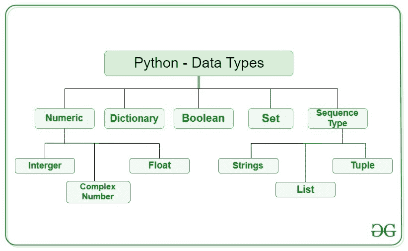
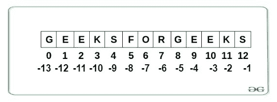

# Python 数据类型

> 原文:[https://www.geeksforgeeks.org/python-data-types/](https://www.geeksforgeeks.org/python-data-types/)

数据类型是数据项的分类或归类。它表示一种值，该值告诉可以对特定数据执行哪些操作。因为在 Python 编程中一切都是对象，所以数据类型实际上是类，变量是这些类的实例(对象)。

以下是 Python 的标准或内置数据类型:

*   **[数字](#numeric)**
*   **[序列类型](#Sequence)**
*   **[布尔](#boolean)**
*   **[设置](#set)**
*   **[字典](#dictionary)**



# 数字的

在 Python 中，数字数据类型表示具有数值的数据。数值可以是整数、浮点数甚至复数。这些值在 Python 中被定义为`int`、`float` 和`complex` 类。

*   **整数**–该值由 int 类表示。它包含正整数或负整数(没有分数或小数)。在 Python 中，整数值的长度没有限制。
*   **浮点**–该值由浮点类表示。它是一个用浮点表示的实数。它由小数点指定。可选地，字符 E 或 E 后跟一个正整数或负整数可以被附加以指定科学符号。
*   **复数**–复数用复数类表示。指定为*(实部)+(虚部)j* 。例如–2+3j

**注**–`type()`功能用于确定数据类型的类型。

## 蟒蛇 3

```
# Python program to 
# demonstrate numeric value

a = 5
print("Type of a: ", type(a))

b = 5.0
print("\nType of b: ", type(b))

c = 2 + 4j
print("\nType of c: ", type(c))
```

**输出:**

```
Type of a:  <class 'int'>

Type of b:  <class 'float'>

Type of c:  <class 'complex'>

```

# 序列类型

在 Python 中，序列是相似或不同数据类型的有序集合。序列允许以有组织和有效的方式存储多个值。Python 中有几种序列类型–

*   [弦](#string)
*   [列表](#list)
*   [元组](#tuple)

## 1)字符串

在 Python 中，[字符串](https://www.geeksforgeeks.org/python-strings/)是表示 Unicode 字符的字节数组。字符串是放在单引号、双引号或三引号中的一个或多个字符的集合。在 python 中没有字符数据类型，字符是长度为 1 的字符串。以`str` 类为代表。

#### 创建字符串

Python 中的字符串可以使用单引号、双引号甚至三引号来创建。

## 蟒蛇 3

```
# Python Program for 
# Creation of String 

# Creating a String  
# with single Quotes 
String1 = 'Welcome to the Geeks World'
print("String with the use of Single Quotes: ") 
print(String1) 

# Creating a String 
# with double Quotes 
String1 = "I'm a Geek"
print("\nString with the use of Double Quotes: ") 
print(String1) 
print(type(String1))

# Creating a String 
# with triple Quotes 
String1 = '''I'm a Geek and I live in a world of "Geeks"'''
print("\nString with the use of Triple Quotes: ") 
print(String1) 
print(type(String1))

# Creating String with triple 
# Quotes allows multiple lines 
String1 = '''Geeks 
            For 
            Life'''
print("\nCreating a multiline String: ") 
print(String1) 
```

**输出:**

```
String with the use of Single Quotes: 
Welcome to the Geeks World

String with the use of Double Quotes: 
I'm a Geek
<class 'str'>

String with the use of Triple Quotes: 
I'm a Geek and I live in a world of "Geeks"
<class 'str'>

Creating a multiline String: 
Geeks 
            For 
            Life

```

#### 访问字符串的元素

在 Python 中，字符串的单个字符可以通过使用索引方法来访问。索引允许负地址引用从字符串的后面访问字符，例如-1 表示最后一个字符，-2 表示倒数第二个字符，以此类推。



## 蟒蛇 3

```
# Python Program to Access 
# characters of String 

String1 = "GeeksForGeeks"
print("Initial String: ") 
print(String1) 

# Printing First character 
print("\nFirst character of String is: ") 
print(String1[0]) 

# Printing Last character 
print("\nLast character of String is: ") 
print(String1[-1]) 
```

**输出:**

```
Initial String: 
GeeksForGeeks

First character of String is: 
G

Last character of String is: 
s

```

**注意**–要了解更多关于琴弦的知识，请参考[蟒蛇弦](https://www.geeksforgeeks.org/python-strings/)。

## 2)列表

[列表](https://www.geeksforgeeks.org/python-list/)就像数组一样，用其他语言声明，是有序的数据集合。它非常灵活，因为列表中的项目不需要属于同一类型。

#### 创建列表

Python 中的列表可以通过将序列放在方括号`[]`中来创建。

## 蟒蛇 3

```
# Python program to demonstrate  
# Creation of List  

# Creating a List 
List = [] 
print("Initial blank List: ") 
print(List) 

# Creating a List with  
# the use of a String 
List = ['GeeksForGeeks'] 
print("\nList with the use of String: ") 
print(List) 

# Creating a List with 
# the use of multiple values 
List = ["Geeks", "For", "Geeks"] 
print("\nList containing multiple values: ") 
print(List[0])  
print(List[2]) 

# Creating a Multi-Dimensional List 
# (By Nesting a list inside a List) 
List = [['Geeks', 'For'], ['Geeks']] 
print("\nMulti-Dimensional List: ") 
print(List) 
```

**输出:**

```
Initial blank List: 
[]

List with the use of String: 
['GeeksForGeeks']

List containing multiple values: 
Geeks
Geeks

Multi-Dimensional List: 
[['Geeks', 'For'], ['Geeks']]

```

#### 访问列表元素

为了访问列表项，请参考索引号。使用索引操作符`[ ]`访问列表中的项目。在 Python 中，负序索引表示从数组末尾开始的位置。不用像`List[len(List)-3]`那样计算偏移量，只写`List[-3]`就够了。负索引表示从末尾开始，-1 表示最后一项，-2 表示倒数第二项，等等。

## 蟒蛇 3

```
# Python program to demonstrate  
# accessing of element from list 

# Creating a List with 
# the use of multiple values 
List = ["Geeks", "For", "Geeks"] 

# accessing a element from the  
# list using index number 
print("Accessing element from the list") 
print(List[0])  
print(List[2]) 

# accessing a element using 
# negative indexing 
print("Accessing element using negative indexing") 

# print the last element of list 
print(List[-1]) 

# print the third last element of list  
print(List[-3]) 
```

**输出:**

```
Accessing element from the list
Geeks
Geeks
Accessing element using negative indexing
Geeks
Geeks

```

**注意**–要了解更多列表，请参考 [Python 列表。](https://www.geeksforgeeks.org/python-list/)

## 3)元组

就像列表一样，[元组](https://www.geeksforgeeks.org/python-tuples/)也是 Python 对象的有序集合。元组和列表的唯一区别是元组是不可变的，即元组创建后不能修改。以`tuple` 类为代表。

#### 创建元组

在 Python 中，[元组](https://www.geeksforgeeks.org/python-tuples/)是通过放置一个由“逗号”分隔的值序列来创建的，使用或不使用括号对数据序列进行分组。元组可以包含任意数量的元素和任意数据类型(如字符串、整数、列表等)。).

**注意:**元组也可以用单个元素创建，但是有点棘手。括号中有一个元素是不够的，必须有一个尾随的“逗号”才能使它成为元组。

## 蟒蛇 3

```
# Python program to demonstrate  
# creation of Set 

# Creating an empty tuple 
Tuple1 = () 
print("Initial empty Tuple: ") 
print (Tuple1) 

# Creating a Tuple with  
# the use of Strings 
Tuple1 = ('Geeks', 'For') 
print("\nTuple with the use of String: ") 
print(Tuple1) 

# Creating a Tuple with 
# the use of list 
list1 = [1, 2, 4, 5, 6] 
print("\nTuple using List: ") 
print(tuple(list1)) 

# Creating a Tuple with the 
# use of built-in function 
Tuple1 = tuple('Geeks') 
print("\nTuple with the use of function: ") 
print(Tuple1) 

# Creating a Tuple  
# with nested tuples 
Tuple1 = (0, 1, 2, 3) 
Tuple2 = ('python', 'geek') 
Tuple3 = (Tuple1, Tuple2) 
print("\nTuple with nested tuples: ") 
print(Tuple3) 
```

**输出:**

```
Initial empty Tuple: 
()

Tuple with the use of String: 
('Geeks', 'For')

Tuple using List: 
(1, 2, 4, 5, 6)

Tuple with the use of function: 
('G', 'e', 'e', 'k', 's')

Tuple with nested tuples: 
((0, 1, 2, 3), ('python', 'geek'))

```

**注**–不使用括号创建 Python 元组称为元组打包。

#### 访问元组的元素

为了访问元组项，请参考索引号。使用索引操作符`[ ]`访问元组中的项目。索引必须是整数。使用嵌套索引访问嵌套元组。

## 蟒蛇 3

```
# Python program to 
# demonstrate accessing tuple

tuple1 = tuple([1, 2, 3, 4, 5])

# Accessing element using indexing
print("First element of tuple")
print(tuple1[0])

# Accessing element from last
# negative indexing
print("\nLast element of tuple")
print(tuple1[-1])

print("\nThird last element of tuple")
print(tuple1[-3])
```

**输出:**

```
First element of tuple
1

Last element of tuple
5

Third last element of tuple
3

```

**注意**–要了解更多元组，请参考 [Python 元组](https://www.geeksforgeeks.org/python-tuples/)。

# 布尔代数学体系的

具有两个内置值之一的数据类型，`True` 或`False`。等于真的布尔对象是真的，等于假的对象是假的。但是非布尔对象也可以在布尔环境中进行评估，并确定为真或假。它由类`bool`表示。

**注意**–大写‘T’和‘F’的 True 和 False 都是有效的布尔值，否则 python 会抛出错误。

## 蟒蛇 3

```
# Python program to 
# demonstrate boolean type

print(type(True))
print(type(False))

print(type(true))
```

**输出:**

```
<class 'bool'>
<class 'bool'>

```

```
Traceback (most recent call last):
  File "/home/7e8862763fb66153d70824099d4f5fb7.py", line 8, in print(type(true))
NameError: name 'true' is not defined 
```

# 一组

在 Python 中，[集合](https://www.geeksforgeeks.org/python-sets/)是一个无序的数据类型集合，它是可迭代的、可变的，并且没有重复的元素。集合中元素的顺序是未定义的，尽管它可能由各种元素组成。

#### 创建集合

可以使用内置的`set()`函数创建集合，该函数带有一个可迭代的对象或一个序列，方法是将序列放在花括号内，用“逗号”分隔。集合中元素的类型不必相同，各种混合的数据类型值也可以传递给集合。

## 蟒蛇 3

```
# Python program to demonstrate  
# Creation of Set in Python 

# Creating a Set 
set1 = set() 
print("Initial blank Set: ") 
print(set1) 

# Creating a Set with  
# the use of a String 
set1 = set("GeeksForGeeks") 
print("\nSet with the use of String: ") 
print(set1) 

# Creating a Set with 
# the use of a List 
set1 = set(["Geeks", "For", "Geeks"]) 
print("\nSet with the use of List: ") 
print(set1) 

# Creating a Set with  
# a mixed type of values 
# (Having numbers and strings) 
set1 = set([1, 2, 'Geeks', 4, 'For', 6, 'Geeks']) 
print("\nSet with the use of Mixed Values") 
print(set1) 
```

**输出:**

```
Initial blank Set: 
set()

Set with the use of String: 
{'F', 'o', 'G', 's', 'r', 'k', 'e'}

Set with the use of List: 
{'Geeks', 'For'}

Set with the use of Mixed Values
{1, 2, 4, 6, 'Geeks', 'For'}

```

#### 访问集合的元素

集合项不能通过引用索引来访问，因为集合是无序的，项没有索引。但是您可以使用 for 循环遍历集合项，或者使用`in` 关键字询问集合中是否存在指定的值。

## 蟒蛇 3

```
# Python program to demonstrate 
# Accessing of elements in a set 

# Creating a set 
set1 = set(["Geeks", "For", "Geeks"]) 
print("\nInitial set") 
print(set1) 

# Accessing element using 
# for loop 
print("\nElements of set: ") 
for i in set1: 
    print(i, end =" ") 

# Checking the element 
# using in keyword 
print("Geeks" in set1) 
```

**输出:**

```
Initial set: 
{'Geeks', 'For'}

Elements of set: 
Geeks For 

True

```

**注–**要了解更多套装，请参考[蟒蛇套装](https://www.geeksforgeeks.org/python-sets/)。

# 词典

[Python 中的字典](https://www.geeksforgeeks.org/python-dictionary/)是一个无序的数据值集合，用于像地图一样存储数据值，与其他只保存单个值作为元素的数据类型不同，字典保存`key:value` 对。字典中提供了键值，以使其更加优化。字典中的每个键值对由冒号`:`分隔，而每个键由“逗号”分隔。

#### 创建词典

在 Python 中，字典可以通过将一系列元素放在花括号`{}`中来创建，用“逗号”分隔。字典中的值可以是任何数据类型，并且可以重复，而关键字不能重复，并且必须是不可变的。字典也可以通过内置功能 `dict()`创建。只需将空字典放在大括号{}中，就可以创建一个空字典。

**注意**–字典键区分大小写，同名但不同大小写的键将被区别对待。

## 蟒蛇 3

```
# Creating an empty Dictionary 
Dict = {} 
print("Empty Dictionary: ") 
print(Dict) 

# Creating a Dictionary  
# with Integer Keys 
Dict = {1: 'Geeks', 2: 'For', 3: 'Geeks'} 
print("\nDictionary with the use of Integer Keys: ") 
print(Dict) 

# Creating a Dictionary  
# with Mixed keys 
Dict = {'Name': 'Geeks', 1: [1, 2, 3, 4]} 
print("\nDictionary with the use of Mixed Keys: ") 
print(Dict) 

# Creating a Dictionary 
# with dict() method 
Dict = dict({1: 'Geeks', 2: 'For', 3:'Geeks'}) 
print("\nDictionary with the use of dict(): ") 
print(Dict) 

# Creating a Dictionary 
# with each item as a Pair 
Dict = dict([(1, 'Geeks'), (2, 'For')]) 
print("\nDictionary with each item as a pair: ") 
print(Dict) 
```

**输出:**

```
Empty Dictionary: 
{}

Dictionary with the use of Integer Keys: 
{1: 'Geeks', 2: 'For', 3: 'Geeks'}

Dictionary with the use of Mixed Keys: 
{1: [1, 2, 3, 4], 'Name': 'Geeks'}

Dictionary with the use of dict(): 
{1: 'Geeks', 2: 'For', 3: 'Geeks'}

Dictionary with each item as a pair: 
{1: 'Geeks', 2: 'For'}

```

#### 访问字典的元素

为了访问字典的条目，请参考它的关键字名称。键可以用在方括号内。还有一种叫做`get()`的方法，也有助于从字典中访问元素。

## 蟒蛇 3

```
# Python program to demonstrate   
# accessing a element from a Dictionary  

# Creating a Dictionary  
Dict = {1: 'Geeks', 'name': 'For', 3: 'Geeks'} 

# accessing a element using key 
print("Accessing a element using key:") 
print(Dict['name']) 

# accessing a element using get() 
# method 
print("Accessing a element using get:") 
print(Dict.get(3)) 
```

**输出:**

```
Accessing a element using key:
For
Accessing a element using get:
Geeks

```