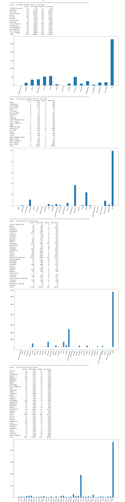

# Python–使用 covid19 印度 API 的数据可视化

> 原文:[https://www . geesforgeks . org/python-数据-可视化-使用-covid19-india-api/](https://www.geeksforgeeks.org/python-data-visualization-using-covid19-india-api/)

**API(应用编程接口)**是多个软件之间交互的计算接口。

**JSON (JavaScript 对象符号)**是一种用于存储和传输数据的轻量级格式。它用于将数据从服务器发送到网络。

**所需模块:**

*   马特普洛特利布
*   要求
*   熊猫
*   json

**安装模块的命令:**

```py
pip install matplotlib
pip install requests
pip install pandas
```

**步骤:**

1.  正在导入所有必需的模块。
2.  调用 API，获取 JSON 数据。
3.  获取州智慧区数据。
4.  数据可视化。

以下网址将您重定向至美国石油学会[https://api.covid19india.org/state_district_wise.json](https://api.covid19india.org/state_district_wise.json)

**导入所有需要的模块**

## 蟒蛇 3

```py
#importing modules
import json
import requests
import pandas as pd
import matplotlib.pyplot as plt
```

**从 API 获取 JSON 数据和数据可视化的功能**

## 蟒蛇 3

```py
#storing the url in the form of string
url="https://api.covid19india.org/state_district_wise.json"

#function to get data from api
def casesData():
    #getting the json data by calling api
    data = ((requests.get(url)).json())
    states = []
```

**获取 JSON 数据中可用的州名**

## 蟒蛇 3

```py
# getting statewise data
for state in states:
        f = (data[state]['districtData'])
# states data available in JSON Data
'''
0 State Unassigned
1 Andaman and Nicobar Islands
2 Andhra Pradesh
3 Arunachal Pradesh
4 Assam
5 Bihar
6 Chandigarh
7 Chhattisgarh
8 Delhi
9 Dadra and Nagar Haveli and Daman and Diu
10 Goa
11 Gujarat
12 Himachal Pradesh
13 Haryana
14 Jharkhand
15 Jammu and Kashmir
16 Karnataka
17 Kerala
18 Ladakh
19 Lakshadweep
20 Maharashtra
21 Meghalaya
22 Manipur
23 Madhya Pradesh
24 Mizoram
25 Nagaland
26 Odisha
27 Punjab
28 Puducherry
29 Rajasthan
30 Sikkim
31 Telangana
32 Tamil Nadu
33 Tripura
34 Uttar Pradesh
35 Uttarakhand
36 West Bengal
'''
```

**获取状态数据**

## 蟒蛇 3

```py
# getting statewise data
for state in states:
    f = (data[state]['districtData'])
    tc = []
    dis = []
    act, con, dea, rec = 0, 0, 0, 0

    # getting districtwise data
    for key in (data[state]['districtData']).items():
        district = key[0]
        dis.append(district)
        active = data[state]['districtData'][district]['active']
        confirmed = data[state]['districtData'][district]['confirmed']
        deaths = data[state]['districtData'][district]['deceased']
        recovered = data[state]['districtData'][district]['recovered']
        if district == 'Unknown':
            active, confirmed, deaths, recovered = 0, 0, 0, 0
        tc.append([active, confirmed, deaths, recovered])
        act = act + active
        con = con + confirmed
        dea = dea + deaths
        rec = rec + recovered
    tc.append([act, con, dea, rec])
    dis.append('Total')
    parameters = ['Active', 'Confirmed', 'Deaths', 'Recovered']
```

**使用熊猫创建数据帧**

## 蟒蛇 3

```py
# creating a dataframe
df = pd.DataFrame(tc, dis, parameters)
print('COVID - 19', state, 'District Wise Data')
print(df)
```

**使用 Matplotlib 的数据可视化**

## 蟒蛇 3

```py
# plotting of data
plt.bar(dis, df['Active'], width=0.5, align='center')
fig = plt.gcf()
fig.set_size_inches(18.5, 10.5)
plt.xticks(rotation=75)
plt.show()
print('*'*100)
```

**最终案例数据()功能代码**

## 蟒蛇 3

```py
# function to get data from api
def casesData():
    # getting the json data by calling api
    data = ((requests.get(url)).json())
    states = []

    # getting states
    for key in data.items():
        states.append(key[0])

    # getting statewise data
    for state in states:
        f = (data[state]['districtData'])
        tc = []
        dis = []
        act, con, dea, rec = 0, 0, 0, 0

        # getting districtwise data
        for key in (data[state]['districtData']).items():
            district = key[0]
            dis.append(district)
            active = data[state]['districtData'][district]['active']
            confirmed = data[state]['districtData'][district]['confirmed']
            deaths = data[state]['districtData'][district]['deceased']
            recovered = data[state]['districtData'][district]['recovered']
            if district == 'Unknown':
                active, confirmed, deaths, recovered = 0, 0, 0, 0
            tc.append([active, confirmed, deaths, recovered])
            act = act + active
            con = con + confirmed
            dea = dea + deaths
            rec = rec + recovered
        tc.append([act, con, dea, rec])
        dis.append('Total')
        parameters = ['Active', 'Confirmed', 'Deaths', 'Recovered']

        # creating a dataframe
        df = pd.DataFrame(tc, dis, parameters)
        print('COVID - 19', state, 'District Wise Data')
        print(df)

        # plotting of data
        plt.bar(dis, df['Active'], width=0.5, align='center')
        fig = plt.gcf()
        fig.set_size_inches(18.5, 10.5)
        plt.xticks(rotation = 75)
        plt.show()
        print('*' * 100)
```

### **最终实施:**

## 蟒蛇 3

```py
# importing modules
import json
import requests
import pandas as pd
import matplotlib.pyplot as plt

# storing the url in the form of string
url = "https://api.covid19india.org/state_district_wise.json"

# function to get data from api

def casesData():
    # getting the json data by calling api
    data = ((requests.get(url)).json())
    states = []

    # getting states
    for key in data.items():
        states.append(key[0])

    # getting statewise data
    for state in states:
        f = (data[state]['districtData'])
        tc = []
        dis = []
        act, con, dea, rec = 0, 0, 0, 0

        # getting districtwise data
        for key in (data[state]['districtData']).items():
            district = key[0]
            dis.append(district)
            active    = data[state]['districtData'][district]['active']
            confirmed = data[state]['districtData'][district]['confirmed']
            deaths    = data[state]['districtData'][district]['deceased']
            recovered = data[state]['districtData'][district]['recovered']
            if district == 'Unknown':
                active, confirmed, deaths, recovered = 0, 0, 0, 0
            tc.append([active, confirmed, deaths, recovered])
            act = act + active
            con = con + confirmed
            dea = dea + deaths
            rec = rec + recovered
        tc.append([act, con, dea, rec])
        dis.append('Total')
        parameters = ['Active', 'Confirmed', 'Deaths', 'Recovered']

        # creating a dataframe
        df = pd.DataFrame(tc, dis, parameters)
        print('COVID - 19', state, 'District Wise Data')
        print(df)

        # plotting of data
        plt.bar(dis, df['Active'], width = 0.5, align = 'center')
        fig = plt.gcf()
        fig.set_size_inches(18.5, 10.5)
        plt.xticks(rotation = 75)
        plt.show()
        print('*' * 100)

# states data available through API
'''
0 State Unassigned
1 Andaman and Nicobar Islands
2 Andhra Pradesh
3 Arunachal Pradesh
4 Assam
5 Bihar
6 Chandigarh
7 Chhattisgarh
8 Delhi
9 Dadra and Nagar Haveli and Daman and Diu
10 Goa
11 Gujarat
12 Himachal Pradesh
13 Haryana
14 Jharkhand
15 Jammu and Kashmir
16 Karnataka
17 Kerala
18 Ladakh
19 Lakshadweep
20 Maharashtra
21 Meghalaya
22 Manipur
23 Madhya Pradesh
24 Mizoram
25 Nagaland
26 Odisha
27 Punjab
28 Puducherry
29 Rajasthan
30 Sikkim
31 Telangana
32 Tamil Nadu
33 Tripura
34 Uttar Pradesh
35 Uttarakhand
36 West Bengal
'''

#Driver Code
casesData()
```

**输出:**

