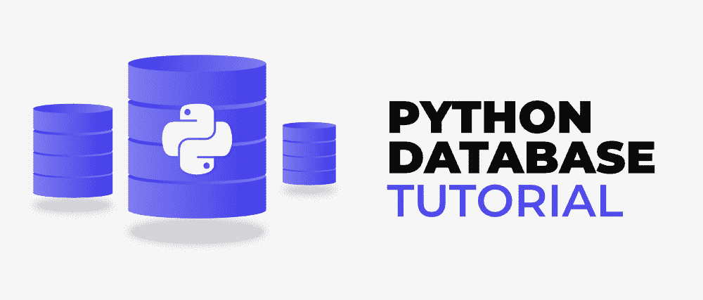

# Python 数据库教程

> 原文:[https://www.geeksforgeeks.org/python-database-tutorial/](https://www.geeksforgeeks.org/python-database-tutorial/)

Python 作为一种高级语言，为各种数据库提供支持。我们可以使用 Python 连接并运行特定数据库的查询，而无需在该特定数据库的终端或外壳中编写原始查询，我们只需要将该数据库安装在我们的系统中。

在本教程中，我们将讨论如何将 Python 与最常用的关系数据库(如 MySQL、SQLite、MongoDB 等 NoSQL 数据库)结合起来，我们还将讨论如何借助好的例子使用 Python 处理 JSON。

## python 语言

Python MySQL Connector 是一个 Python 驱动程序，有助于集成 Python 和 MySQL。这个 Python MySQL 库允许 Python 和 MySQL 数据类型之间的转换。MySQL Connector API 使用纯 Python 实现，不需要任何第三方库。

### 介绍

*   [安装 Python MySQL 连接器](https://www.geeksforgeeks.org/how-to-install-mysql-connector-package-in-python/)
*   [Python 中的 MySQL-Connector-Python 模块](https://www.geeksforgeeks.org/mysql-connector-python-module-in-python/)
*   [使用 MySQL-Connector Python 连接 MySQL 数据库](https://www.geeksforgeeks.org/connect-mysql-database-using-mysql-connector-python/)

### Python MySQL 查询

*   [Python MySQL–创建数据库](https://www.geeksforgeeks.org/python-mysql-create-database/)
*   [Python: MySQL 创建表](https://www.geeksforgeeks.org/python-mysql-create-table/)
*   [Python MySQL–插入表格](https://www.geeksforgeeks.org/python-mysql-insert-into-table/)
*   [Python MySQL–选择查询](https://www.geeksforgeeks.org/python-mysql-select-query/)
*   [Python MySQL–Where 子句](https://www.geeksforgeeks.org/pyhton-mysql-where-clause/)
*   [Python MySQL–订单条款](https://www.geeksforgeeks.org/python-mysql-order-by-clause/)
*   [Python MySQL–删除查询](https://www.geeksforgeeks.org/python-mysql-delete-query/)
*   [Python MySQL–拖放表](https://www.geeksforgeeks.org/python-mysql-drop-table/)
*   [Python MySQL–更新查询](https://www.geeksforgeeks.org/python-mysql-update-query/)
*   [Python MySQL–限制条款](https://www.geeksforgeeks.org/python-mysql-limit-clause/)
*   [Python MySQL–加入](https://www.geeksforgeeks.org/python-mysql-join/)
*   [在 Python 中提交&回滚操作](https://www.geeksforgeeks.org/commit-rollback-operation-in-python/)

**注:**更多信息请参考我们详细的 [Python MySQL 教程](https://www.geeksforgeeks.org/python-mysql/)

## Python SQLite

Python SQLite3 模块用于将 SQLite 数据库与 Python 集成。它是一个标准化的 Python DBI API 2.0，为与 SQLite 数据库交互提供了一个简单明了的界面。不需要单独安装这个模块，因为它是在 2.5x 版本之后与 Python 一起提供的。

### 介绍

*   [Python 中 SQLite 的介绍](https://www.geeksforgeeks.org/introduction-to-sqlite-in-python/)
*   [Python SQlite–连接到数据库](https://www.geeksforgeeks.org/python-sqlite-connecting-to-database/)
*   [SQLite 数据类型及其对应的 Python 类型](https://www.geeksforgeeks.org/sqlite-datatypes-and-its-corresponding-python-types/)

### Python SQLite 查询

*   [Python SQlite–光标对象](https://www.geeksforgeeks.org/python-sqlite-cursor-object/)
*   [Python SQlite–创建表格](https://www.geeksforgeeks.org/python-sqlite-create-table/)
*   [Python SQLite–插入数据](https://www.geeksforgeeks.org/python-sqlite-insert-data/)
*   [Python SQLite–从表中选择数据](https://www.geeksforgeeks.org/python-sqlite-select-data-from-table/)
*   [Python SQlite–WHERE 子句](https://www.geeksforgeeks.org/python-sqlite-where-clause/)
*   [Python SQlite–订单条款](https://www.geeksforgeeks.org/python-sqlite-order-by-clause/)
*   [Python SQlite–限制条款](https://www.geeksforgeeks.org/python-sqlite-limit-clause/)
*   [Python SQlite–JOIN 子句](https://www.geeksforgeeks.org/python-sqlite-join-clause/)
*   [Python SQLite–删除表中的数据](https://www.geeksforgeeks.org/python-sqlite-deleting-data-in-table/)
*   [Python SQlite–DROP 表](https://www.geeksforgeeks.org/python-sqlite-drop-table/)
*   [Python SQLite–更新数据](https://www.geeksforgeeks.org/python-sqlite-update-data/)
*   [Python SQLite–更新特定列](https://www.geeksforgeeks.org/python-sqlite-update-specific-column/)

**注意:**更多信息请参考我们详细的 [Python SQLite3 教程](https://www.geeksforgeeks.org/python-mysql/)

## 蟒蛇 JSON

对象符号是一种结构化数据的格式。它主要用于在浏览器和服务器之间存储和传输数据。Python 也通过一个名为 json 的内置包支持 JSON。这个包提供了使用 JSON 对象的所有必要工具，包括解析、序列化、反序列化等等。

### 介绍

*   [什么是 JSON？](https://www.geeksforgeeks.org/javascript-json/)
*   [JSON 中的数据类型](https://www.geeksforgeeks.org/json-data-types/)
*   [使用 Python 中的 JSON 数据](https://www.geeksforgeeks.org/working-with-json-data-in-python/)

### python JSON——读写

*   [用 Python 将 JSON 读写到文件中](https://www.geeksforgeeks.org/reading-and-writing-json-to-a-file-in-python/)
*   [使用 Python 追加到 JSON 文件中](https://www.geeksforgeeks.org/append-to-json-file-using-python/)

### 解析 JSON

*   [如何将数据从 JSON 解析成 Python？](https://www.geeksforgeeks.org/how-to-parse-data-from-json-into-python/)
*   [如何将 Python 字典转换为 JSON？](https://www.geeksforgeeks.org/how-to-convert-python-dictionary-to-json/)
*   [Python–将 JSON 转换为字符串](https://www.geeksforgeeks.org/python-convert-json-to-string/)
*   [将字符串转换为 json 对象的方法](https://www.geeksforgeeks.org/python-ways-to-convert-string-to-json-object/)
*   [将 JSON 数据转换成自定义 Python 对象](https://www.geeksforgeeks.org/convert-json-data-into-a-custom-python-object/)

### python JSON–序列化和反序列化

*   [在 Python 中序列化 JSON](https://www.geeksforgeeks.org/serializing-json-data-in-python/)
*   [Python 中的 json.dump()](https://www.geeksforgeeks.org/json-dump-in-python/)
*   [Python 中的 json.dumps()](https://www.geeksforgeeks.org/json-dumps-in-python/)
*   [Python–JSON . dump()和 JSON . dump()](https://www.geeksforgeeks.org/python-difference-between-json-dump-and-json-dumps/)的区别
*   [在 Python 中将 JSON 反序列化为对象](https://www.geeksforgeeks.org/deserialize-json-to-object-in-python/)
*   [Python 中的 json.load()](https://www.geeksforgeeks.org/json-load-in-python/)
*   [Python 中的 json.loads()](https://www.geeksforgeeks.org/json-loads-in-python/)
*   [JSON . load()和 json.loads()](https://www.geeksforgeeks.org/python-difference-between-json-load-and-json-loads/) 的区别
*   [Python-JSON 中自定义对象的编码和解码](https://www.geeksforgeeks.org/encoding-and-decoding-custom-objects-in-python-json/)
*   [在 Python 中序列化和反序列化复杂的 JSON](https://www.geeksforgeeks.org/serialize-and-deserialize-complex-json-in-python/)

## Python MongoDB

MongoDB 是最流行的 NoSQL 数据库之一。它是一个跨平台、面向对象的数据库。基本上，NoSQL 意味着 MongoDB 不以表或关系格式存储数据，而是提供不同的数据存储和检索机制。这叫做 BSON，类似于 JSON。这就是为什么 MongoDB 提供高速、高可用性和高可扩展性。

### 介绍

*   [MongoDB 和 Python](https://www.geeksforgeeks.org/mongodb-and-python/)
*   [Python 安装 MongoDB 指南| Windows](https://www.geeksforgeeks.org/guide-install-mongodb-python-windows/)
*   [什么是 PyMongo 光标？](https://www.geeksforgeeks.org/what-is-a-pymongo-cursor/)
*   [使用 Python 在 MongoDB 中创建数据库](https://www.geeksforgeeks.org/create-a-database-in-mongodb-using-python/)

### Python MongoDB 查询

*   [什么是 MongoDB 查询？](https://www.geeksforgeeks.org/python-mongodb-query/)
*   [插入和更新数据查询](http://geeksforgeeks.org/mongodb-python-insert-update-data/)
*   [插入 _ 一个查询](https://www.geeksforgeeks.org/python-mongodb-insert_one-query/)
*   [插入 _ 多次查询](https://www.geeksforgeeks.org/python-mongodb-insert_many-query/)
*   [Pymongo 中 insert、insert_one 和 insert _ multi 查询的区别](https://www.geeksforgeeks.org/difference-between-insert-insertone-and-insertmany-in-pymongo/)
*   [更新 _ 一次查询](https://www.geeksforgeeks.org/python-mongodb-update_one/)
*   [更新 _ 多次查询](https://www.geeksforgeeks.org/python-mongodb-update_many-query/)
*   [插入、替换一个、替换多个查询](http://geeksforgeeks.org/mongodb-python-insert-replace_one-replace_many/)
*   [删除数据并删除采集](http://geeksforgeeks.org/mongodb-python-delete-data-drop-collection/)
*   [删除 _ 一个查询](https://www.geeksforgeeks.org/python-mongodb-delete_one/)
*   [删除 _ 多次查询](https://www.geeksforgeeks.org/python-mongodb-delete_many/)
*   [查找查询](http://geeksforgeeks.org/python-mongodb-find/)
*   [查找 _ 一个查询](https://www.geeksforgeeks.org/python-mongodb-find_one-query/)
*   [查找一并更新查询](https://www.geeksforgeeks.org/python-mongodb-find_one_and_update-query/)
*   [find_one_and_delete 查询](https://www.geeksforgeeks.org/python-mongoddb-find_one_and_delete-query/)
*   [查找 _ 一 _ 替换查询](https://www.geeksforgeeks.org/python-mongodb-find_one_and_replace-query/)
*   [排序查询](http://geeksforgeeks.org/python-mongodb-sort/)
*   [不同查询](https://www.geeksforgeeks.org/python-mongodb-distinct/)
*   [重命名查询](https://www.geeksforgeeks.org/python-mongodb-rename/)
*   [批量 _ 写查询](https://www.geeksforgeeks.org/python-mongodb-bulk_write/)
*   [$组(聚合)操作](https://www.geeksforgeeks.org/python-mongodb-group-aggregation/)
*   [限额查询](https://www.geeksforgeeks.org/python-mongodb-limit-query/)
*   [PyMongo 中的嵌套查询](https://www.geeksforgeeks.org/nested-queries-in-pymongo/)

### Python MongoDB 索引

*   [使用 Python 在 MongoDB 中进行索引](https://www.geeksforgeeks.org/indexing-in-mongodb-using-python/)
*   [Python MongoDB–创建 _ 索引查询](https://www.geeksforgeeks.org/python-mongodb-create_index-query/)
*   [如何用 Python 为 MongoDB Collection 创建索引？](https://www.geeksforgeeks.org/how-to-create-index-for-mongodb-collection-using-python/)
*   [使用 PyMongo](https://www.geeksforgeeks.org/get-all-the-information-of-a-collections-indexes-using-pymongo/) 获取集合索引的所有信息
*   [drop_index 查询](https://www.geeksforgeeks.org/python-mongodb-drop_index-query/)
*   [如何使用 PyMongo 删除集合中的所有索引？](https://www.geeksforgeeks.org/how-to-drop-all-the-indexes-in-a-collection-using-pymongo/)
*   [如何用 PyMongo 重建一个集合的所有索引？](https://www.geeksforgeeks.org/how-to-rebuild-all-the-indexes-of-a-collection-using-pymongo/)