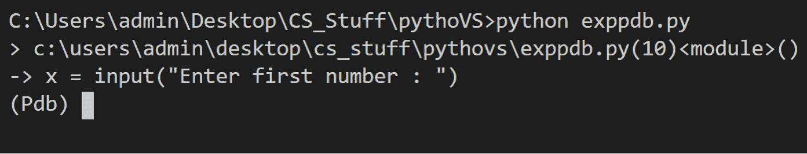
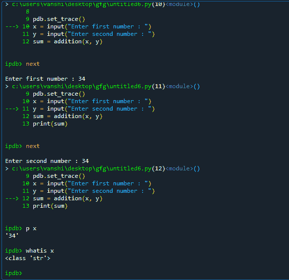
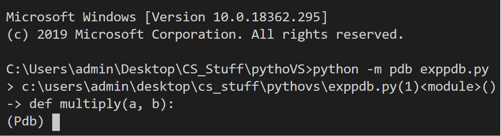
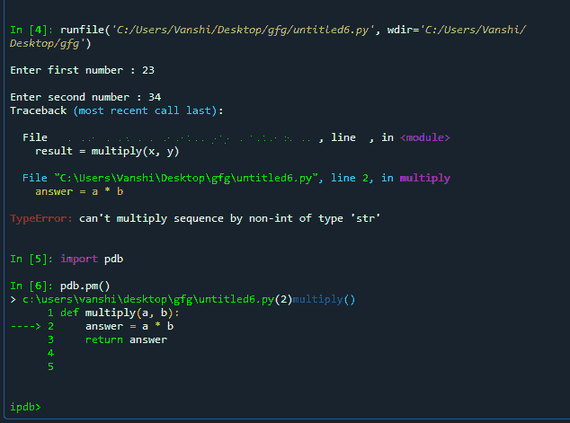
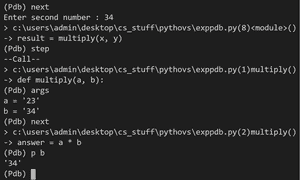
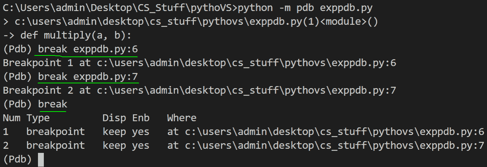
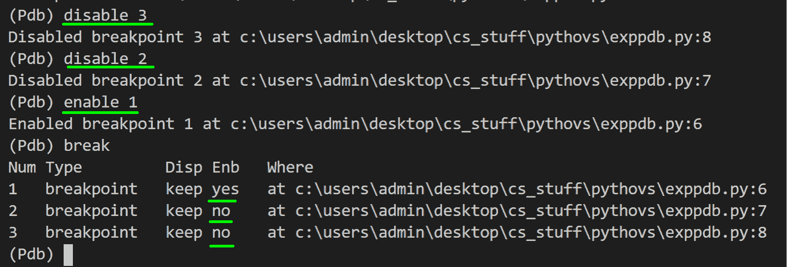

# Python 除错程式–python pdb

> 哎哎哎:# t0]https://www . geeksforgeeks . org/python 调试器-python-pdb/

**Python 中的调试**通过内置于 Python 标准库的 **pdb 模块(** python 调试器)来实现。它实际上被定义为 Pdb 类，在内部使用 bdb(基本调试器功能)和 cmd(支持面向行的命令解释器)模块。pdb 的主要优点是它完全在命令行中运行，因此当我们没有基于图形用户界面的调试器的特权时，它非常适合在远程服务器上调试代码。

pdb 支持-

*   设置断点
*   单步执行代码
*   源代码列表
*   查看堆栈跟踪

## **启动 Python 调试器**

有几种方法可以调用调试器

*   要在**程序内开始调试**只需插入导入 pdb、**pdb . set _ trace()**命令即可。正常运行您的脚本，执行将在我们引入断点的地方停止。所以基本上我们在调用 set_trace()的一行下面硬编码一个断点。在 python 3.7 和更高版本中，有一个名为**断点()**的内置函数，其工作方式相同。关于如何插入 set_trace()函数，请参考下面的示例。

**例 1:** 两个数相加

**故意错误:**由于input()返回字符串，程序将这些字符串串联起来，而不是添加输入数字

## 蟒蛇 3

```py
import pdb

def addition(a, b):
    answer = a + b
    return answer

pdb.set_trace()
x = input("Enter first number : ")
y = input("Enter second number : ")
sum = addition(x, y)
print(sum)
```

**输出:**



设置跟踪

在尖括号后第一行的输出中，我们有我们文件的**目录路径**、**行号**我们断点所在的位置、 **<模块>** 。它基本上是说我们在模块级别的第 10 行的 exppdb.py 中有一个断点。如果在函数中引入断点，那么它的名称将出现在< >中。下一行是代码行，我们的执行在这里停止。那一行还没有执行。然后我们有 **pdb 提示**。现在，为了导航代码，我们可以使用以下命令:

<figure class="table">

| **命令** | **功能** |
| 帮助 | 显示所有命令 |
| 在哪里 | 显示当前行的堆栈跟踪和行号 |
| 然后 | 执行当前行并移动到下一行，忽略函数调用 |
| 步骤 | 进入当前行调用的函数 |

</figure>

现在要检查变量的类型，只需写下**什么是**和变量名。在下面给出的例子中，x 类型的输出作为<类字符串>返回。因此，在我们的程序中将字符串类型转换为 int 可以解决这个错误。

**例 2:**



*   **从命令行:**这是使用调试器最简单的方法。您只需在终端中运行以下命令

> python -m pdb exppdb.py(将文件名改为 exppdb.py)

此语句加载您的源代码，并停止第一行代码的执行。

**例 3:**

## 蟒蛇 3

```py
def addition(a, b):
    answer = a + b
    return answer

x = input("Enter first number : ")
y = input("Enter second number : ")
sum = addition(x, y)
print(sum)
```

**输出:**



命令行

*   **事后调试**是指程序完成执行过程后进入调试模式(已经出现故障)。pdb 通过 **pm()** 和**宰后()**功能支持宰后调试。这些函数寻找活动的回溯，并在异常发生的调用堆栈中的行启动调试器。在给定示例的输出中，您可以注意到当程序中遇到异常时会出现 pdb。

**例 4:**

## 蟒蛇 3

```py
def multiply(a, b):
    answer = a * b
    return answer

x = input("Enter first number : ")
y = input("Enter second number : ")
result = multiply(x, y)
print(result)
```

**输出:**



### **检查堆栈上的变量**

所有变量，包括程序中正在执行的函数的局部变量和全局变量，都保存在堆栈上。我们可以使用**参数**(或者使用 **a** )打印当前激活的函数的所有参数。 **p** 命令计算作为参数给出的表达式，并打印结果。

这里，本文的示例 4 在调试模式下执行，向您展示如何检查变量:



检查变量值

### **Python pdb 断点**

在处理大型程序时，我们经常希望在已知可能发生错误的地方添加一些断点。要做到这一点，你只需要使用****打破**命令。插入断点时，调试器会从 1 开始为其分配一个数字。使用**断点**显示程序中的所有断点。**

****语法:****

> **分隔符文件名:行号，条件**

**下面给出了在用于示例 4 的程序中添加断点的实现。**

**

添加断点** 

### ****管理断点****

**在添加断点后，借助分配给它们的数字，我们可以使用****启用和禁用**和**删除**命令来管理断点。**禁用**告知调试器在到达断点时不要停止，而**启用**则打开禁用的断点。****

****下面给出了使用示例 4 管理断点的实现。****

****

管理断点****