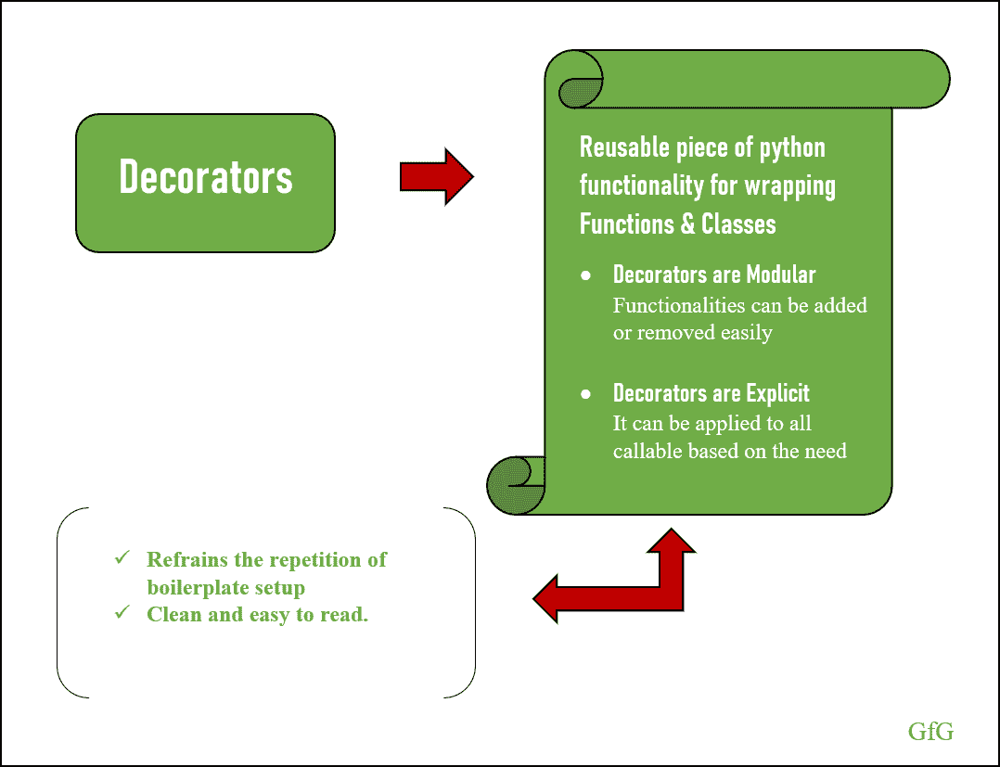
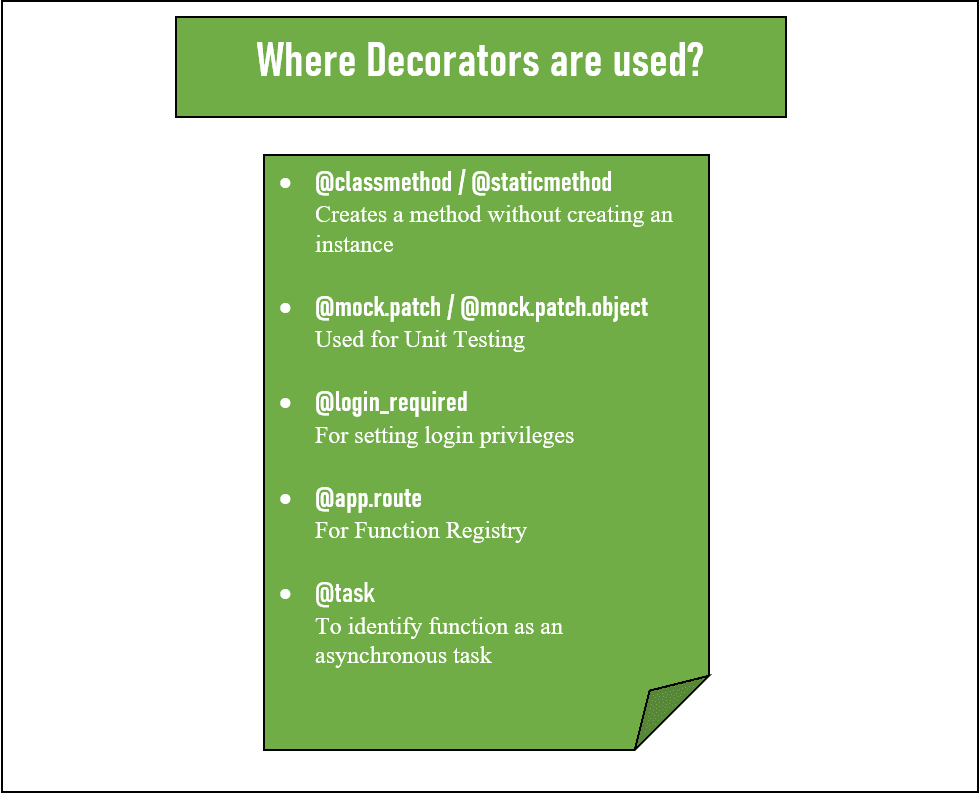
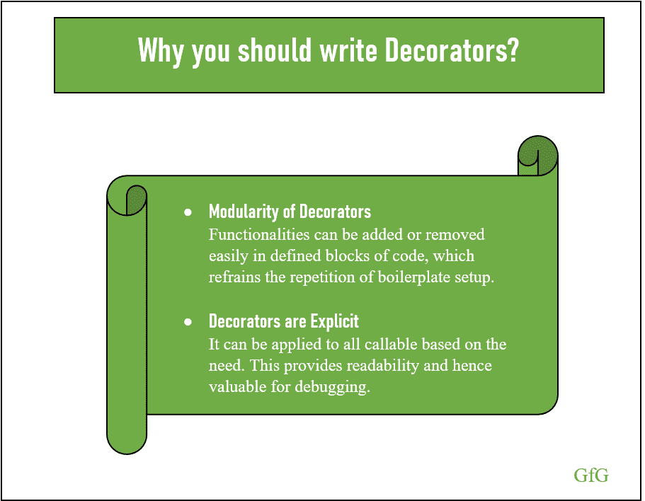

# Python 装饰者:完整指南

> 原文:[https://www . geesforgeks . org/python-decorators-a-complete-guide/](https://www.geeksforgeeks.org/python-decorators-a-complete-guide/)

**装饰器**是 Python 中的一种设计模式工具，用于围绕函数或类(定义的块)包装代码。这种设计模式允许程序员在不修改现有结构的情况下向现有函数或类添加新功能。该部分概述了什么是装饰器，如何装饰函数和类，以及它可以解决什么问题。



装饰者

## 理解装饰者

装饰器是一个函数，它将另一个函数作为参数，执行一些操作，然后根据执行的操作返回参数。由于函数在 Python 中是[一级](https://www.geeksforgeeks.org/first-class-functions-python/)对象，因此它们可以作为参数传递给另一个函数。
因此我们可以说**装饰者是一个[可调用的](https://www.geeksforgeeks.org/callable-in-python/)接受并返回一个可调用的。**
下面的代码显示了一个简单的装饰器，它向 my_function [docstring](https://www.geeksforgeeks.org/python-docstrings/) 添加了附加注释:

```
def decorated_docstring(function):
    function.__doc__ += '\n Hi George, I''m a simple Decorator.'
    return function

def my_function(string1):
    """Return the string."""
    return string1

def main():
    myFunc = decorated_docstring(my_function)
    myFunc('Hai')
    help(myFunc)

if __name__ == "__main__":
    main()
```

**输出:**

```
Help on function my_function in module __main__:

my_function(string1)
    Return the string.
    Hi George, Im a simple Decorator.

```

### 装饰语法

从上面的解释中，你可以理解如何装饰一个功能。但是定义一个函数，将其分配给一个变量，然后将修饰后的函数重新分配给同一个变量，这是不可接受的。因此，Python 2.5 引入了一种装饰函数的语法，在装饰器名称前添加一个`@`字符，并在函数声明的正上方添加。下面的代码显示了如何使用语法:

```
def reverse_decorator(function):

    def reverse_wrapper():
        make_reverse = "".join(reversed(function()))
        return make_reverse

    return reverse_wrapper

@reverse_decorator
def say_hi():
    return 'Hi George'

def main():
    print(say_hi())

if __name__ == "__main__":
    main()
```

**输出:**

```
egroeG iH
```

这里我们用@字符来修饰函数。

```
@reverse_decorator
def say_hi():
    return 'Hi George'
```

上面的代码在语法上等同于下面的代码`reverse_decorator(say_hi())`

在这种情况下，reverse_decorator 函数执行并创建 revserse_wrapper 的引用。让我们看看下面的例子，以便更好地理解:

```
def reverse_decorator(function):
    print('Inside reverse_decorator function')

    def reverse_wrapper():
        print('Inside reverse_wrapper function')
        return 'Return reverse_wrapper function'

    return reverse_wrapper

@reverse_decorator
def say_hi():
    return 'Inside say_hi'
```

**输出:**

```
Inside reverse_decorator function
```

**这里 reverse_decorator 不执行函数 reverse_wrapper，而是创建引用，并在可调用调用函数时返回。**

```
def reverse_decorator(function):
    print('Inside reverse_decorator function')

    def reverse_wrapper():
        print('Inside reverse_wrapper function')
        return 'reverse_wrapper'

    return reverse_wrapper

@reverse_decorator
def say_hi():
    return 'Inside say_hi'

def main():
    print('Inside main()')
    print(say_hi)
    print(''); 
    print(say_hi()) # main executes the reference

main()
```

**输出:**

> Inside reverse_decorator 功能
> Inside main()
> <功能 reverse_decorator..0x0000015762A16708 >处的 reverse_wrapper
> 
> 内部反向包装功能
> 反向包装

### 单功能多装饰器

现在，您已经清楚了如何使用@语法来修饰函数。另一个很酷的东西是，我们可以在一个功能上使用多个装饰器。这里需要注意的一点是**裱花师**应用的顺序很重要，就是**从下往上应用**。让我们来看看多个装饰者。

```
def reverse_decorator(function):

    def reverse_wrapper():
        make_reverse = "".join(reversed(function()))
        return make_reverse

    return reverse_wrapper

def uppercase_decorator(function):

    def uppercase_wrapper():
        var_uppercase = function().upper()
        return var_uppercase

    return uppercase_wrapper

@uppercase_decorator
@reverse_decorator
def say_hi():
    return 'hi george'

def main():
    print(say_hi())

if __name__ == "__main__":
    main()
```

**输出:**

```
EGROEG IH
```

这里，字符串首先反转，其次转换为大写。

```
@uppercase_decorator
@reverse_decorator
def say_hi():
    return 'hi george'
```

以上代码在语法上等同于
`uppercase_decorator(reverse_decorator(say_hi()))`

### 装饰函数中的参数

到目前为止，你已经看到了没有任何争论的装饰者。在某些情况下，有必要传递参数来相应地修饰方法。

```
def decorator_arguments(function):
    def wrapper_arguments(arg1, arg2):
        print("Arguments accepted are: {0}, {1}".format(arg1, arg2))
        function(arg1, arg2)  # calls the function hobbies

    return wrapper_arguments

@decorator_arguments
def hobbies(hobby_one, hobby_two):
    print("My Hobbies are {0} and {1}".format(hobby_one, hobby_two))

def main():
    hobbies("Travelling", "Reading")

if __name__ == "__main__":
    main()
```

**输出:**

> 接受的论点是:旅行，阅读
> 我的爱好是旅行和阅读

在上面的例子中，装饰器不会接受任何参数，而是由可调用的传递给包装函数。下面的代码在使用引用传递参数的过程中更加清晰。

```
def decorator_arguments(function):

    def wrapper_arguments(arg1, arg2):
        print(" Arguments accepted are: {0}, {1}".format(arg1, arg2))

    return wrapper_arguments

@decorator_arguments
def hobbies(hobby_one, hobby_two):
    print("My Hobbies are {0} and {1}".format(hobby_one, hobby_two))

def main():

    # the reference of wrapper_arguments
    # is returned
    hob = hobbies
    print(hob)

    # passing the arguments to the 
    # wrapper_arguments
    hob('Travelling', 'Reading')

main()
```

**输出**

> <function decorator_arguments..wrapper_arguments="" at="">接受的论点是:旅行，阅读</function>

### 装饰师用在哪里？


标准库提供了很多包含装饰器的模块，以及很多利用装饰器的 Python 工具和框架。几个例子是:

*   您可以使用@classmethod 或@staticmethod 装饰器来创建方法，而无需创建实例
*   mock 模块允许使用@mock.patch 或@mock.patch.object 作为用于单元测试的装饰器。
*   常见的工具如用于设置登录权限的 Django(使用@login_required)和用于函数注册表使用装饰器的 Flask(使用@app.route)。
*   为了将函数识别为异步任务，芹菜使用@task decorator。

### 为什么你应该写装饰者


编写这段可重用的 Python 功能的两个重要原因是，如果编写得当，装饰器是模块化和显式的。

*   装饰者的模块化
*   装饰者是明确的

#### 装饰者的模块化

使用装饰者的程序员可以在已定义的代码块中轻松添加或删除功能，从而避免重复样板设置。

#### 装饰者是明确的

程序员可以根据需要将装饰器应用于所有可调用的程序。这确保了可读性，并提供了干净的代码。

### 装饰用例


这里我们将讨论几个装饰器用例，帮助你理解什么时候写装饰器。

1.  功能插件
2.  数据清理
3.  功能注册

#### 功能插件

编写装饰器的首要原因是它可以灵活地向已定义的代码块(函数和类)添加额外的功能。

#### 数据清理

通过适当的数据清理方法，您可以删除或销毁存储在内存中的数据，使其无法恢复。例如，您可以使用缓存功能来避免运行相同的功能，或者您可以使用方法来验证用户登录凭据等，这表明了数据清理的重要性。装饰器可以适当地净化传递给装饰函数的参数，也可以净化从函数返回的数据。

#### 功能注册

编写装饰器的另一个要点是注册一个函数。在这里，decorator 允许两个或更多的子系统在彼此没有太多信息的情况下进行通信。

## 装饰班

上一节展示了装饰者如何帮助装饰功能。我们已经看到装饰器是可调用的，它接受并返回一个可调用的。因为类是可调用的，所以装饰器也被用来装饰类。装饰类的一些用途有:

*   属性的添加或增强
*   属性交互
*   改变类的应用编程接口(改变声明类的方式及其实例使用)

让我们来看看如何使用类来修饰一个函数。

```
class MyDecorator:

    def __init__(self, function):
        self.function = function

    def __call__(self):
        print("Inside Function Call")
        self.function()

@MyDecorator
def function():
    print("GeeksforGeeks")

def main():
    function()

if __name__ == "__main__":
    main()
```

**输出:**

```
Inside Function Call
GeeksforGeeks

```

让我们看另一个例子。在代码下面，根据实例的创建时间对其进行排序。这里我们需要三个附加属性——实例化时间戳，__lt__ 和 __gt__ 方法。

```
import functools
import time

def sort_by_creation_time(cl):
    org_init = cl.__init__

    # Enhance the class to store the creation
    # time based on the instantiation.
    @functools.wraps(org_init)
    def new_init(self, *args, **kwargs):
        org_init(self, *args, **kwargs)
        self._created = time.time()

    # __lt__ and __gt__ methods return true or false 
    # based on the creation time.
    cl.__init__ = new_init
    cl.__lt = lambda self, other: self._created < other._created
    cl.__gt__ = lambda self, other: self._created > other._created
    return cl

@sort_by_creation_time
class Sort(object):
    def __init__(self, identifier):
        self.identifier = identifier

    def __repr__(self):
        return self.identifier

def main():

    first = Sort('Python')
    second = Sort('Data Analysis')
    third = Sort('Machine Learning')

    sortables = [third, first, second]
    print(sorted(sortables))

if __name__ == "__main__":
    main()
```

**输出**

```
[Python, Data Analysis, Machine Learning]

```

`new_init`，**它的主要职责是运行包装函数，并为包装函数**添加额外的功能。`@functools.wraps(org_init)`更新包装函数，以反映包装函数的外观。查看[功能工具](https://www.geeksforgeeks.org/python-functools-wraps-function/)了解详情。

```
@functools.wraps(org_init)
def new_init(self, *args, **kwargs):

    # calls the init method of class
    org_init(self, *args, **kwargs)

    # add an extra attribute and store 
    # creation time  
    self._created = time.time() 

# reference of new_init is assigned to
# __init__ method and executes when
# callable creates the class object.
cl.__init__ = new_init  
```

## 修饰函数并返回一个类

有时需要修饰一个函数并返回一个类。比方说，高级案例开发人员可以在一个应用编程接口中子类化一个类。它还可以避免样板代码的增加。

```
class Addition(object):

    def __call__(self, *args, **kwargs):
        return self.run(*args, **kwargs)

    def run(self, *args, **kwargs):
        raise NotImplementedError('Subclass must implement `run`.')

    def identity(self):
        return 'Hi George, I''m here to help you with addition !'

def addition(decorated):
    class AddSubclass(Addition):
        def run(self, *args, **kwargs):

            if args:
                add = 0
                for arg in args:
                    add = arg + add   # add arguments 
                return add

            else:
                # func is called if there are no arguments passed.
                return decorated(*args, **kwargs) 

    return AddSubclass()

@addition
def func(*args):
    return 1 + 1

print(func.identity())
print(func())
print(func(2, 2))
print(func(2, 1, 4))
```

**输出**

```
Hi George, Im here to help you with addition!
2
4
7

```

这里装饰器创建一个加法子类，并返回子类的实例而不是引用(`return AddSubclass()`)。

```
def addition(decorated):
    class AddSubclass(Addition):
        def run(self, *args, **kwargs):

            if args:
                add = 0
                for arg in args:
                    add = arg + add
                return add

            else:
                return decorated(*args, **kwargs)

    return AddSubclass()
```

“加法”类中的 __call__ 方法意味着它的实例是可调用的。因此，子类“AddSubclass()”的实例可以运行任务，因此程序员可以避免调用运行方法作为`func().run()`。

## 摘要

装饰器是一个将代码包装在函数和类周围的优秀工具，它提供了一种使用样板代码的有效方法，也有助于提高可读性。尽管它们是模块化的和显式的，但是这个工具也有缺点。由于它是一种将代码包装在已定义块周围的工具，调试变得更具挑战性。而且，写得不好的装饰者可能会导致错误。
毕竟，一个写得很好的装饰器可以被视为一个高效的、可重用的 Python 功能，用于包装已定义的代码块。