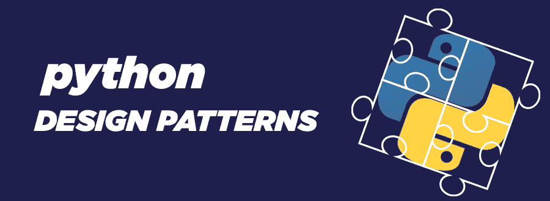

# Python 设计模式

> 原文:[https://www.geeksforgeeks.org/python-design-patterns/](https://www.geeksforgeeks.org/python-design-patterns/)

**设计模式**是软件工程最重要的部分，因为它们为软件设计中常见的问题提供了通用的可重复的解决方案。它们通常代表经验丰富的面向对象软件开发人员采用的一些最佳实践。

我们不能把**设计模式**当成可以直接转换成代码的成品设计。它们只是描述如何高效解决特定问题的模板。要了解更多设计模式基础知识，请参考–[设计模式介绍](https://www.geeksforgeeks.org/design-patterns-set-1-introduction/)。

### 设计模式的分类

## 创造型设计模式:

创建模式提供了关于类实例化或对象实例化的基本信息。类创造模式和对象创造模式是创造设计模式的主要分类。当类创建模式在实例化过程中有效地使用继承时，对象创建模式有效地使用委托来完成工作。

**创意设计模式分类–**

*   **[工厂法](https://www.geeksforgeeks.org/factory-method-python-design-patterns/)**
*   **[抽象工厂法](https://www.geeksforgeeks.org/abstract-factory-method-python-design-patterns/)**
*   **[建造者方法](https://www.geeksforgeeks.org/builder-method-python-design-patterns/)**
*   **[原型法](https://www.geeksforgeeks.org/prototype-method-python-design-patterns/)**
*   **单例法**

## 结构设计模式:

结构设计模式是关于组织不同的类和对象来形成更大的结构，并提供新的功能，同时保持这些结构的灵活性和效率。大多数情况下，他们使用继承来组成所有的接口。它还确定了导致结构简化的关系。

**结构设计模式分类–**

*   **[适配器方法](https://www.geeksforgeeks.org/adapter-method-python-design-patterns/)**
*   **[桥法](https://www.geeksforgeeks.org/bridge-method-python-design-patterns/)**
*   **[合成法](https://www.geeksforgeeks.org/composite-method-python-design-patterns/)**
*   **[装饰方法](https://www.geeksforgeeks.org/decorator-method-python-design-patterns/)**
*   **[外立面法](https://www.geeksforgeeks.org/facade-method-python-design-patterns/)**
*   **[代理法](https://www.geeksforgeeks.org/proxy-method-python-design-patterns/)**
*   **[飞重法](https://www.geeksforgeeks.org/flyweight-method-python-design-patterns/)**

## 行为设计模式:

行为模式都是关于识别对象之间的公共通信模式并实现这些模式。这些模式与算法和对象之间的责任分配有关。

**行为设计模式分类–**

*   **[责任链法](https://www.geeksforgeeks.org/chain-of-responsibility-python-design-patterns/)**
*   **[指挥方法](https://www.geeksforgeeks.org/command-method-python-design-patterns/)**
*   **[迭代器方法](https://www.geeksforgeeks.org/iterator-method-python-design-patterns/)**
*   **[【调解人法】](https://www.geeksforgeeks.org/mediator-method-python-design-pattern/)**
*   **[纪念品法](https://www.geeksforgeeks.org/memento-method-python-design-patterns/)**
*   **[观察者法](https://www.geeksforgeeks.org/observer-method-python-design-patterns/)**
*   **[状态法](https://www.geeksforgeeks.org/state-method-python-design-patterns/)**
*   **[战略方法](https://www.geeksforgeeks.org/strategy-method-python-design-patterns/)**
*   **[模板法](https://www.geeksforgeeks.org/template-method-python-design-patterns/)**
*   **[访客法](https://www.geeksforgeeks.org/visitor-method-python-design-patterns/)**

### 使用设计模式的优势

*   **可重用性:**通过使用 **[继承](https://www.geeksforgeeks.org/inheritance-in-python/)** ，它们有助于使代码可重用，因此我们可以在多个项目中使用它们。
*   **透明:**它为所有将来要使用它的开发人员提高了代码的透明度。
*   **既定解决方案:**我们可以盲目相信**设计模式**提供的解决方案，因为它们在关键阶段得到了很好的证明和证明。
*   **既定沟通:**设计模式让设计师之间的沟通更有效率。当软件专业人员在讨论系统设计时提到用于解决特定问题的模式名称时，他们可以立即在脑海中描绘出高级设计。
*   **高效开发:**设计模式有助于以最小的耦合开发高内聚的模块。

**更多有用链接–**

[设计模式:软件开发人员必备的技能](https://www.geeksforgeeks.org/design-patterns-a-must-skill-to-have-for-software-developers-in-2019/)
[设计模式:用现实生活中的例子理解重要性](https://www.geeksforgeeks.org/design-patterns-understand-the-importance-with-real-life-examples/)
[设计一个像 Bookmyshow 一样的电影票预约系统](https://www.geeksforgeeks.org/design-movie-ticket-booking-system-like-bookmyshow/)
[如何用面向对象的原理设计停车场？](https://www.geeksforgeeks.org/design-parking-lot-using-object-oriented-principles/)