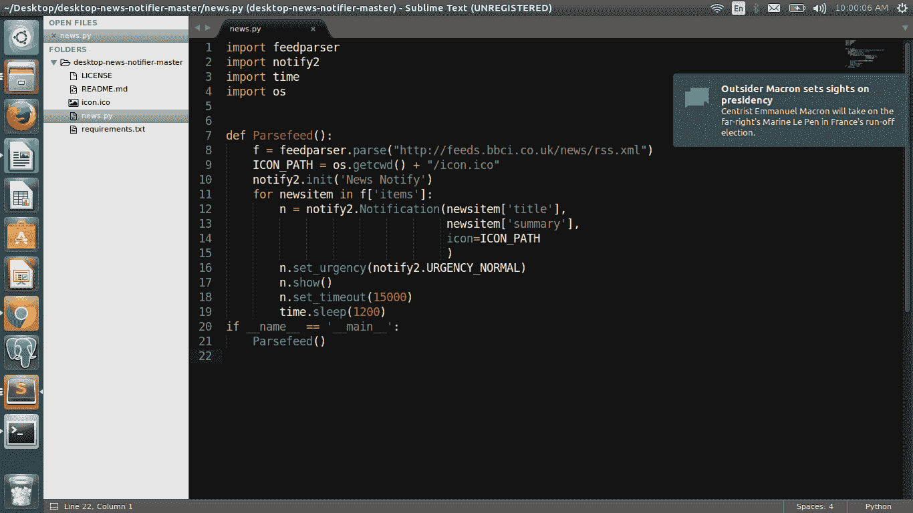

# Python 桌面新闻通知器 20 行

> 原文:[https://www . geesforgeks . org/python-desktop-news-notifier-in-20-line/](https://www.geeksforgeeks.org/python-desktop-news-notifier-in-20-lines/)

要开始使用桌面新闻通知程序，我们需要两个库:feedparser 和 notify2。
发出以下命令安装 feedparser:

```
sudo pip3 install feedparser
```

要在您的终端中安装 notify2:

```
sudo pip3 install notify2
```

Feedparser 将解析我们将从 URL 获得的提要。我们将使用 notify2 进行桌面通知。除了这两个库，我们将使用操作系统和时间库。安装完成后，在程序中导入两个库。在这里，在这个例子中，我解析了来自英国广播公司的新闻，你可以使用任何新闻提要解析器的网址。我们来看看节目:

## 计算机编程语言

```
# Python program to illustrate
# desktop news notifier
import feedparser
import notify2
import os
import time
def parseFeed():
    f = feedparser.parse("http://feeds.bbci.co.uk/news/rss.xml")
    ICON_PATH = os.getcwd() + "/icon.ico"
    notify2.init('News Notify')
    for newsitem in f['items']:
        n = notify2.Notification(newsitem['title'],
                                 newsitem['summary'],
                                 icon=ICON_PATH
                                 )
    n.set_urgency(notify2.URGENCY_NORMAL)
    n.show()
    n.set_timeout(15000)
    time.sleep(1200)

if __name__ == '__main__':
    parseFeed()
```

**新闻通知弹出的截图**

[](https://media.geeksforgeeks.org/wp-content/uploads/Screenshot-from-2017-04-24-10_00_06.png)

**代码分步说明:**

```
f = feedparser.parse("http://feeds.bbci.co.uk/news/rss.xml")
```

*   这里 feedparser 将从提要 URL 解析新闻数据。解析后的数据将采用字典的形式。

```
ICON_PATH = os.getcwd() + "/icon.ico"
```

*   如果您想在通知中设置任何图标，那么我们在这里设置图标路径。这是可选的。

```
notify2.init('News Notify')
```

*   这里我们使用 notify2 的 init 方法初始化 notify2。初始化数据总线连接。必须在发送任何通知或检索服务器信息或功能之前调用。

```
 for newsitem in f['items']: 
        n = notify2.Notification(newsitem['title'], 
                                 newsitem['summary'], 
                                 icon=ICON_PATH 
                                 )
```

*   使用 notify2 lib 的 notification 方法，循环解析数据以获取相关信息，如新闻标题、简短摘要和设置通知图标。

```
n.set_urgency(notify2.URGENCY_NORMAL)
```

*   将紧急级别设置为紧急低、紧急正常或紧急严重之一

```
n.show()
```

*   此方法将在桌面上显示通知

```
n.set_timeout(15000)
```

*   设置通知保留在桌面上的时间(毫秒)。我把这里设定为 15 秒。

```
time.sleep(1200)
```

*   这通常每 20 分钟显示一次新闻通知。你可以根据自己的要求设定时间。你可以找到托管在 [GitHub](https://github.com/srcecde/desktop-news-notifier) 上的完整源代码

本文由 **Srce Cde** 供稿。如果你喜欢极客博客并想投稿，你也可以用 write.geeksforgeeks.org 写一篇文章或者把你的文章邮寄到 review-team@geeksforgeeks.org。看到你的文章出现在极客博客主页上，帮助其他极客。
如果你发现任何不正确的地方，或者你想分享更多关于上面讨论的话题的信息，请写评论。