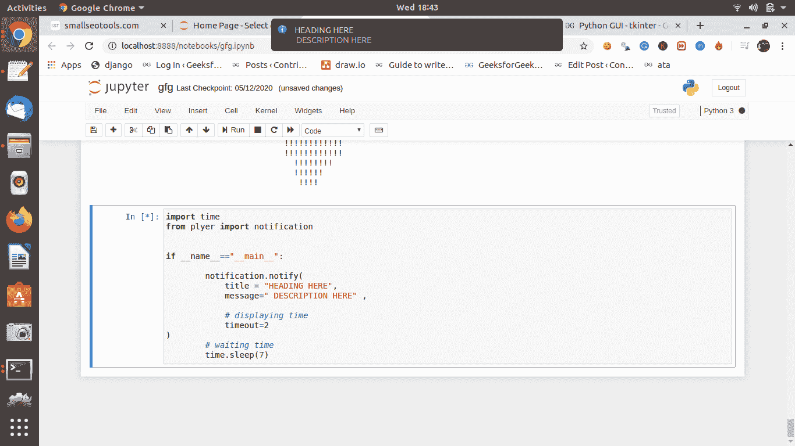

# 使用普利特模块的 Python 桌面通知程序

> 原文:[https://www . geesforgeks . org/python-desktop-notifier-use-plyer-module/](https://www.geeksforgeeks.org/python-desktop-notifier-using-plyer-module/)

本文演示了如何使用 Python 创建一个简单的**桌面通知程序**应用程序。桌面通知程序是一个简单的应用程序，它以弹出消息的形式在桌面上生成通知消息。我们将使用普利特模块。

### 需要模块

1.  **时间:**该模块与时间对象一起工作，默认安装
2.  **普利特:**普利特模块用于访问硬件的功能。这个模块没有内置 Python。我们需要从外部安装它。要安装此模块，请在终端中键入以下命令。

```
pip install plyer 
```

**进场:**

**步骤 1)** 从 plyer 模块导入通知类

```
from plyer import notification
```

**步骤 2)** 之后只需要调用这个类的 notify 方法。

> **语法:** notify(title=，message=，app_name=，app_icon=，timeout=10，ticker=，toast=False)
> 
> **参数:**
> 
> *   **标题**(*str*)–通知标题
> *   **消息** ( *字符串*)–通知消息
> *   **app _ Name**(*str*)–启动此通知的应用程序的名称
> *   **app _ Icon**(*str*)–与消息一起显示的图标
> *   **超时**(*int*)–显示消息的时间，默认为 10
> *   **滚动条** ( *字符串*)–通知到达时状态栏上显示的文本
> *   **祝酒** ( *嘘声*)–简单的安卓消息，而不是完整的通知

**步骤 3)** 添加睡眠功能，再次显示该通知。

下面是实现。

## 蟒蛇 3

```
import time
from plyer import notification

if __name__=="__main__":

        notification.notify(
            title = "HEADING HERE",
            message=" DESCRIPTION HERE" ,

            # displaying time
            timeout=2
)
        # waiting time
        time.sleep(7)
```

**输出:**

