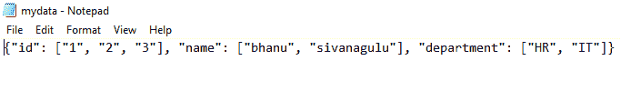

# Python–元组到 JSON 的字典

> 原文:[https://www . geesforgeks . org/python-dict-of-tuples-to-JSON/](https://www.geeksforgeeks.org/python-dict-of-tuples-to-json/)

在本文中，我们将讨论如何将元组字典转换为 JSON。

## 方法 1:使用 [json.dumps()](https://www.geeksforgeeks.org/json-dumps-in-python/)

这将把元组字典转换成 json

> **语法** : json.dumps(字典，缩进)
> 
> **参数**:
> 
> *   字典是输入字典。
> *   缩进指定缩进的单位数

**示例**:元组到 json 转换的 Python 字典

## 蟒蛇 3

```py
# import json module
import json

# dictionary of employee data
data = {
    "id": ("1", "2", "3"),
    "name": ("bhanu", "sivanagulu"),
    "department": ("HR", "IT")
}

# convert into json
final = json.dumps(data, indent=2)

# display
print(final)
```

**输出**:

```py
{
  "id": [
    "1",
    "2",
    "3"
  ],
  "name": [
    "bhanu",
    "sivanagulu"
  ],
  "department": [
    "HR",
    "IT"
  ]
}
```

## 方法二:使用 [json.dump()](https://www.geeksforgeeks.org/json-dump-in-python/)

这将把转换后的 json 数据写入文件，该文件将被下载并保存在您的计算机上。

> **语法** : json.dump(字典、指针)
> 
> **参数**:
> 
> *   字典是输入字典。
> *   指针是在写入或追加模式下打开的文件指针。

**语法**:

```py
with open("mydata.json", "w") as final:
    json.dump(data, final)
```

其中，mydata 是新的 JSON 文件

最后，我们必须下载创建的 JSON 文件

**语法**:

```py
files.download('mydata.json')
```

**示例**:元组到 json 转换的 Python 字典

## 蟒蛇 3

```py
# import json module
from google.colab import files
import json

# dictionary of employee data
data = {
    "id": ("1", "2", "3"),
    "name": ("bhanu", "sivanagulu"),
    "department": ("HR", "IT")
}

# convert into json
# file name is mydata
with open("mydata.json", "w") as final:
    json.dump(data, final)

# download the json file
files.download('mydata.json')
```

**输出:**

