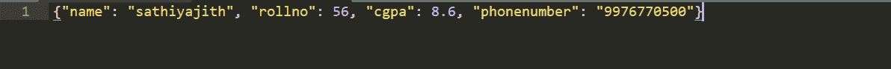

# Python–JSON . dump()和 JSON . dump()

的区别

> 原文:[https://www . geesforgeks . org/python-json-dump 和-JSON-dump 之间的区别/](https://www.geeksforgeeks.org/python-difference-between-json-dump-and-json-dumps/)

[JSON](https://www.geeksforgeeks.org/javascript-json/) 是一种轻量级的数据交换数据格式，人类可以轻松读写，机器可以轻松解析生成。这是一种完全独立于语言的文本格式。为了处理 json 数据，Python 有一个名为 JSON 的内置包。
**注:**更多信息，请参考[使用 Python 中的 JSON 数据](https://www.geeksforgeeks.org/working-with-json-data-in-python/)

## json.dumps()

json.dumps()方法可以将 Python 对象转换为 json 字符串。

> **语法:** json.dumps(dict，indent)
> **参数:**
> 
> *   **字典–**应该转换为 JSON 对象的字典的名称。
>     
> *   **缩进–**定义缩进的单位数

**例:**

## 蟒蛇 3

```
# Python program to convert
# Python to JSON

import json

# Data to be written
dictionary ={
  "id": "04",
  "name": "sunil",
  "department": "HR"
}

# Serializing json 
json_object = json.dumps(dictionary, indent = 4)
print(json_object)
```

**输出:**

```
{
    "department": "HR",
    "id": "04",
    "name": "sunil"
}
```

**Python 对象及其到 JSON 的等价转换:**

<figure class="table">

| 计算机编程语言 | 等效 JSON |
| --- | --- |
| 词典 | 目标 |
| 列表、元组 | 排列 |
| 潜艇用热中子反应堆（submarine thermal reactor 的缩写） | 线 |
| int，float | 数字 |
| 真实的 | 真实的 |
| 错误的 | 错误的 |
| 没有人 | 空 |

</figure>

## json.dump()

json.dump()方法可用于写入 json 文件。

> **语法:** json.dump(dict，file_pointer)
> **参数:**
> 
> *   **字典–**应该转换为 JSON 对象的字典的名称。
>     
> *   **文件指针–**以写入或追加模式打开的文件的指针。

**例:**

## 蟒蛇 3

```
# Python program to write JSON
# to a file

import json

# Data to be written
dictionary ={
    "name" : "sathiyajith",
    "rollno" : 56,
    "cgpa" : 8.6,
    "phonenumber" : "9976770500"
}

with open("sample.json", "w") as outfile:
    json.dump(dictionary, outfile)
```

**输出:**

