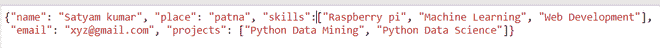

# Python–JSON . load()和 json.loads()

的区别

> 原文:[https://www . geesforgeks . org/python-JSON-load 和-json-loads 之差/](https://www.geeksforgeeks.org/python-difference-between-json-load-and-json-loads/)

[JSON](https://www.geeksforgeeks.org/javascript-json/)(JavaScript Object notification)是一个脚本(可执行)文件，它由编程语言中的文本组成，用于存储和传输数据。它是一种独立于语言的格式，非常容易理解，因为它本质上是自描述的。Python 有一个名为 json 的内置包。在本文中，我们将看到 Json.load 和 json.loads()方法。这两种方法都用于读取和写入带有文件的 Unicode 字符串。

## json.load()

[**json.load()**](https://www.geeksforgeeks.org/json-load-in-python/) 取一个文件对象，返回 json 对象。它用于从文件中读取 JSON 编码的数据，并将其转换为 Python 字典和反序列化文件本身，即它接受文件对象。

> **语法:** json.load( *fp* ， *cls=None* ， *object_hook=None* ， *parse_float=None* ， *parse_int=None* ， *parse_constant=None* ， *object_pairs_hook=None* ， ***kw* )
> 
> **参数:**
> 
> **fp:** 读取文本的文件指针。
> 
> **object_hook:** 它是一个可选参数，将使用任何对象文字解码的结果来调用。
> 
> ***parse_float:*** 这是一个可选参数，将使用要解码的每个 JSON float 的字符串来调用。
> 
> ***parse_int:*** 它是一个可选参数，将用每个要解码的 JSON int 的字符串调用。
> 
> ***object _ pairs _ hook:***这是一个可选参数，将使用任何对象文字的结果调用，这些对象文字使用有序的对列表进行解码。

**示例:**

首先创建 json 文件:

## 蟒蛇 3

```
import json

data = {
    "name": "Satyam kumar",
    "place": "patna",
    "skills": [
        "Raspberry pi",
        "Machine Learning",
        "Web Development"
    ],
    "email": "xyz@gmail.com",
    "projects": [
        "Python Data Mining",
        "Python Data Science"
    ]
}
with open( "data_file.json" , "w" ) as write:
    json.dump( data , write )
```

**输出:**



data_file.json

之后，创建 json 文件，让我们使用 json.load():

## 蟒蛇 3

```
with open("data_file.json", "r") as read_content:
    print(json.load(read_content))
```

**输出:**

> {'name': 'Satyam kumar '，' place': 'patna '，' skills ':[' rubber pi '，' Machine Learning '，' Web Development']，
> 'email': 'xyz@gmail.com '，' project ':[' Python 数据挖掘'，' Python 数据科学']}

## json.loads()

[**json.loads()**](https://www.geeksforgeeks.org/json-loads-in-python/) 方法可以解析一个有效的 json 字符串，并将其转换为 Python Dictionary。它主要用于将由 JSON 数据组成的本机字符串、字节或字节数组反序列化为 Python 字典。

> **语法:** json.loads( *s* ，*编码=None* ， *cls=None* ， *object_hook=None* ， *parse_float=None* ， *parse_int=None* ， *parse_constant=None* ， *object_pairs_hook=None* ， ***kw* )
> 
> **参数:**
> 
> **s:** 使用该转换表将包含 JSON 文档的字符串实例反序列化为 Python 对象。
> 
> **object_hook:** 它是一个可选参数，将使用任何对象文字解码的结果来调用。
> 
> ***parse_float:*** 这是一个可选参数，将使用要解码的每个 JSON float 的字符串来调用。
> 
> ***parse_int:*** 它是一个可选参数，将用每个要解码的 JSON int 的字符串调用。
> 
> ***object _ pairs _ hook:***这是一个可选参数，将使用任何对象文字的结果调用，这些对象文字使用有序的对列表进行解码。

**示例:**

## 蟒蛇 3

```
import json 

# JSON string: 
# Multi-line string 
data = """{ 
    "Name": "Jennifer Smith", 
    "Contact Number": 7867567898, 
    "Email": "jen123@gmail.com", 
    "Hobbies":["Reading", "Sketching", "Horse Riding"] 
    }"""

# parse data: 
res = json.loads( data ) 

# the result is a Python dictionary: 
print( res )
```

**输出:**

> { '姓名':'詹妮弗·史密斯'，'联系电话':7867567898，'电子邮件':' jen123@gmail.com '，
> '爱好':['阅读'，'写生'，'骑马']}