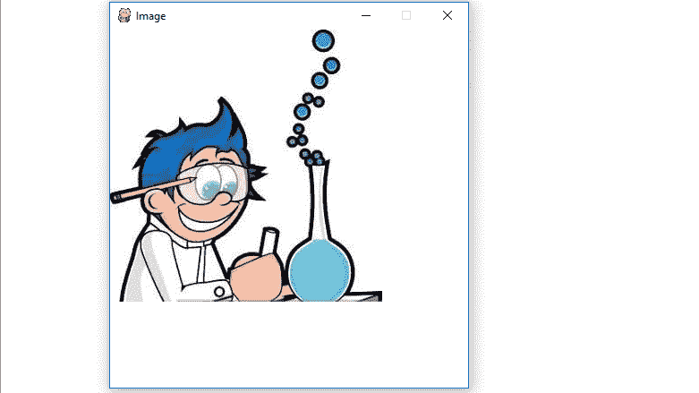

# Python |用 PyGame 显示图像

> 原文:[https://www . geesforgeks . org/python-display-images-with-pygame/](https://www.geeksforgeeks.org/python-display-images-with-pygame/)

**`Pygame`** 是一套跨平台的 Python 模块，专为编写视频游戏而设计。它包括设计用于 Python 编程语言的计算机图形和声音库。现在，这取决于开发者的想象力或必要性，他/她想使用这个工具包开发什么类型的游戏。

命令安装 **pygame** :

```
pip install pygame

```

在`pygame` 窗口显示图像有四个基本步骤:

*   使用 pygame 的`display.set_mode()`方法创建显示表面对象。
*   使用 pygame 的`image.load()`方法创建一个图像表面对象，即在其上绘制图像的表面对象。
*   使用 pygame 显示面对象的`blit()`方法将图像面对象复制到显示面对象。
*   使用 pygame 的`display.update()`方法在 pygame 窗口显示显示面对象。

现在，让我们看看使用`pygame`显示图像的代码:

```
# import pygame module in this program
import pygame

# activate the pygame library .
# initiate pygame and give permission
# to use pygame's functionality.
pygame.init()

# define the RGB value
# for white colour
white = (255, 255, 255)

# assigning values to X and Y variable
X = 400
Y = 400

# create the display surface object
# of specific dimension..e(X, Y).
display_surface = pygame.display.set_mode((X, Y ))

# set the pygame window name
pygame.display.set_caption('Image')

# create a surface object, image is drawn on it.
image = pygame.image.load(r'C:\Users\user\Pictures\geek.jpg')

# infinite loop
while True :

    # completely fill the surface object
    # with white colour
    display_surface.fill(white)

    # copying the image surface object
    # to the display surface object at
    # (0, 0) coordinate.
    display_surface.blit(image, (0, 0))

    # iterate over the list of Event objects
    # that was returned by pygame.event.get() method.
    for event in pygame.event.get() :

        # if event object type is QUIT
        # then quitting the pygame
        # and program both.
        if event.type == pygame.QUIT :

            # deactivates the pygame library
            pygame.quit()

            # quit the program.
            quit()

        # Draws the surface object to the screen.  
        pygame.display.update() 

```

**输出:**
