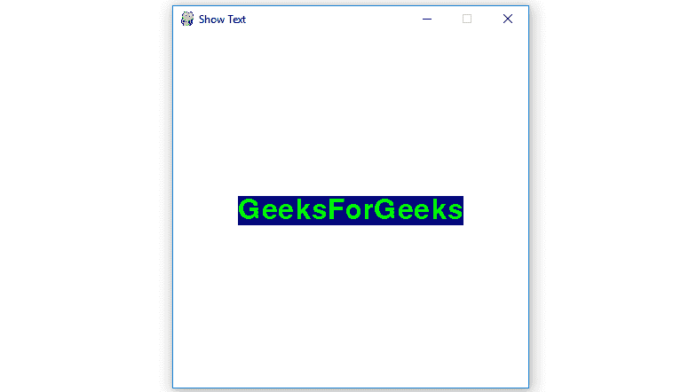
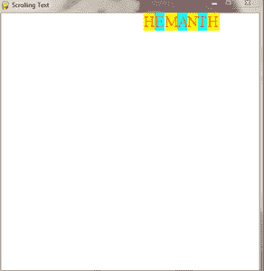
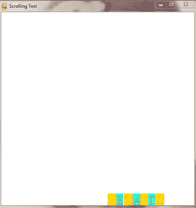
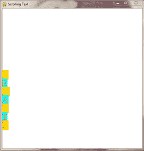
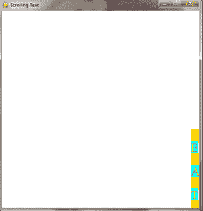
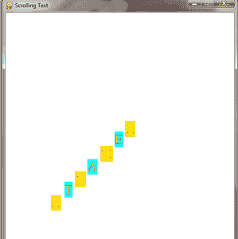
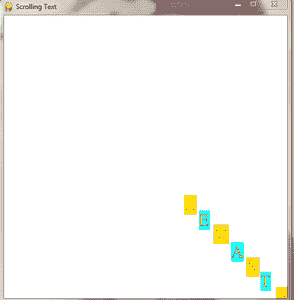

# Python |向 PyGame 窗口显示文本

> 原文:[https://www . geesforgeks . org/python-display-text-to-pygame-window/](https://www.geeksforgeeks.org/python-display-text-to-pygame-window/)

**Pygame** 是一套跨平台的 Python 模块，专为编写视频游戏而设计。它包括设计用于 Python 编程语言的计算机图形和声音库。现在，这取决于开发者的想象力或必要性，他/她想使用这个工具包开发什么类型的游戏。
。

在基于 windows 的系统上安装 **pygame** 的命令:

```py
pip install pygame
```

在 pygame 窗口显示文本有 7 个基本步骤:

*   使用 pygame 的 display.set_mode()方法创建显示表面对象。
*   使用 fony 创建字体对象。pygame 的 Font()方法。
*   使用 pygame 字体对象的 render()方法创建一个文本表面对象，即在其上绘制文本的表面对象。
*   使用 pygame 文本表面对象的 get_rect()方法为文本表面对象创建一个矩形对象。
*   通过设置 pygame 矩形对象的 center 属性的值来设置矩形对象的位置。
*   使用 pygame 显示表面对象的 blit()方法将文本表面对象复制到显示表面对象。
*   使用 pygame 的 display.update()方法在 pygame 窗口上显示显示表面对象。

下面是实现:

## 蟒蛇 3

```py
# import pygame module in this program
import pygame

# activate the pygame library
# initiate pygame and give permission
# to use pygame's functionality.
pygame.init()

# define the RGB value for white,
#  green, blue colour .
white = (255, 255, 255)
green = (0, 255, 0)
blue = (0, 0, 128)

# assigning values to X and Y variable
X = 400
Y = 400

# create the display surface object
# of specific dimension..e(X, Y).
display_surface = pygame.display.set_mode((X, Y))

# set the pygame window name
pygame.display.set_caption('Show Text')

# create a font object.
# 1st parameter is the font file
# which is present in pygame.
# 2nd parameter is size of the font
font = pygame.font.Font('freesansbold.ttf', 32)

# create a text surface object,
# on which text is drawn on it.
text = font.render('GeeksForGeeks', True, green, blue)

# create a rectangular object for the
# text surface object
textRect = text.get_rect()

# set the center of the rectangular object.
textRect.center = (X // 2, Y // 2)

# infinite loop
while True:

    # completely fill the surface object
    # with white color
    display_surface.fill(white)

    # copying the text surface object
    # to the display surface object
    # at the center coordinate.
    display_surface.blit(text, textRect)

    # iterate over the list of Event objects
    # that was returned by pygame.event.get() method.
    for event in pygame.event.get():

        # if event object type is QUIT
        # then quitting the pygame
        # and program both.
        if event.type == pygame.QUIT:

            # deactivates the pygame library
            pygame.quit()

            # quit the program.
            quit()

        # Draws the surface object to the screen.
        pygame.display.update()
```

**输出:**



现在我们将看到一个显示文本的应用程序，但是方式不同，那就是在 pygame 窗口上以 6 种不同的方式滚动文本。

1.滚动屏幕顶部的文本。

2.滚动屏幕底部的文本。

3.滚动屏幕左侧的文本

4.滚动屏幕右侧的文本

5.从屏幕左侧到右侧以对角线滚动文本

6.从屏幕的右侧到左侧以对角线滚动文本。

看到下面的代码后，您可以实现自己的模式

下面是实现

## 计算机编程语言

```py
# import pygame module in this program
import pygame

# activate the pygame library
# initiate pygame and give permission
# to use pygame's functionality.
pygame.init()

# create the display surface object
# (x, y) is the height and width of pygame window
win=pygame.display.set_mode((500, 500))

# set the pygame window name
pygame.display.set_caption("Scrolling Text")

# setting the pygame font style(1st parameter)
# and size of font(2nd parameter)
Font=pygame.font.SysFont('timesnewroman',  30)

# define the RGB value for white,
# green, yellow, orange colour
white=(255, 255, 255)
yellow=(255, 255, 0)
green=(0, 255, 255)
orange=(255, 100, 0)
done=False

# Split the text into letters
# 3rd parameter is font colour and
# 4th parameter is Font background
letter1=Font.render("H", False, orange, yellow)
letter2=Font.render("E", False, orange, green)
letter3=Font.render("M", False, orange, yellow)
letter4=Font.render("A", False, orange, green)
letter5=Font.render("N", False, orange, yellow)
letter6=Font.render("T", False, orange, green)
letter7=Font.render("H", False, orange, yellow)

# assigning values to
# i and c variable
i=0
c=1

# infinite loop
while not done:
    if(i>=820):
        i=0
        c+=1
        pygame.time.wait(500)

    # completely fill the surface object
    # with white color
    win.fill(white)
    if(c%6==0):   
        # Scrolling the text in diagonal
        # on right side of the Screen.
        # copying the text surface object
        # to the display surface object 
        # at the center coordinate.
        win.blit(letter1, (662-i, -162+i))
        win.blit(letter2, (639-i, -139+i))
        win.blit(letter3, (608-i, -108+i))
        win.blit(letter4, (579-i, -79+i))
        win.blit(letter5, (552-i, -52+i))
        win.blit(letter6, (529-i, -29+i))
        win.blit(letter7, (500 -i, 0 + i))
        i+=80
    if(c%6==5):
        # Scrolling the text in diagonal on
        # left side of the Screen.
        win.blit(letter1, (-162+i, -162+i))
        win.blit(letter2, (-135+i, -135+i))
        win.blit(letter3, (-110+i, -110+i))
        win.blit(letter4, (-79+i, -79+i))
        win.blit(letter5, (-52+i, -52+i))
        win.blit(letter6, (-27+i, -27+i))
        win.blit(letter7, (0+i, 0+i))

        # Decides the speed of
        # the text on screen
        i+=80   
    if(c%6==4):

        # Scrolling the text in
        # right side of the Screen.
        win.blit(letter1, (480, -180+i))
        win.blit(letter2, (480, -150+i))
        win.blit(letter3, (480, -120+i))
        win.blit(letter4, (480, -90+i))
        win.blit(letter5, (480, -60+i))
        win.blit(letter6, (480, -30+i))
        win.blit(letter7, (480, 0+i))

        # Decides the speed of
        # the text on screen
        i +=80 
    if(c%6==3): 
        # Scrolling the text in left
        # side of the Screen.
        win.blit(letter1, (0, -180+i))
        win.blit(letter2, (0, -150+i))
        win.blit(letter3, (0, -120+i))
        win.blit(letter4, (0, -90+i))
        win.blit(letter5, (0, -60+i))
        win.blit(letter6, (0, -30+i))
        win.blit(letter7, (0, 0+i))

        # Decides the speed of
        # the text on screen
        i+=80  
    if(c%6==1):

        win.blit(letter1, (-124+i, 0))
        win.blit(letter2, (-102+i, 0))
        win.blit(letter3, (-82+i, 0))
        win.blit(letter4, (-58+i, 0))
        win.blit(letter5, (-40+i, 0))
        win.blit(letter6, (-19+i, 0))
        win.blit(letter7, (0+i, 0))

        # Decides the speed of
        # the text on screen
        i +=80   
    if(c%6==2):

       # Scrolling the text in bottom of the Screen.
        win.blit(letter1, (-124+i, 470))
        win.blit(letter2, (-102+i, 470))
        win.blit(letter3, (-82+i, 470))
        win.blit(letter4, (-58+i, 470))
        win.blit(letter5, (-40+i, 470))
        win.blit(letter6, (-19+i, 470))
        win.blit(letter7, (0+i, 470))

        # Decides the speed
        # of the text on screen
        i+=80

    # Draws the surface object to the screen.
    pygame.display.update()

    # iterate over the list of Event objects
    # that was returned by pygame.event.get() method
    for event in pygame.event.get():
        if(event.type==pygame.QUIT):
            done=True
    #Delay with 5ms
    pygame.time.wait(500)
pygame.quit()
```

**输出:**

1.当文本在屏幕顶部滚动时



2.当文本在屏幕底部滚动时



3.当文本在屏幕左侧滚动时



4.当文本在屏幕右侧滚动时



5.当文本从屏幕左侧沿对角线滚动时

 

6.当文本从屏幕右侧沿对角线滚动时

