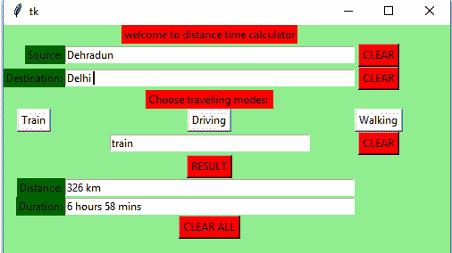

# Python |使用 Tkinter 的距离-时间 GUI 计算器

> 原文:[https://www . geesforgeks . org/python-distance-time-GUI-calculator-using-tkinter/](https://www.geeksforgeeks.org/python-distance-time-gui-calculator-using-tkinter/)

**先决条件:**[Tkinter 简介](https://www.geeksforgeeks.org/python-gui-tkinter/) | [使用谷歌距离矩阵 API](https://www.geeksforgeeks.org/python-calculate-distance-duration-two-places-using-google-distance-matrix-api/)

Python 为开发图形用户界面提供了多个选项。在所有的 GUI 方法中，tkinter 是最常用的方法。它是 Python 附带的 Tk 图形用户界面工具包的标准 Python 接口。带有 tkinter 输出的 Python 是创建图形用户界面应用程序最快最简单的方法。使用 tkinter 创建图形用户界面是一项简单的任务。

**创建 tkinter :**

1.  导入模块–tkinter
2.  创建主窗口(容器)
3.  向主窗口添加任意数量的小部件
4.  在小部件上应用事件触发器。

让我们使用 Python Tkinter 模块创建一个基于图形用户界面的距离-时间计算器，它可以告诉两个城市/位置之间的距离以及从一个位置到另一个位置的旅行时间。

**所需模块:**

```
tkinter
requests
json
```

下面是实现:

```
# Python3 program to create Distance
# Time GUI calculator using Tkinter

# import everything from tkinter modules
from tkinter import *

# import modules
import requests, json

# Function for finding distance
# and duration between two places 
def result(source, destination, travel_modes):

    # Enter your API key here
    api_key = 'Your_api_key'

    # base variable to store base url
    base = 'https://maps.googleapis.com/maps/api/distancematrix/json?'

    # Check travel modes
    if travel_modes == "train":

        # complete_url variable to store complete url address
        complete_url = base + 'origins =' + source + \
                      '&destinations =' + destination + \
                      '&mode = transit&transit_mode = train' + \
                      '&key ='+api_key

        # get method of requests module
        # return response object
        r = requests.get(complete_url)

    else:

        # complete_url variable to
        # store complete url address
        complete_url = base + 'origins =' + source+ \
                       '&destinations ='+ destination + \
                       '&mode ='+travel_modes+'&key ='+ api_key

        # get method of requests module
        # return response object
        r = requests.get(complete_url)

    # json method of response object convert
    # json format data into python format data
    x = r.json()

    # x contains list of nested dictionaries
    # we know dictionary contains key value pair

    # Extracting useful information
    # from x dictionary
    row = x['rows'][0]
    cell = row['elements'][0]

    # Check value corresponding to
    # status key in cell dictionary
    if cell['status'] == 'OK' :

        # insert method inserting the 
        # value in the text entry box.
        # Extracting useful information
        # from cell dictionary and inserting
        # into the respective text fields.
        distance_field.insert(10, cell['distance']['text'])
        duration_field.insert(10, cell['duration']['text'])

    else :

        # insert method inserting the
        # value in the text entry box.
        # Extract value corresponding to
        # status key from cell dictionary and
        # inserting into the respective text fields.
        mode_field.insert(10, cell['status'])
        distance_field.insert(10, cell['status'])

# Function for getting values from
# respective text entry boxes and 
# calling result function .                             
def find() :

    # get method returns current text 
    # as a string from text entry box
    source = source_field.get()
    destination = destination_field.get()
    travel_modes = mode_field.get()

    # Calling result() Function
    result(source, destination, travel_modes)

# Function for inserting the train string
# in the mode_field text entry box
def train() :
    mode_field.insert(10, "train")

# Function for inserting the driving string
# in the mode_field text entry box
def driving() :
    mode_field.insert(10, "driving")

# Function for inserting the walking string
# in the mode_field text entry box
def walking() :
    mode_field.insert(10, "walking")

# Function for clearing the contents 
# of source_field, distance_field,
# duration_field text entry boxes. 
def del_source() :
    source_field.delete(0, END)
    distance_field.delete(0, END)
    duration_field.delete(0, END)

# Function for clearing the contents of 
# destination_field, distance_field,
# duration_field text entry boxes.
def del_destination() :
    destination_field.delete(0, END)
    distance_field.delete(0, END)
    duration_field.delete(0, END)

# function for clearing the contents of mode_field,
# distance_field, duration_field text entry boxes.
def del_modes() :
    mode_field.delete(0, END)
    distance_field.delete(0, END)
    duration_field.delete(0, END)

# Function for clearing the
# contents of all text entry boxes 
def delete_all() :
    source_field.delete(0, END)
    destination_field.delete(0, END)
    mode_field.delete(0, END)
    distance_field.delete(0, END)
    duration_field.delete(0, END)

# Driver code
if __name__ == "__main__" :

    # Create a GUI window
    root = Tk()

    # Set the background colour of GUI window
    root.configure(background = 'light green')

    # Set the configuration of GUI window
    root.geometry("500x300")

    # Create a welcome to distance time calculator label
    headlabel = Label(root, text = 'welcome to distance time calculator',
                      fg = 'black', bg = "red")

    # Create a Source: label
    label1 = Label(root, text = "Source:",
                   fg = 'black', bg = 'dark green')

    # Create a Destination: label
    label2 = Label(root, text = "Destination:",
                   fg = 'black', bg = 'dark green')

    # Create a Choose travelling modes: label
    label3 = Label(root, text = "Choose travelling modes: ",
                   fg = 'black', bg = 'red')

    # Create a Distance: label
    label4 = Label(root, text = "Distance:",
                    fg = 'black', bg = 'dark green')

    # Create a Duration: label
    label5 = Label(root, text = "Duration:", 
                    fg = 'black', bg = 'dark green')

    # grid method is used for placing
    # the widgets at respective positions
    # in table like structure . 
    headlabel.grid(row = 0, column = 1)
    label1.grid(row = 1, column = 0, sticky ="E")
    label2.grid(row = 2, column = 0, sticky ="E")
    label3.grid(row = 3, column = 1)
    label4.grid(row = 7, column = 0, sticky ="E")
    label5.grid(row = 8, column = 0, sticky ="E")

    # Create a text entry box
    # for filling or typing the information.
    source_field = Entry(root)
    destination_field = Entry(root)
    mode_field = Entry(root)
    distance_field = Entry(root)
    duration_field = Entry(root)

    # grid method is used for placing
    # the widgets at respective positions
    # in table like structure .
    # ipadx keyword argument set width of entry space .
    source_field.grid(row = 1, column = 1, ipadx ="100")
    destination_field.grid(row = 2, column = 1, ipadx ="100")
    mode_field.grid(row = 5, column = 1, ipadx ="50")
    distance_field.grid(row = 7, column = 1, ipadx ="100")
    duration_field.grid(row = 8, column = 1, ipadx ="100")

    # Create a CLEAR Button and attached
    # to del_source function
    button1 = Button(root, text = "CLEAR", bg = "red",
                     fg = "black", command = del_source)

    # Create a CLEAR Button and attached to del_destination
    button2 = Button(root, text = "CLEAR", bg = "red",
                     fg = "black", command = del_destination)

    # Create a RESULT Button and attached to find function
    button3 = Button(root, text = "RESULT", 
                     bg = "red", fg = "black",
                                command = find)

    # Create a CLEAR ALL Button and attached to delete_all function
    button4 = Button(root, text = "CLEAR ALL",
                     bg = "red", fg = "black",
                            command = delete_all)

    # Create a Train Button and attached to train function
    button5 = Button(root, text = "Train", command = train)

    # Create a Driving Button and attached to driving function
    button6 = Button(root, text = "Driving", command = driving)

    # Create a Walking Button and attached to walking function
    button7 = Button(root, text = "Walking", command = walking)

    # Create a CLEAR Button and attached to del_modes function
    button8 = Button(root, text = "CLEAR",
                     fg = "black", bg = "red",
                           command = del_modes)

    # grid method is used for placing
    # the widgets at respective positions
    # in table like structure .
    button1.grid(row = 1, column = 2)
    button2.grid(row = 2, column = 2)
    button3.grid(row = 6, column = 1)
    button4.grid(row = 9, column = 1)
    button5.grid(row = 4, column = 0)
    button6.grid(row = 4, column = 1)
    button7.grid(row = 4, column = 2)
    button8.grid(row = 5, column = 2)

    # Start the GUI
    root.mainloop()
```

**输出:**

