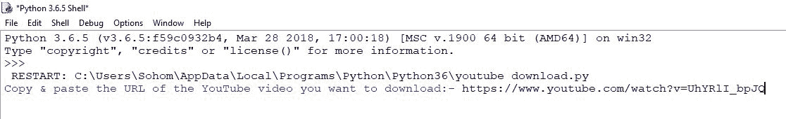
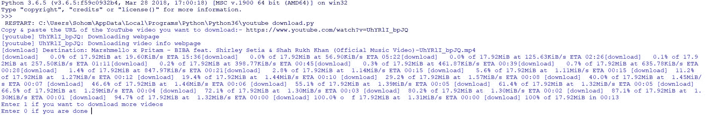
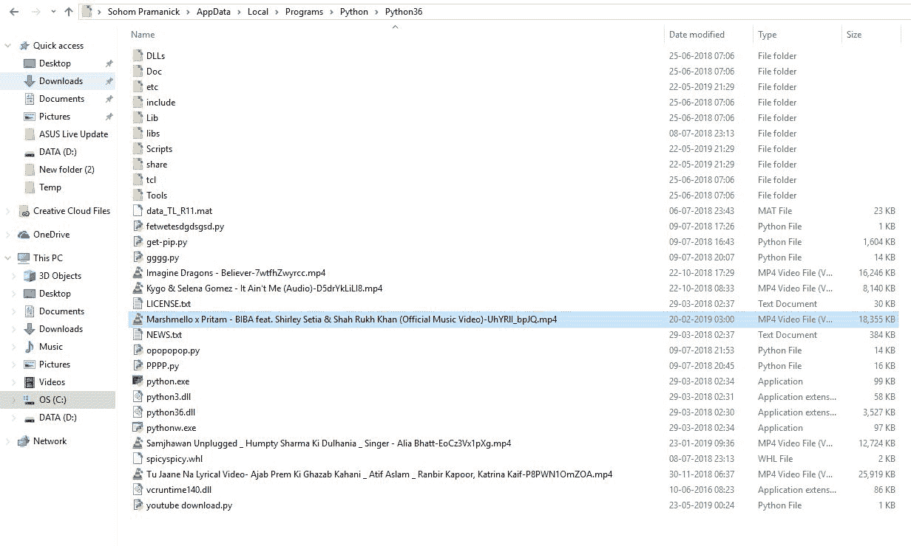

# Python |使用 youtube_dl 模块下载 YouTube 视频

> 原文:[https://www . geesforgeks . org/python-download-YouTube-videos-use-YouTube _ dl-module/](https://www.geeksforgeeks.org/python-download-youtube-videos-using-youtube_dl-module/)

每天，你都必须在 YouTube 上看一些视频，这些视频可能与音乐、电影、研究、调查、休闲等相关。您可能希望存储一些视频，以备将来使用，因为缺少互联网、保存数据或任何其他原因，需要这些视频。

如果我们告诉你，你可以用 Python 做同样的事情。让我们看看如何使用 Python 中的`**youtube_dl**` 模块下载 Youtube 视频。

使用以下命令安装模块–

```py
pip install youtube_dl

```

现在，假设你正在 YouTube 上看这个视频。


下面是 Python 代码–

```py
# importing module
import youtube_dl

ydl_opts = {}

def dwl_vid():
    with youtube_dl.YoutubeDL(ydl_opts) as ydl:
        ydl.download([zxt])

channel = 1
while (channel == int(1)):
    link_of_the_video = input("Copy & paste the URL of the YouTube video you want to download:- ")
    zxt = link_of_the_video.strip()

    dwl_vid()
    channel = int(input("Enter 1 if you want to download more videos \nEnter 0 if you are done "))
```

**输出:**



一切都结束了。您想要的视频会下载到 Python 文件夹中。
