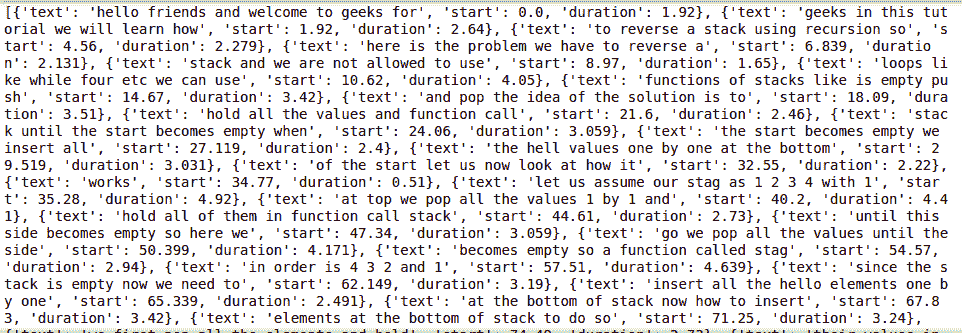
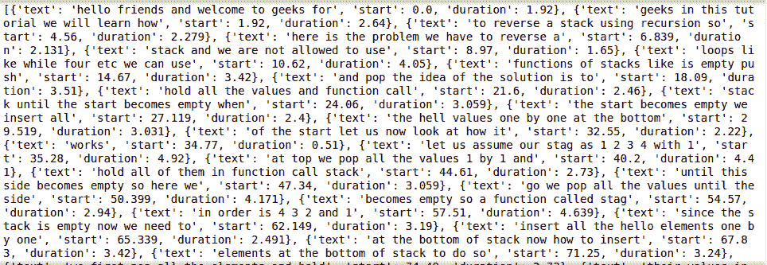
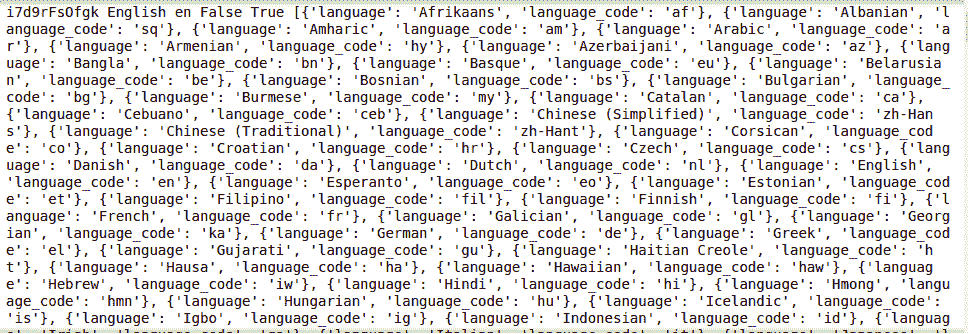
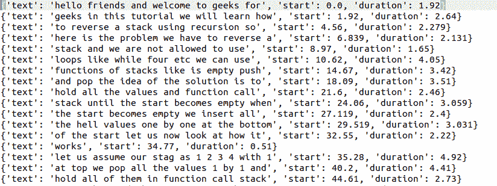

# Python–从 YouTube 下载字幕

> 原文:[https://www . geesforgeks . org/python-下载-字幕-来自-youtube/](https://www.geeksforgeeks.org/python-downloading-captions-from-youtube/)

Python 提供了大量的 API 供开发人员选择。谷歌提供的每一项服务都有相关的应用编程接口。作为其中之一，YouTube 抄本 API 使用非常简单，提供了各种功能。

在本文中，我们将学习如何从 YouTube 视频下载字幕或字幕。字幕可以由 YouTube 自动生成，也可以由导师手动添加，如果这两种类型都有，我们也可以看看如何获得特定的手动或自动字幕。我们还将探索如何获取特定语言的标题，并将标题从一种语言翻译成另一种语言。然后，我们还将看到如何在文本文件中编写抄本。

**youtube _ 抄本 _api:** 该模块用于从 YouTube 视频中获取字幕/字幕。可以使用以下方式安装:

```
pip install youtube-transcript-api # for windows
or 
pip3 install youtube-transcript-api # for Linux and MacOs 
```

在开始这个过程之前，我们想解释一下如何获取 YouTube 视频的视频 id。例如，如果 YouTube 视频有以下网址

```
https://youtu.be/SW14tOda_kI
```

那么这个视频的视频 id 应该是“ *SW14tOda_kI”，*也就是在*后面的所有短语？v=* 计为视频 id。这对于 YouTube 上的每一个视频都是独一无二的。

### 入门指南

*   现在我们将从基础开始，在第一个代码片段中，我们试图使用**获取视频 id 的副本。get _ 抄本()**函数。
*   它向我们返回一个字典列表，其中每个字典包含 3 个键值对，第一个是内容，第二个是开始说出标题句子/短语的时刻，第三个是完整说出该句子或短语的持续时间(以秒为单位)。
*   第一行基本上导入所需的包，下一行分配一个变量来存储字典列表，最后在第三行打印出变量。

## 蟒蛇 3

```
from youtube_transcript_api import YouTubeTranscriptApi

# assigning srt variable with the list
# of dictonaries obtained by the get_transcript() function
srt = YouTubeTranscriptApi.get_transcript("SW14tOda_kI")

# prints the result
print(srt)
```

**输出:**



要获取一个以上视频的转录本，我们可以使用逗号来传递，如在 YouTubeTranscriptApi.get _ 抄本(videoid1，Videoid2，…)中。)，在这种情况下，我们会有一个列表列表，在每个内部列表中，我们会有一个字典。

### 获取特定语言的抄本

现在，如果我们想得到一种特定语言的文字记录，我们可以把语言作为一个参数。在下一个代码片段中，我们也打算这样做。所有的代码和工作将与前面的例子相同，不同的是，这次它将只获得英语成绩单，并忽略字幕(如果有的话)。

## 蟒蛇 3

```
from youtube_transcript_api import YouTubeTranscriptApi

# assigning srt variable with the list of dictonaries
# obtained by the the .get_transcript() function
# and this time it gets only teh subtitles that
# are of english langauge.
srt = YouTubeTranscriptApi.get_transcript("SW14tOda_kI",
                                          languages=['en'])

# prints the result
print(srt)
```

**输出:**



由于我们正在考虑的这个例子的视频只有英文字幕，所以两个例子给了我们相同的答案。

### 获取所有成绩单的列表

*   现在要获得一个视频的所有副本的列表，我们可以使用**。list _ 成绩单()**功能。这个函数返回视频中所有可用语言的所有文本。它返回可迭代的转录列表对象，并提供方法来过滤特定语言和类型的转录列表。
*   接下来，我们使用函数从获得的元数据中获取一些关于抄本的数据。
    *   **抄本. video_id** 返回视频的视频 id 给我们
    *   **抄本语言**返回给我们抄本的语言
    *   **抄本. language_code** 返回给我们抄本的语言 cod，例如，英语的“en”等。
    *   **抄本. is_generated** 告诉我们是手工创建的还是 YouTube 生成的
    *   **抄本. is _ translated**表示该抄本是否可以翻译
    *   **抄本. translation_languages** 它给出了抄本可以翻译成的语言列表。
*   然后我们用**。fetch()** 函数获取实际的成绩单。
*   然后我们还展示了如何使用**。translate()** 功能是将字幕从一种语言转换/翻译成另一种语言，如果它是可翻译的(因为我们只有这种语言的英文字幕，在这种情况下可能不明显，但是如果视频中有多种语言的文字记录，这种翻译非常有用)。
*   下一行我们有**。find _ 抄本()**功能，帮助我们获得我们想要的视频的实际抄本以及元数据。
*   最后，我们使用了**。find _ manually _ created _ 抄本()**功能专门查找手动下标，类似于这个我们有**。find _ generated _ 抄本()**我们在这个例子中没有用到，因为没有生成字幕，这里只有手动字幕。

## 蟒蛇 3

```
# importing the module
from youtube_transcript_api import YouTubeTranscriptApi

# retrieve the available transcripts
transcript_list = YouTubeTranscriptApi.list_transcripts('SW14tOda_kI')

# iterate over all available transcripts
for transcript in transcript_list:

    # the Transcript object provides metadata
    # properties
    print(
        transcript.video_id,
        transcript.language,
        transcript.language_code,

        # whether it has been manually created or
        # generated by YouTube
        transcript.is_generated,

        # whether this transcript can be translated
        # or not
        transcript.is_translatable,

        # a list of languages the transcript can be
        # translated to
        transcript.translation_languages,
    )

    # fetch the actual transcript data
    print(transcript.fetch())

    # translating the transcript will return another
    # transcript object
    print(transcript.translate('en').fetch())

# you can also directly filter for the language you are
# looking for, using the transcript list
transcript = transcript_list.find_transcript(['en'])

# or just filter for manually created transcripts
transcript = transcript_list.find_manually_created_transcript(['en'])
```

**输出:**



### 将字幕写入文本文件

现在我们将看到如何在文本文件中编写 YouTube 视频的字幕。首先，我们将导入模块，然后使用。函数并将其存储到一个变量中。然后我们将使用 python 的内置文件读取器。该行使用了一个上下文管理器，这样我们就不用担心在工作完成后关闭文件。我们以写模式打开一个名为*字幕. txt* 的文件，然后在其中我们将遍历列表的每个元素，然后将其写入文件。代码如下:

## 蟒蛇 3

```
# importing modules
from youtube_transcript_api import YouTubeTranscriptApi

# using the srt variable with the list of dictonaries
# obtained by the the .get_transcript() function
srt = YouTubeTranscriptApi.get_transcript("SW14tOda_kI")

# creating or overwriting a file "subtitles.txt" with
# the info inside the context manager
with open("subtitles.txt", "w") as f:

        # iterating through each element of list srt
    for i in srt:
        # writing each element of srt on a new line
        f.write("{}\n".format(i))
```

**输出:**



该文件将在与。py 文件如果您只是在上下文管理器中输入文件的名称，要在不同的位置创建/保存它，我们需要给出它的绝对或相对路径。此外，程序可能会为字幕中的未知字符生成错误。但是，字幕文件将使用已知字符创建。