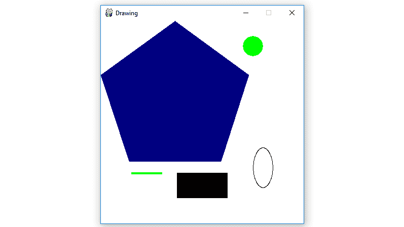

# Python |在 PyGame 窗口上绘制不同的形状

> 原文:[https://www . geesforgeks . org/python-drawing-异状-on-pygame-window/](https://www.geeksforgeeks.org/python-drawing-different-shapes-on-pygame-window/)

**`Pygame`** 是一套跨平台的 Python 模块，专为编写视频游戏而设计。它包括设计用于 Python 编程语言的计算机图形和声音库。现在，这取决于开发者的想象力或必要性，他/她想使用这个工具包开发什么类型的游戏。

命令安装 **pygame** :

```
pip install pygame

```

在`pygame`窗口显示图像有四个基本步骤:

*   使用 pygame 的`display.set_mode()`方法创建显示表面对象。
*   使用 pygame 显示表面对象的`fill()`方法，用白色完全填充表面对象。
*   使用 pygame 的`Primitive Drawing Functions`在表面物体上绘制不同的形状。
*   使用 pygame 的`display.update()`方法在 pygame 窗口显示显示面对象。

下面是实现:

```
# import pygame module in this program
import pygame

# activate the pygame library .
# initiate pygame and give permission
# to use pygame's functionality.
pygame.init()

# define the RGB value
# for white, green,
# blue, black, red
# colour respectively.
white = (255, 255, 255)
green = (0, 255, 0)
blue = (0, 0, 128)
black = (0, 0, 0)
red = (255, 0, 0)

# assigning values to X and Y variable
X = 400
Y = 400

# create the display surface object
# of specific dimension..e(X,Y).
display_surface = pygame.display.set_mode((X, Y ))

# set the pygame window name
pygame.display.set_caption('Drawing')

# completely fill the surface object 
# with white colour 
display_surface.fill(white)

# draw a polygon using draw.polygon()
# method of pygame.
# pygame.draw.polygon(surface, color, pointlist, thickness)
# thickness of line parameter is optional.
pygame.draw.polygon(display_surface, blue,
                    [(146, 0), (291, 106),
                    (236, 277), (56, 277), (0, 106)])

# draw a line using draw.line()
# method of pygame.
# pygame.draw.line(surface, color,
# start point, end point, thickness) 
pygame.draw.line(display_surface, green,
                (60, 300), (120, 300), 4)

# draw a circle using draw.circle()
# method of pygame.
# pygame.draw.circle(surface, color,
# center point, radius, thickness) 
pygame.draw.circle(display_surface,
           green, (300, 50), 20, 0)

# draw a ellipse using draw.ellipse()
# method of pygame.
# pygame.draw.ellipse(surface, color,
# bounding rectangle, thickness) 
pygame.draw.ellipse(display_surface, black,
                    (300, 250, 40, 80), 1)

# draw a rectangle using draw.rect()
# method of pygame.
# pygame.draw.rect(surface, color,
# rectangle tuple, thickness)
# thickness of line parameter is optional.
pygame.draw.rect(display_surface, black,
                    (150, 300, 100, 50))

# infinite loop
while True :

    # iterate over the list of Event objects
    # that was returned by pygame.event.get() method.
    for event in pygame.event.get() :

        # if event object type is QUIT
        # then quitting the pygame
        # and program both.
        if event.type == pygame.QUIT :

            # deactivates the pygame library
            pygame.quit()

            # quit the program.
            quit()

        # Draws the surface object to the screen. 
        pygame.display.update() 
```

**输出:**
