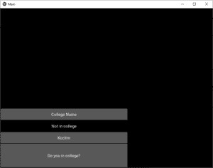
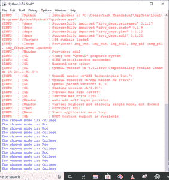

# Python | kivy 中的下拉列表使用。kv 文件

> 原文:[https://www . geesforgeks . org/python-下拉列表-in-kivy-using-kv-file/](https://www.geeksforgeeks.org/python-drop-down-list-in-kivy-using-kv-file/)

Kivy 是 Python 中独立于平台的 GUI 工具。因为它可以在安卓、IOS、linux 和 Windows 等平台上运行。它基本上是用来开发安卓应用程序的，但并不意味着它不能在桌面应用程序上使用。

> 👉🏽 [Kivy 教程–通过示例学习 Kivy](https://www.geeksforgeeks.org/kivy-tutorial/)。

### dropdownlist

下拉列表可以与自定义小部件一起使用。它允许您在显示的小部件下显示小部件列表。与其他工具包不同，小部件列表可以包含任何类型的小部件:简单的按钮、图像等。
下拉列表的定位是全自动的:我们会一直尝试以用户可以选择列表中某个项目的方式放置下拉列表。

> 要使用此小部件，您必须从 kivy.uix.dropdown 导入下拉菜单中导入:

```
Basic Approach:
1) import kivy
2) import kivyApp
3) import dropdown
4) import Floatlayout(according to need)
5) Set minimum version(optional)
6) Create Layout class
7) Create App class
9) create .kv file (name same as the app class):
        1) create Dropdown
        2) create callback
        3) And many more styling as needed
10) return Layout/widget/Class(according to requirement)
11) Run an instance of the class
```

**#。py 文件**

## 蟒蛇 3

```
'''
Code of How to use drop-down list with.kv file
'''

# Program to Show how to create a switch 
# import kivy module    
import kivy  

# base Class of your App inherits from the App class.    
# app:always refers to the instance of your application   
from kivy.app import App 

# this restrict the kivy version i.e  
# below this kivy version you cannot  
# use the app or software  
kivy.require('1.9.0') 

# drop-down menu is a list of items that
# appear whenever a piece of text or a
# button is clicked.
# To use drop down you must have ti import it
from kivy.uix.dropdown  import DropDown

# module consists the floatlayout  
# to work with FloatLayout first  
# you have to import it  
from kivy.uix.floatlayout import FloatLayout

# The Button is a Label with associated actions that
# are triggered when the button is pressed (
# or released after a click / touch).
from kivy. uix . button  import Button

class CustomDropDown(DropDown):
    pass

class DropdownDemo(FloatLayout):
    '''The code of the application itself.''' 
    def __init__(self, **kwargs):

        '''The button at the opening of the window is created here,
        not in kv
        ''' 
        super(DropdownDemo, self).__init__(**kwargs)
        self.dropdown = CustomDropDown()

        # Creating a self widget button
        self.mainbutton = Button(text ='Do you in college?',
                                 size_hint_x = 0.6, size_hint_y = 0.15)

        # Added button to FloatLayout so inherits this class 
        self.add_widget(self.mainbutton)

        # Adding actions 
        # If click 
        self.mainbutton.bind(on_release = self.dropdown.open)

        # root.select on_select called
        self.dropdown.bind(on_select = lambda\
                           instance, x: setattr(self.mainbutton, 'text', x))
        self.dropdown.bind(on_select = self.callback)

    def callback(self, instance, x):
        '''x is self.mainbutton.text refreshed''' 
        print ( "The chosen mode is: {0}" . format ( x ) )

class MainApp(App):
    '''The build function returns root,
    here root = DropdownDemo ().
    root can only be called in the kv file.
    ''' 
    def build(self):
        return DropdownDemo()

if __name__ == '__main__':

    MainApp().run()
```

**。kv 文件:**

## 蟒蛇 3

```
<CustomDropDown>:
    Button:
        text: 'College Name'
        size_hint_y: None
        height: 44
        on_release: root.select('College is')
    Label:
        text: 'Not in college'
        size_hint_y: None
        height: 44
    Button:
        text: 'KccItm'
        size_hint_y: None
        height: 44
        on_release: root.select('Kcc')
```

**输出:**



