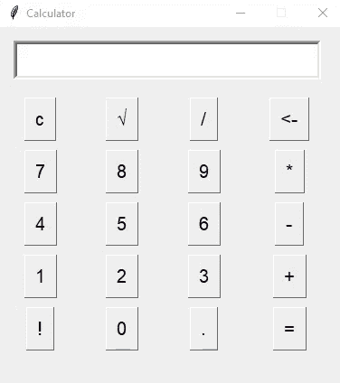

# Python–使用 Tkinter 模块的动态 GUI 计算器

> 原文:[https://www . geesforgeks . org/python-dynamic-GUI-calculator-using-tkinter-module/](https://www.geeksforgeeks.org/python-dynamic-gui-calculator-using-tkinter-module/)

Python 为开发图形用户界面提供了许多选项，如 Kivy、PyQT、WxPython 和其他一些选项。Tkinter 是内置 python 的版本，这使得它成为最常用的版本。Tkinter 简单、快速、强大。

初学者可以轻松学会使用本文创建一个简单的计算器: [Python |使用 Tkinter 的简单 GUI 计算器](https://www.geeksforgeeks.org/python-simple-gui-calculator-using-tkinter/)

通过手动添加每个按钮并为每个独特的按钮创建不同的功能来创建简单的计算器是一项乏味的任务。这不是最佳做法。在这里，我们将看到一个动态计算器程序，可以很容易地缩放。让我们创建一个简单易用的图形用户界面计算器，它可以进行乘法、除法、平方根、加法和减法等基本数学运算，甚至可以添加更多的运算，并根据它对函数进行更改。

#### 逐步方法:

*   创建主窗口
*   创建包含计算器中使用的所有键的容器(此处列出)
*   为我们创建的所有按钮创建一个容器
*   创建按钮并将它们添加到按钮容器中
*   定义按下按钮时要调用的函数
*   运行主循环

#### 下面是上述方法的实现:

## 蟒蛇 3

```
# Import required modules
from tkinter import *
import tkinter.font as font

# Creating the main window
root = Tk()

# Assigning it the desired geometry
root.geometry("380x400")

# Assigning the name of our window
root.title("Calculator")

# Assigning it the capability to
# be resizable (It is default)
root.resizable(0, 0)

# Creating a StringVar to take
# the text entered in the Entry widget
inp = StringVar()
myFont = font.Font(size=15)

# Creating an Entry widget to get the
# mathematical expression
# And also to display the results
screen = Entry(root, text=inp, width=30,
               justify='right', font=(10), bd=4)

# We will use a grid like structure
screen.grid(row=0, columnspan=4, padx=15,
            pady=15, ipady=5)

# Key matrix contains all the required the keys
key_matrix = [["c", u"\u221A", "/", "<-"],
              ["7", "8", "9", "*"],
              ["4", "5", "6", "-"],
              ["1", "2", "3", "+"],
              ["!", 0, ".", "="]]

# Creating a dictionary for the buttons
btn_dict = {}

# Variable to store our results
ans_to_print = 0

# Defining the function for calculation
def Calculate(event):

    # getting the name of the button clicked
    button = event.widget.cget("text")

    # Referring the global values
    global key_matrix, inp, ans_to_print

    try:
        # Event containing a sqrt operation
        if button == u"\u221A":
            ans = float(inp.get())**(0.5)
            ans_to_print = str(ans)
            inp.set(str(ans))

        elif button == "c":  # Clear Button
            inp.set("")

        elif button == "!":  # Factorial
            def fact(n): return 1 if n == 0 else n*fact(n-1)
            inp.set(str(fact(int(inp.get()))))

        elif button == "<-":  # Backspace
            inp.set(inp.get()[:len(inp.get())-1])

        elif button == "=":  # Showing The Results
            # Calculating the mathematical exp. using eval
            ans_to_print = str(eval(inp.get()))
            inp.set(ans_to_print)

        # You may add many more operations

        else:
            # Displaying the digit pressed on screen
            inp.set(inp.get()+str(button))

    except:
        # In case invalid syntax given in expression
        inp.set("Wrong Operation")

# Creating the buttons using for loop

# Number of rows containing buttons
for i in range(len(key_matrix)): 
    # Number of columns 
    for j in range(len(key_matrix[i])): 

        # Creating and Adding the buttons to dictionary
        btn_dict["btn_"+str(key_matrix[i][j])] = Button(
          root, bd=1, text=str(key_matrix[i][j]), font=myFont)

        # Positioning buttons
        btn_dict["btn_"+str(key_matrix[i][j])].grid(
          row=i+1, column=j, padx=5, pady=5, ipadx=5, ipady=5)

        # Assigning an action to the buttons
        btn_dict["btn_"+str(key_matrix[i][j])].bind('<Button-1>', Calculate)

# Running the main loop
root.mainloop()
```

**输出:**



输出示例 2