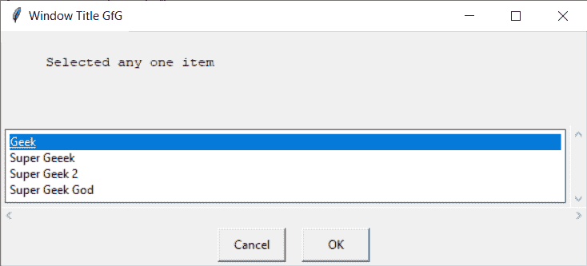
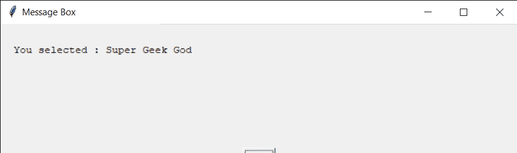
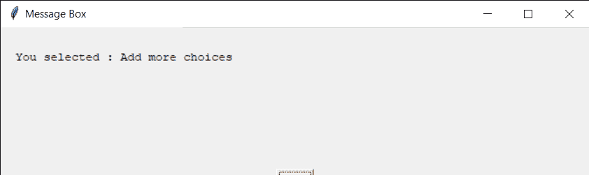

# Python EasyGUI–选择框

> 原文:[https://www.geeksforgeeks.org/python-easygui-choice-box/](https://www.geeksforgeeks.org/python-easygui-choice-box/)

**选择框:**用于在 EasyGUI 中显示一个有多个选项即项目的窗口，可用于需要在一组项目中选择任何一个项目的地方，它由标题、要显示的消息、一组项目和一对确认项目选择的“确定”、“取消”按钮组成。下面是选择框的外观


> 为了做到这一点，我们将使用`choicebox`方法
> 
> **语法:**选择框(消息、标题、选项)
> 
> **参数:**需要 3 个参数，第一个字符串即要显示的消息/信息，第二个字符串即窗口标题，第三个是字符串列表即项目
> 
> **返回:**返回选中项目的显示文本，无

**示例:**
在这里我们将创建一个带有多个项目的选择框，当任何一个项目被确认后它会根据该项目在屏幕上显示具体的消息，下面是实现

```py
# importing easygui module
from easygui import *

# message to be displayed
text = "Selected any one item"

# window title
title = "Window Title GfG"

# item choices
choices = ["Geek", "Super Geeek", "Super Geek 2", "Super Geek God"]

# creating a button box
output = choicebox(text, title, choices)

# title for the message box
title = "Message Box"

# message 
message = "You selected : " + str(output)

# creating a message box 
msg = msgbox(message, title)
```

**输出:**

<video class="wp-video-shortcode" id="video-480702-1" width="665" height="263" preload="metadata" controls=""><source type="video/mp4" src="https://media.geeksforgeeks.org/wp-content/uploads/20200903235550/Window-Title-GfG-2020-09-03-23-55-22.mp4?_=1">[https://media.geeksforgeeks.org/wp-content/uploads/20200903235550/Window-Title-GfG-2020-09-03-23-55-22.mp4](https://media.geeksforgeeks.org/wp-content/uploads/20200903235550/Window-Title-GfG-2020-09-03-23-55-22.mp4)</video>


**另一个例子:**
在这个中我们将创建一个选择框，不添加任何项目，当任何项目被确认时它将根据项目在屏幕上显示具体的消息，下面是实现

```py
# importing easygui module
from easygui import *

# message to be displayed
text = "Selected any one item"

# window title
title = "Window Title GfG"

# creating a button box
output = choicebox(text, title)

# title for the message box
title = "Message Box"

# message 
message = "You selected : " + str(output)

# creating a message box 
msg = msgbox(message, title)
```

**输出:**

<video class="wp-video-shortcode" id="video-480702-2" width="665" height="230" preload="metadata" controls=""><source type="video/mp4" src="https://media.geeksforgeeks.org/wp-content/uploads/20200904003431/Window-Title-GfG-2020-09-04-00-34-01.mp4?_=2">[https://media.geeksforgeeks.org/wp-content/uploads/20200904003431/Window-Title-GfG-2020-09-04-00-34-01.mp4](https://media.geeksforgeeks.org/wp-content/uploads/20200904003431/Window-Title-GfG-2020-09-04-00-34-01.mp4)</video>
