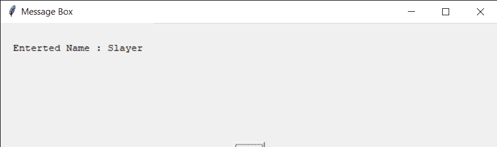
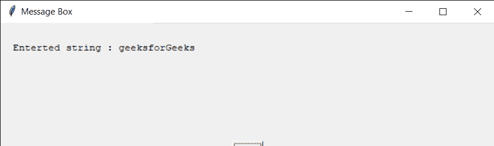

# Python EasyGUI–进入框

> 原文:[https://www.geeksforgeeks.org/python-easygui-enter-box/](https://www.geeksforgeeks.org/python-easygui-enter-box/)

**输入框:**用于获取用户的输入，输入可以是任意键盘输入，它采取字符串形式输入。它显示标题、要显示的消息、输入文本的位置以及一对用于确认输入的“确定”、“取消”按钮。我们也可以在用户输入文本的地方设置一些默认的文本，下图是
T3 的输入框

> 为了做到这一点，我们将使用`enterbox`方法
> 
> **语法:**输入框(消息、标题、默认文本)
> 
> **参数:**需要 3 个参数，第一个字符串即要显示的消息/信息，第二个字符串即窗口标题，第三个字符串即默认文本
> 
> **返回:**如果按下取消，则返回输入的文本和无

**示例:**
在这里我们将创建一个带有默认文本的输入框，并根据输入的文本在屏幕上显示具体的消息，下面是实现

```py
# importing easygui module
from easygui import *

# message to be displayed
text = "Enter your Geek name !!"

# window title
title = "Window Title GfG"

# default text
d_text = "Enter here.."

# creating a enter box
output = enterbox(text, title, d_text)

# title for the message box
title = "Message Box"

# creating a message
message = "Enterted Name : " + str(output)

# creating a message box
msg = msgbox(message, title)
```

**输出:**

<video class="wp-video-shortcode" id="video-480697-1" width="665" height="217" preload="metadata" controls=""><source type="video/mp4" src="https://media.geeksforgeeks.org/wp-content/uploads/20200904015705/Window-Title-GfG-2020-09-04-01-56-34.mp4?_=1">[https://media.geeksforgeeks.org/wp-content/uploads/20200904015705/Window-Title-GfG-2020-09-04-01-56-34.mp4](https://media.geeksforgeeks.org/wp-content/uploads/20200904015705/Window-Title-GfG-2020-09-04-01-56-34.mp4)</video>


**另一个例子:**
在这里我们会创建一个回车框，并且会根据输入的文本在屏幕上显示具体的消息，下面是实现

```py
# importing easygui module
from easygui import *

# message to be displayed
text = "Enter Something"

# window title
title = "Window Title GfG"

# creating a enter box
output = enterbox(text, title)

# title for the message box
title = "Message Box"

# creating a message
message = "Enterted string : " + str(output)

# creating a message box
msg = msgbox(message, title)
```

**输出:**

<video class="wp-video-shortcode" id="video-480697-2" width="665" height="217" preload="metadata" controls=""><source type="video/mp4" src="https://media.geeksforgeeks.org/wp-content/uploads/20200904020045/Window-Title-GfG-2020-09-04-02-00-08.mp4?_=2">[https://media.geeksforgeeks.org/wp-content/uploads/20200904020045/Window-Title-GfG-2020-09-04-02-00-08.mp4](https://media.geeksforgeeks.org/wp-content/uploads/20200904020045/Window-Title-GfG-2020-09-04-02-00-08.mp4)</video>
