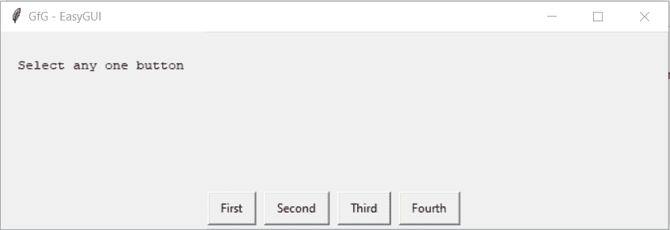

# Python EasyGUI–索引框

> 哎哎哎:# t0]https://www . geeksforgeeks . org/python-easy GUI 索引盒/

**索引框:**用于在 EasyGUI 中显示一个有多个选项即按钮的窗口，可以在需要获取用户选择的选项的地方使用。它类似于按钮框，但用于按钮同名的地方，它根据按钮的索引指定选定的按钮。按钮的索引从 0 开始，下面是索引框的样子


> 为了做到这一点，我们将使用`indexbox`方法
> 
> **语法:**索引框(消息、标题、按钮)
> 
> **参数:**需要 3 个参数，第一个字符串即要显示的消息/信息，第二个字符串即窗口标题，第三个是字符串列表即按钮
> 
> **返回:**返回用户选择的索引的返回

**示例:**
在这里我们将创建一个添加了按钮的索引框，当任何按钮被按下时，它都会根据索引在屏幕上显示具体的消息，下面是实现

```py
# importing easygui module
from easygui import *

# message / information to be displayed on the screen
message = "Select any one button"

# title of the window
title = "GfG - EasyGUI"

# list of buttons 
buttons = ["First", "Second", "Third", "Fourth"]

# creating a index box
output = indexbox(message, title, buttons)

# showing new message according to the buttons pressed
# if index is 0
if output == 0:

    # message / information
    message = "First"
# if index is 1
elif output == 1:

    # message / information
    message = "Second"

# if index is 2
elif output == 2:

    # message / information
    message = "Third"

# if index is 3
elif output == 3:

    # message / information
    message = "Fourth"

# message 
message = message + " Button Pressed"
# title of the window
title = "GfG - EasyGUI"

# creating a message box
msg = msgbox(message, title)

```

**输出:**

<video class="wp-video-shortcode" id="video-479811-1" width="665" height="197" preload="metadata" controls=""><source type="video/mp4" src="https://media.geeksforgeeks.org/wp-content/uploads/20200903015330/GfG-EasyGUI-2020-09-03-01-52-59.mp4?_=1">[https://media.geeksforgeeks.org/wp-content/uploads/20200903015330/GfG-EasyGUI-2020-09-03-01-52-59.mp4](https://media.geeksforgeeks.org/wp-content/uploads/20200903015330/GfG-EasyGUI-2020-09-03-01-52-59.mp4)</video>
<video class="wp-video-shortcode" id="video-479811-2" width="665" height="197" preload="metadata" controls=""><source type="video/mp4" src="https://media.geeksforgeeks.org/wp-content/uploads/20200903015343/GfG-EasyGUI-2020-09-03-01-53-10.mp4?_=2">[https://media.geeksforgeeks.org/wp-content/uploads/20200903015343/GfG-EasyGUI-2020-09-03-01-53-10.mp4](https://media.geeksforgeeks.org/wp-content/uploads/20200903015343/GfG-EasyGUI-2020-09-03-01-53-10.mp4)</video>

**另一个例子:**
在这里我们将创建一个没有设置任何按钮的索引框，当任何按钮被按下时它会根据索引在屏幕上显示具体的消息，下面是实现

```py
# importing easygui module
from easygui import *

# message / information to be displayed on the screen
message = "Select any one button"

# title of the window
title = "GfG - EasyGUI"

# creating a index box
output = indexbox(message, title)

# showing new message according to the buttons pressed
# if index is 0
if output == 0:

    # message / information
    message = "First"
# if index is 1
elif output == 1:

    # message / information
    message = "Second"

# message 
message = message + " Button Pressed"

# title of the window
title = "GfG - EasyGUI"

# creating a message box
msg = msgbox(message, title)

```

**输出:**

<video class="wp-video-shortcode" id="video-479811-3" width="665" height="197" preload="metadata" controls=""><source type="video/mp4" src="https://media.geeksforgeeks.org/wp-content/uploads/20200903015612/GfG-EasyGUI-2020-09-03-01-55-46.mp4?_=3">[https://media.geeksforgeeks.org/wp-content/uploads/20200903015612/GfG-EasyGUI-2020-09-03-01-55-46.mp4](https://media.geeksforgeeks.org/wp-content/uploads/20200903015612/GfG-EasyGUI-2020-09-03-01-55-46.mp4)</video>
<video class="wp-video-shortcode" id="video-479811-4" width="665" height="197" preload="metadata" controls=""><source type="video/mp4" src="https://media.geeksforgeeks.org/wp-content/uploads/20200903015343/GfG-EasyGUI-2020-09-03-01-53-10.mp4?_=4">[https://media.geeksforgeeks.org/wp-content/uploads/20200903015343/GfG-EasyGUI-2020-09-03-01-53-10.mp4](https://media.geeksforgeeks.org/wp-content/uploads/20200903015343/GfG-EasyGUI-2020-09-03-01-53-10.mp4)</video>