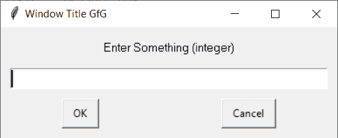
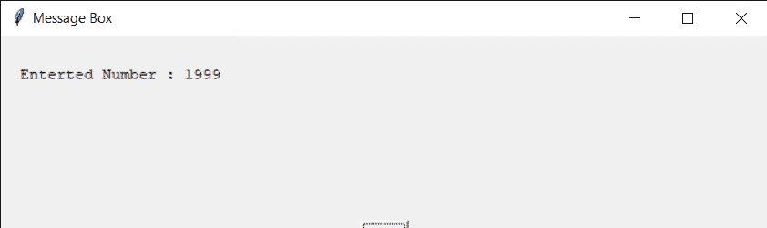

# Python EasyGUI–整数框

> 哎哎哎:# t0]https://www . geeksforgeeks . org/python-easy GUI 整数盒/

**整数框:**用于获取用户输入的整数，输入应该是整数输入，而不是输入框中出现的刺痛。它显示标题、要显示的消息、输入整数的位置以及一对用于确认输入的“确定”、“取消”按钮。我们可以在用户输入文本的地方设置一些默认的整数值，也可以设置用户可以输入的上下限值，下图是
的输入框

> 为了做到这一点，我们将使用`integerbox`方法
> 
> **语法:** integerbox(消息、标题、default_integer、下界、上界)
> 
> **参数:**取 5 个参数，第一个字符串即要显示的消息/信息，第二个字符串即窗口标题，第三个是整数，是默认整数，第四个和第五个分别是代表下限和上限的整数
> 
> **返回:**如果按下取消，则返回输入的整数和无

**示例:**
在这里我们将创建一个带有缺省整数和上下界值的整数框，并根据输入的整数在屏幕上显示具体的消息，下面是实现

```py
# importing easygui module
from easygui import *

# message to be displayed
text = "Enter Something (integer)"

# window title
title = "Window Title GfG"

# default integer
d_int = 10

# lower bound
lower = 0

# upper bound
upper = 99999

# creating a integer box
output = integerbox(text, title, d_int, lower, upper)

# title for the message box
title = "Message Box"

# creating a message
message = "Enterted Number : " + str(output)

# creating a message box
msg = msgbox(message, title)
```

**输出:**

<video class="wp-video-shortcode" id="video-480696-1" width="665" height="217" preload="metadata" controls=""><source type="video/mp4" src="https://media.geeksforgeeks.org/wp-content/uploads/20200904021929/Window-Title-GfG-2020-09-04-02-19-05.mp4?_=1">[https://media.geeksforgeeks.org/wp-content/uploads/20200904021929/Window-Title-GfG-2020-09-04-02-19-05.mp4](https://media.geeksforgeeks.org/wp-content/uploads/20200904021929/Window-Title-GfG-2020-09-04-02-19-05.mp4)</video>


**另一个例子:**
在这里我们将创建一个整数框，并根据输入的整数在屏幕上显示具体的消息，下面是实现

```py
# importing easygui module
from easygui import *

# message to be displayed
text = "Enter a number !!"

# window title
title = "Window Title GfG"

# creating a integer box
output = integerbox(text, title)

# title for the message box
title = "Message Box"

# creating a message
message = "Enterted Number : " + str(output)

# creating a message box
msg = msgbox(message, title)
```

**输出:**

<video class="wp-video-shortcode" id="video-480696-2" width="665" height="217" preload="metadata" controls=""><source type="video/mp4" src="https://media.geeksforgeeks.org/wp-content/uploads/20200904022403/Window-Title-GfG-2020-09-04-02-23-18.mp4?_=2">[https://media.geeksforgeeks.org/wp-content/uploads/20200904022403/Window-Title-GfG-2020-09-04-02-23-18.mp4](https://media.geeksforgeeks.org/wp-content/uploads/20200904022403/Window-Title-GfG-2020-09-04-02-23-18.mp4)</video>
If we try to enter wrong input i.e string or number which don’t lie between the specified lower and upper bound an error message will keep appearing until correct input is entered
<video class="wp-video-shortcode" id="video-480696-3" width="665" height="197" preload="metadata" controls=""><source type="video/mp4" src="https://media.geeksforgeeks.org/wp-content/uploads/20200904022513/Error-2020-09-04-02-23-31.mp4?_=3">[https://media.geeksforgeeks.org/wp-content/uploads/20200904022513/Error-2020-09-04-02-23-31.mp4](https://media.geeksforgeeks.org/wp-content/uploads/20200904022513/Error-2020-09-04-02-23-31.mp4)</video>