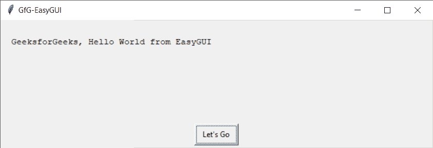
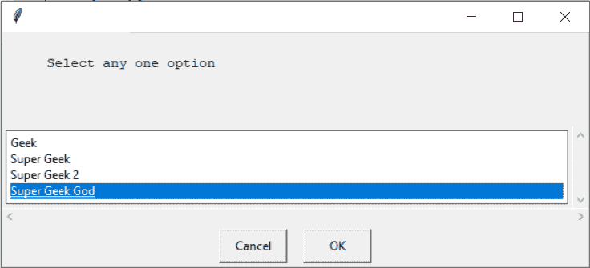

# Python EasyGUI 模块–简介

> 原文:[https://www . geesforgeks . org/python-easy GUI-module-introduction/](https://www.geeksforgeeks.org/python-easygui-module-introduction/)

**EasyGUI** 是一个用 Python 进行非常简单、非常容易的 GUI 编程的模块。EasyGUI 与其他 GUI 生成器的不同之处在于 EasyGUI 不是事件驱动的。相反，所有的图形用户界面交互都是通过简单的函数调用来调用的。与其他复杂的图形用户界面不同，易趣是迄今为止最简单的图形用户界面。

**使用以下命令安装:**

```py
pip install easygui
```

**注意:**不建议在 IDLE 上运行 EasyGui，因为 EasyGui 运行在 Tkinter 上，有自己的事件循环，IDLE 也是 Tkinter 模块编写的应用，也有自己的事件循环。因此，当两者同时运行时，可能会发生冲突，并产生不可预测的结果。因此，最好在空闲状态下运行 EasyGui。

**导入易居**

```py
from easygui import *
```

在没有额外参考的情况下使用所有小部件是最好的方法。

**示例:**
在本例中，我们将创建一个窗口，该窗口有一条短消息和一个按钮，按下该按钮将关闭我们的消息框，下面是实现

## 蟒蛇 3

```py
# importing easygui module
from easygui import *

# title of our window
title = "GfG-EasyGUI"

# message for our window
msg = "GeeksforGeeks, Hello World from EasyGUI"

# button message by default it is "OK"
button = "Let's Go"

# creating a message box
msgbox(msg, title, button )
```

**输出:**



```py
"Let's Go"
```

**另一个例子:**
在这个例子中，我们将允许用户选择“极客形式”，当 ans 被选中时，它将被打印出来，下面是实现

## 蟒蛇 3

```py
# importing easygui module
from easygui import *

# choices which user can select
choices = ["Geek", "Super Geek", "Super Geek 2", "Super Geek God"]

# message / question to be asked
msg = "Select any one option"

# opening a choice box using our msg and choices
reply = choicebox(msg, choices = choices)

# printing the selected option
print("You selected : ", end = "")
print(reply)
```

**输出:**



```py
You selected : Super Geek God
```