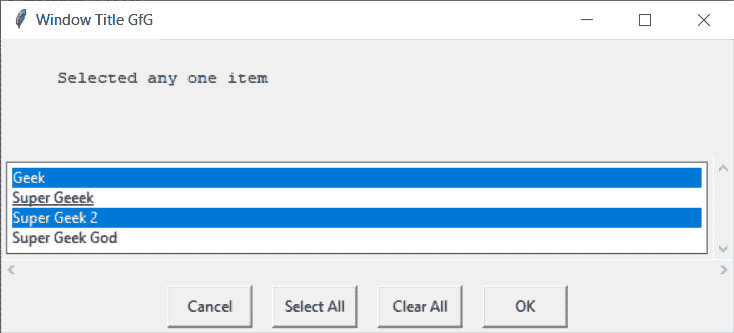
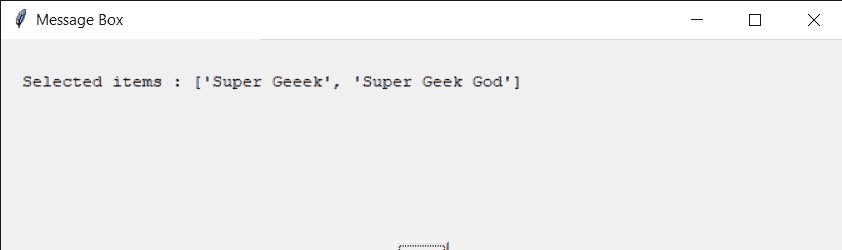
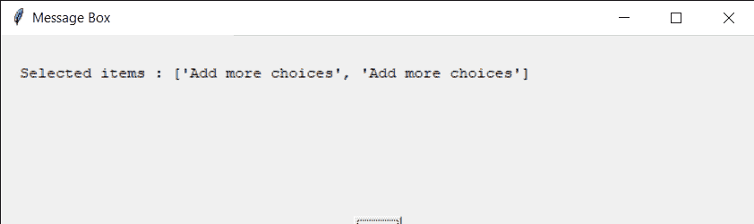

# Python EasyGUI–多选框

> 原文:[https://www . geesforgeks . org/python-easy GUI-多选-box/](https://www.geeksforgeeks.org/python-easygui-multi-choice-box/)

**多选框:**用于在 EasyGUI 中显示一个有多个选项即项目的窗口，可以在一组项目中需要选择多个项目的地方使用，它由标题、要显示的消息、一组项目和按钮即“取消”、“全选”、“全部清除”、“确定”按钮组成，用于确认项目的选择。它类似于选择框，但不同于选择框，在多选框中，我们可以一次选择多个项目。下面是选择框的样子



> 为此，我们将使用 multchoicebox 方法
> **语法:** multchoicebox(消息、标题、选项)
> **参数:**它需要 3 个参数，第一个字符串即要显示的消息/信息，第二个字符串即窗口标题，第三个字符串即字符串列表即项目
> **返回:**它返回所选项目的显示文本列表无其他

**示例:**
在这里我们将创建一个包含多个项目的多选框，当任何一个项目被确认时，它将根据该项目在屏幕上显示具体的消息，下面是实现

## 蟒蛇 3

```py
# importing easygui module
from easygui import *

# message to be displayed
text = "Selected any item from the list given below"

# window title
title = "Window Title GfG"

# item choices
choices = ["Geek", "Super Geeek", "Super Geek 2", "Super Geek God"]

# creating a multi choice box
output = multchoicebox(text, title, choices)

# title for the message box
title = "Message Box"

# message
message = "Selected items : " + str(output)

# creating a message box
msg = msgbox(message, title)
```

**输出:**

<video class="wp-video-shortcode" id="video-480700-1" width="640" height="360" preload="metadata" controls=""><source type="video/mp4" src="https://media.geeksforgeeks.org/wp-content/uploads/20200904013613/Window-Title-GfG-2020-09-04-01-35-29.mp4?_=1">[https://media.geeksforgeeks.org/wp-content/uploads/20200904013613/Window-Title-GfG-2020-09-04-01-35-29.mp4](https://media.geeksforgeeks.org/wp-content/uploads/20200904013613/Window-Title-GfG-2020-09-04-01-35-29.mp4)</video>



**另一个例子:**
在这个中我们将创建一个多选框，不添加任何项目，当任何项目被确认时，它将根据项目在屏幕上显示具体的消息，下面是实现

## 蟒蛇 3

```py
# importing easygui module
from easygui import *

# message to be displayed
text = "Selected any item from the list given below"

# window title
title = "Window Title GfG"

# creating a multi choice box
output = multchoicebox(text, title)

# title for the message box
title = "Message Box"

# message
message = "Selected items : " + str(output)

# creating a message box
msg = msgbox(message, title)
```

**输出:**

<video class="wp-video-shortcode" id="video-480700-2" width="640" height="360" preload="metadata" controls=""><source type="video/mp4" src="https://media.geeksforgeeks.org/wp-content/uploads/20200904013842/Window-Title-GfG-2020-09-04-01-37-54.mp4?_=2">[https://media.geeksforgeeks.org/wp-content/uploads/20200904013842/Window-Title-GfG-2020-09-04-01-37-54.mp4](https://media.geeksforgeeks.org/wp-content/uploads/20200904013842/Window-Title-GfG-2020-09-04-01-37-54.mp4)</video>

