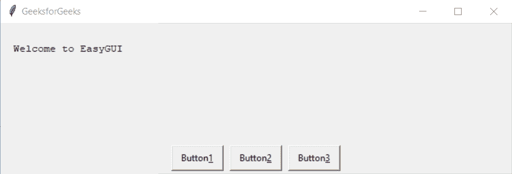

# Python EasyGUI–在按钮框中显示图像

> 原文:[https://www . geesforgeks . org/python-easygui-showing-image-in-a-button-box/](https://www.geeksforgeeks.org/python-easygui-showing-image-in-a-button-box/)

在本文中，我们将看到如何在按钮框中添加或显示图像。按钮框用于在 EasyGUI 中显示一个有多个按钮的窗口，在有条件的情况下可以在多个按钮中选择一个，例如一次在 lift 中的按钮，用户只能选择一个选项，下面是普通按钮框的样子


当我们调用 buttonbox 函数(或其他显示按钮框的函数，如 msgbox、indexbox、ynbox 等)时。)，我们可以指定关键字参数 image=img，其中 img 是图像的文件名。文件可以是. gif。通常，我们可以使用其他图像，如. png

> 为了做到这一点，我们将使用`buttonbox`方法
> 
> **语法:**按钮框(文本、标题、图像=img，选项=button_list)
> 
> **参数:**需要 4 个参数，第一个字符串即要显示的文本，第二个字符串即窗口标题，第三个和第四个是关键字参数，即图像源和按钮选项
> 
> **返回:**返回用户选择的按钮文本

**示例:**
在这里我们将创建一个带有图像的按钮框，用户可以选择任意按钮，根据消息会出现消息，下面是实现

```py
# importing easygui module
from easygui import *

# message to be displayed
text = "Message to be displayed on the window GfG"

# window title
title = "Window Title GfG"

# button list
button_list = []

# button 1
button1 = "Average"

# second button
button2 = "Good"

# third button
button3 = "Very Good"

# appending button to the button list
button_list.append(button1)
button_list.append(button2)
button_list.append(button3)

img = "gfg.png"

# creating a button box
output = buttonbox(text, title, image = img, choices = button_list)

# title for the message box
title = "Message Box"

# message 
message = "You selected : " + output

# creating a message box 
msg = msgbox(message, title)
```

**输出:**

<video class="wp-video-shortcode" id="video-480704-1" width="665" height="367" preload="metadata" controls=""><source type="video/mp4" src="https://media.geeksforgeeks.org/wp-content/uploads/20200903233256/Window-Title-GfG-2020-09-03-23-31-32.mp4?_=1">[https://media.geeksforgeeks.org/wp-content/uploads/20200903233256/Window-Title-GfG-2020-09-03-23-31-32.mp4](https://media.geeksforgeeks.org/wp-content/uploads/20200903233256/Window-Title-GfG-2020-09-03-23-31-32.mp4)</video>
<video class="wp-video-shortcode" id="video-480704-2" width="665" height="197" preload="metadata" controls=""><source type="video/mp4" src="https://media.geeksforgeeks.org/wp-content/uploads/20200903233455/Message-Box-2020-09-03-23-32-13.mp4?_=2">[https://media.geeksforgeeks.org/wp-content/uploads/20200903233455/Message-Box-2020-09-03-23-32-13.mp4](https://media.geeksforgeeks.org/wp-content/uploads/20200903233455/Message-Box-2020-09-03-23-32-13.mp4)</video>

**另一个例子:**

```py
# importing easygui module
from easygui import *

# message to be displayed
text = "How much do you like the image given below"

# window title
title = "Window Title GfG"

# button list
button_list = []

# button 1
button1 = "Average"

# second button
button2 = "Good"

# third button
button3 = "Very Good"

# appending button to the button list
button_list.append(button1)
button_list.append(button2)
button_list.append(button3)

# a image of a dog
img = "dog_image.png"

# creating a button box
output = buttonbox(text, title, image = img, choices = button_list)

# title for the message box
title = "Message Box"

# message 
message = "You selected : " + output

# creating a message box 
msg = msgbox(message, title)
```

**输出:**

<video class="wp-video-shortcode" id="video-480704-3" width="665" height="496" preload="metadata" controls=""><source type="video/mp4" src="https://media.geeksforgeeks.org/wp-content/uploads/20200903233729/Window-Title-GfG-2020-09-03-23-36-41.mp4?_=3">[https://media.geeksforgeeks.org/wp-content/uploads/20200903233729/Window-Title-GfG-2020-09-03-23-36-41.mp4](https://media.geeksforgeeks.org/wp-content/uploads/20200903233729/Window-Title-GfG-2020-09-03-23-36-41.mp4)</video>
<video class="wp-video-shortcode" id="video-480704-4" width="665" height="197" preload="metadata" controls=""><source type="video/mp4" src="https://media.geeksforgeeks.org/wp-content/uploads/20200903233455/Message-Box-2020-09-03-23-32-13.mp4?_=4">[https://media.geeksforgeeks.org/wp-content/uploads/20200903233455/Message-Box-2020-09-03-23-32-13.mp4](https://media.geeksforgeeks.org/wp-content/uploads/20200903233455/Message-Box-2020-09-03-23-32-13.mp4)</video>