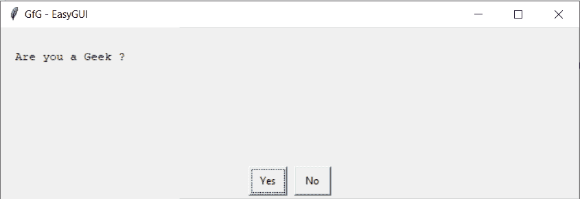

# Python EasyGUI–是否框

> 原文:[https://www.geeksforgeeks.org/python-easygui-yes-no-box/](https://www.geeksforgeeks.org/python-easygui-yes-no-box/)

**是否框:**用于在 EasyGUI 中显示一个有两个选项是或否的窗口，可以在需要以是或否的形式得到问题答案的地方使用，它显示两个选项是或否例如当我们想问用户他是否在 18 岁以上时我们会使用是否框，这有点类似于继续取消框，下面是继续取消框的样子


> 为了做到这一点，我们将使用`ynbox`方法
> 
> **语法:** ynbox(消息、标题、选项)
> 
> **参数:**需要 3 个参数，第一个字符串即要显示的消息/信息，第二个字符串即窗口标题，第三个是正好有两个值的列表，这是 yes 和 no 两个选项
> 
> **返回:**返回真，按是，否则按假

**示例:**
在这里我们将创建一个是否框，当任何按钮被按下时它将在屏幕上显示具体的消息，下面是实现

```py
# importing easygui module
from easygui import *

# message / information to be displayed on the screen
message = "Are you a Geek ?"

# title of the window
title = "GfG - EasyGUI"

# creating a yes no box
output = ynbox(message, title)

# if user pressed yes
if output:

    # message / information to be displayed on the screen
    message = "Thats Great !!"

    # title of the window
    title = "GfG - EasyGUI"

    # creating a message box
    msg = msgbox(message, title)

# if user pressed No
else:

    # message / information to be displayed on the screen
    message = "You should become a Geek, go to GeeksforGeeks to become one"

    # title of the window
    title = "GfG - EasyGUI"

    # creating a message box
    msg = msgbox(message, title)

```

**输出:**

<video class="wp-video-shortcode" id="video-479809-1" width="665" height="197" preload="metadata" controls=""><source type="video/mp4" src="https://media.geeksforgeeks.org/wp-content/uploads/20200903012108/GfG-EasyGUI-2020-09-03-01-20-35.mp4?_=1">[https://media.geeksforgeeks.org/wp-content/uploads/20200903012108/GfG-EasyGUI-2020-09-03-01-20-35.mp4](https://media.geeksforgeeks.org/wp-content/uploads/20200903012108/GfG-EasyGUI-2020-09-03-01-20-35.mp4)</video>
<video class="wp-video-shortcode" id="video-479809-2" width="665" height="197" preload="metadata" controls=""><source type="video/mp4" src="https://media.geeksforgeeks.org/wp-content/uploads/20200903012128/GfG-EasyGUI-2020-09-03-01-20-44.mp4?_=2">[https://media.geeksforgeeks.org/wp-content/uploads/20200903012128/GfG-EasyGUI-2020-09-03-01-20-44.mp4](https://media.geeksforgeeks.org/wp-content/uploads/20200903012128/GfG-EasyGUI-2020-09-03-01-20-44.mp4)</video>

**另一个例子:**
在这里我们将创建一个是否框，并为是和否按钮设置具体选项，当任何按钮被按下时，它将在屏幕上显示具体的消息，下面是实现

```py
# importing easygui module
from easygui import *

# message / information to be displayed on the screen
message = "Are you a Geek ?"

# title of the window
title = "GfG - EasyGUI"

# choices for yes and no button
choices = ["Agree", "Disagree"]

# creating a yes no box
output = ynbox(message, title, choices)

# if user pressed yes
if output:

    # message / information to be displayed on the screen
    message = "Thats Great !!"

    # title of the window
    title = "GfG - EasyGUI"

    # creating a message box
    msg = msgbox(message, title)

# if user pressed No
else:

    # message / information to be displayed on the screen
    message = "You should become a Geek, go to GeeksforGeeks to become one"

    # title of the window
    title = "GfG - EasyGUI"

    # creating a message box
    msg = msgbox(message, title)

```

**输出:**

<video class="wp-video-shortcode" id="video-479809-3" width="665" height="197" preload="metadata" controls=""><source type="video/mp4" src="https://media.geeksforgeeks.org/wp-content/uploads/20200903012322/GfG-EasyGUI-2020-09-03-01-22-59.mp4?_=3">[https://media.geeksforgeeks.org/wp-content/uploads/20200903012322/GfG-EasyGUI-2020-09-03-01-22-59.mp4](https://media.geeksforgeeks.org/wp-content/uploads/20200903012322/GfG-EasyGUI-2020-09-03-01-22-59.mp4)</video>
<video class="wp-video-shortcode" id="video-479809-4" width="665" height="197" preload="metadata" controls=""><source type="video/mp4" src="https://media.geeksforgeeks.org/wp-content/uploads/20200903012128/GfG-EasyGUI-2020-09-03-01-20-44.mp4?_=4">[https://media.geeksforgeeks.org/wp-content/uploads/20200903012128/GfG-EasyGUI-2020-09-03-01-20-44.mp4](https://media.geeksforgeeks.org/wp-content/uploads/20200903012128/GfG-EasyGUI-2020-09-03-01-20-44.mp4)</video>