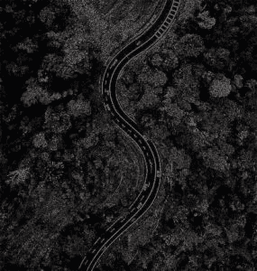
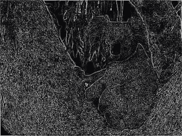

# Python–使用 pgmagick 库提取边缘

> 原文:[https://www . geesforgeks . org/python-edge-extraction-use-pgmagick-library/](https://www.geeksforgeeks.org/python-edge-extraction-using-pgmagick-library/)

**边缘提取**是一种突出图像中存在的边缘的技术。边缘提取用于特征检测和特征提取的计算机视觉中的数据提取。

> **边缘提取的应用–**
> 1。医学科学
> 2。指纹扫描
> 3。计算机/机器视觉
> 4。车牌检测
> 5。道路制图
> 6。文本检测

**例如:**

 

让我们看看如何使用 pgmagick 库在 Python 中做到这一点。
**代号:**

## 蟒蛇 3

```
# importing module
from pgmagick.api import Image

img = Image('koala.jpeg')
img.edge(1)
img.write('edge_koala.jpeg')
```

**输入图像:**


**输出图像:**

