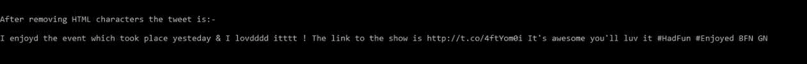
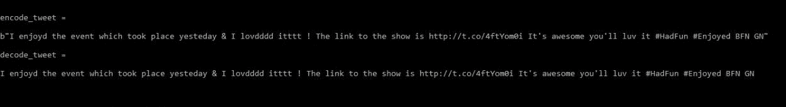
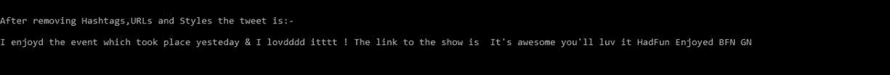
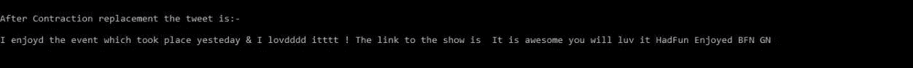
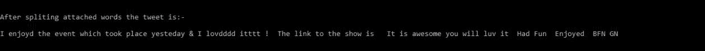
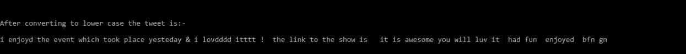
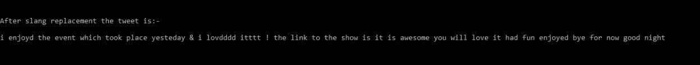
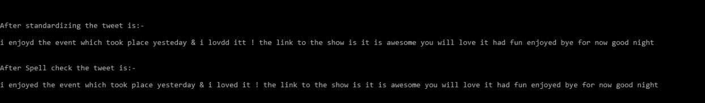
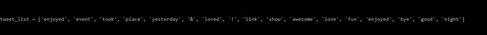
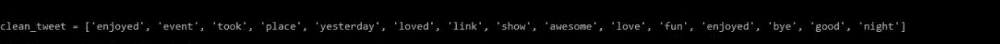

# Python–高效的文本数据清理

> 原文:[https://www . geesforgeks . org/python-efficient-text-data-cleaning/](https://www.geeksforgeeks.org/python-efficient-text-data-cleaning/)

以前数据大多是行列格式的日子已经一去不复返了，或者我们可以说**结构化数据**。现在，收集的数据更多的是**非结构化的**而不是**结构化的**。我们有文本、图像、音频等形式的数据，结构化数据与非结构化数据的比率多年来一直在下降。**非结构化数据**正以每年 55-65%的速度增长。

因此，我们需要学习如何处理非结构化数据，以便能够从中提取相关信息并使其变得有用。在处理文本数据时，在使用文本数据进行预测或分析之前，对其进行**预处理是非常重要的。
在本文中，我们将学习使用 python 的各种文本数据清理技术。**

让我们以一条推文为例:

```py
I enjoyd the event which took place yesteday &amp; I luvd it ! The link to the show is 
http://t.co/4ftYom0i It's awesome you'll luv it #HadFun #Enjoyed BFN GN
```

我们将逐步对这条推文进行数据清理。

### 数据清理步骤

**1)清除 HTML 字符:**很多像&这样的 HTML 实体；，&amp；，&lt；等等可以在网上的大部分数据中找到。我们需要从我们的数据中去掉这些。有两种方法可以做到这一点:

*   通过使用特定的正则表达式或
*   通过使用可用的模块或包(python 的 *htmlparser* )

我们将使用 python 中已有的模块。

**代码:**

## 蟒蛇 3

```py
#Escaping out HTML characters
from html.parser import HTMLParser

tweet="I enjoyd the event which took place yesteday & I lovdddd itttt ! The link to the show is http://t.co/4ftYom0i It's awesome you'll luv it #HadFun #Enjoyed BFN GN" 
tweet=HTMLParser().unescape(tweet)
print("After removing HTML characters the tweet is:-\n{}".format(tweet))
```

**输出:**



**2)编码&解码数据:**是将信息从简单易懂的字符转换为复杂符号的过程，反之亦然。有不同形式的编码&解码，如“UTF8”、“ascii”等。可用于文本数据。我们应该以标准的编码格式保存我们的数据。最常见的格式是 UTF 8 格式。

给定的推文已经是 UTF-8 格式，所以我们将其编码为 ascii 格式，然后将其解码为 UTF-8 格式来解释这个过程。

**代码:**

## 蟒蛇 3

```py
#Encode from UTF-8 to ascii
encode_tweet =tweet.encode('ascii','ignore')
print("encode_tweet = \n{}".format(encode_tweet))

#decode from ascii to UTF-8
decode_tweet=encode_tweet.decode(encoding='UTF-8')
print("decode_tweet = \n{}".format(decode_tweet))
```

**输出:**



**3)移除 URL、** **标签和样式:**在我们的文本数据集中，我们可以有超链接、标签或样式，如推特数据集的转发文本等。这些没有提供相关信息，可以删除。在哈希表中，只有散列符号“#”将被删除。为此，我们将使用 **re 库**来执行正则表达式操作。

**代码:**

## 蟒蛇 3

```py
#library for regular expressions
import re   

# remove hyperlinks
tweet = re.sub(r'https?:\/\/.\S+', "", tweet)

# remove hashtags
# only removing the hash # sign from the word
tweet = re.sub(r'#', '', tweet)

# remove old style retweet text "RT"
tweet = re.sub(r'^RT[\s]+', '', tweet)

print("After removing Hashtags,URLs and Styles the tweet is:-\n{}".format(tweet))
```

**输出:**



**4)收缩替换:**文本数据可能包含用于收缩的撇号。例- **“没”为“没”**等。这可以改变单词或句子的意思。因此，我们需要用标准词汇替换这些撇号。要做到这一点，我们可以有一个字典，其中包含了需要替换的单词的值，并使用它。

```py
Few of the contractions used are:-
n't --> not        'll --> will
's  --> is        'd  --> would
'm  --> am        've --> have
're --> are
```

**代码:**

## 蟒蛇 3

```py
#dictionary consisting of the contraction and the actual value
Apos_dict={"'s":" is","n't":" not","'m":" am","'ll":" will",
           "'d":" would","'ve":" have","'re":" are"}

#replace the contractions
for key,value in Apos_dict.items():
    if key in tweet:
        tweet=tweet.replace(key,value)

print("After Contraction replacement the tweet is:-\n{}".format(tweet))
```

**输出:**



**5)拆分附词:**有些词连在一起，比如–**“福舍温”**。这些需要分开，以便能够从中提取意义。分裂后将是**《为了胜利》**。

**代码:**

## 蟒蛇 3

```py
import re
#separate the words
tweet = " ".join([s for s in re.split("([A-Z][a-z]+[^A-Z]*)",tweet) if s])
print("After splitting attached words the tweet is:-\n{}".format(tweet))
```

**输出:**



**6)转换为小写:**将文本转换为小写，以避免与区分大小写相关的问题。

**代码:**

## 蟒蛇 3

```py
#convert to lower case
tweet=tweet.lower()
print("After converting to lower case the tweet is:-\n{}".format(tweet))
```

**输出:**



**7)俚语查找:**现在使用的俚语词很多，可以在文本数据中找到。所以我们需要用它们的意义来代替它们。我们可以像使用缩略替换一样使用俚语词典，或者我们可以创建一个由俚语组成的文件。俚语的例子有:-

```py
asap --> as soon as possible
b4   --> before
lol  --> laugh out loud
luv  --> love
wtg  --> way to go
```

我们正在使用一个包含单词的文件。可以下载文件[俚语. txt](https://drive.google.com/file/d/19VGaLW5uapOv2TVTDJzgd0sOUR-243mF/view?usp=sharing) 。本文件来源于[此处](https://github.com/rishabhverma17/sms_slang_translator/blob/master/slang.txt)。

**代码:**

## 蟒蛇 3

```py
#open the file slang.txt
file=open("slang.txt","r")
slang=file.read()

#separating each line present in the file
slang=slang.split('\n')

tweet_tokens=tweet.split()
slang_word=[]
meaning=[]

#store the slang words and meanings in different lists
for line in slang:
    temp=line.split("=")
    slang_word.append(temp[0])
    meaning.append(temp[-1])

#replace the slang word with meaning
for i,word in enumerate(tweet_tokens):
    if word in slang_word:
        idx=slang_word.index(word)
        tweet_tokens[i]=meaning[idx]

tweet=" ".join(tweet_tokens)
print("After slang replacement the tweet is:-\n{}".format(tweet))
```

**输出:**



**8)标准化和拼写检查:**文本中可能存在拼写错误或格式不正确。例如–**“驾驶”表示“驾驶”**或**“我错过了”表示“我错过了”。**我们可以通过使用 python 的 ***【自动更正】*** **库**来更正这些。还有其他可用的库，您也可以使用。首先，您必须使用以下命令安装库

```py
#install autocorrect library
 pip install autocorrect
```

**代码:**

## 蟒蛇 3

```py
import itertools
#One letter in a word should not be present more than twice in continuation
tweet = ''.join(''.join(s)[:2] for _, s in itertools.groupby(tweet))
print("After standardizing the tweet is:-\n{}".format(tweet))

from autocorrect import Speller
spell = Speller(lang='en')
#spell check
tweet=spell(tweet)
print("After Spell check the tweet is:-\n{}".format(tweet))
```

**输出:**



**9)去掉 Stopwords:** Stop words 是指在文本中出现频率较高但没有添加显著意义的词。为此，我们将使用由数据预处理模块组成的***nltk 库*** 。它为我们提供了一个停止词列表。您也可以根据用例创建自己的停用词列表。

首先，确保安装了 *nltk* 库。如果没有，那么使用命令下载它-

```py
#install nltk library
 pip install nltk
```

**代码:**

## 蟒蛇 3

```py
import nltk
#download the stopwords from nltk using
nltk.download('stopwords')
#import stopwords
from nltk.corpus import stopwords

#import english stopwords list from nltk
stopwords_eng = stopwords.words('english')

tweet_tokens=tweet.split()
tweet_list=[]
#remove stopwords
for word in tweet_tokens:
    if word not in stopwords_eng:
        tweet_list.append(word)

print("tweet_list = {}".format(tweet_list))
```

**输出:**



**10)去除标点符号:**标点符号由**组成！、< @# & $** 等。

**代码:**

## 蟒蛇 3

```py
#for string operations
import string         
clean_tweet=[]
#remove punctuations
for word in tweet_list:
    if word not in string.punctuation:
        clean_tweet.append(word)

print("clean_tweet = {}".format(clean_tweet))
```

**输出:**



这些是我们通常在文本数据格式上执行的一些数据清理技术。您还可以执行一些高级数据清理，如语法检查等。