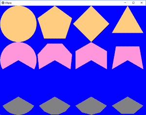

# Python | Kivy 中的椭圆(不同多边形)

> 原文:[https://www . geesforgeks . org/python-椭圆-不同-多边形-in-kivy/](https://www.geeksforgeeks.org/python-ellipse-different-polygons-in-kivy/)

Kivy 是 Python 中独立于平台的 GUI 工具。因为它可以在安卓、IOS、linux 和视窗等平台上运行。它基本上是用来开发安卓应用程序的，但并不意味着它不能在桌面应用程序上使用。

> [Kivy 教程–通过示例学习 Kivy](https://www.geeksforgeeks.org/kivy-tutorial/)。

## 椭圆:

椭圆是顶点画布指令。它允许绘制一个正多边形，或基于正多边形的一条弧线。在这篇文章中，我们将看到不同的多边形有不同的边数，圆上也有许多顶点。
和 Kivy 一样，我们可以基于椭圆制作多边形。注意，Kivy 中的角度和数学中的不同。在基维，0 度点，对应于数学中的 90 度点。

> **注:**
> 这些是 x 和 y 的公式，这些数学公式假设中心是 0，0。因此，在完成计算之后，必须有 a 的 x 和 b 的 y 的平移。宽度是 2a，高度是 2b。
> 
> N 个线段= N 个顶点
> 1)角度[I]= I * 360/N；i=0 到 n
> 2) x[i]=a cos(角度[i])
> 3) y[i]=b sin(角度[i])
> 4)在 kivy 中，12 点是 0 度，顺时针增加，但在数学中 3 点是 0 度，逆时针增加。

**程序展示如何用椭圆在 kivy 中制作不同的多边形。**

**main.py 文件:**

## 蟒蛇 3

```py
# Code to create different polygons using Ellipse

# import kivy module
import kivy

# this restrict the kivy version i.e
# below this kivy version you cannot
# use the app or software
kivy.require("1.9.1")

# base Class of your App inherits from the App class.
# app:always refers to the instance of your application
from kivy.app import App

# The GridLayout arranges children in a matrix.
# It takes the available space and
# divides it into columns and rows,
# then adds widgets to the resulting “cells”.
from kivy.uix.gridlayout import GridLayout

# creating the Layout class
class Ellipsekv(GridLayout):
    pass

# creating the App class   
class EllipseApp(App):
    def build(self):
        return Ellipsekv()

# run the App
if __name__=='__main__':
    EllipseApp().run()
```

**椭圆. kv 文件**

## 蟒蛇 3

```py
# Ellipse.kv file of the code

###################################################

# For the arcs, we have to give the start,
# and the end angle. We use default number of segments,
# 180, and 5, for the two ellipse arcs.
# The rest of the kv file, corresponds, to the other,
# 6 ellipse arcs, following the same pattern.

#:set angle_start_row2 240
#:set angle_end_row2 480
#:set angle_start_row3 120
#:set angle_end_row3 240

#################################################

<Ellipsekv>:

    # Setting column to 4
    cols:4

##################################################

# Row 1

    # Creating Canvas
    canvas:
        Color:
            rgb: 0, 0, 1
        Rectangle:
            pos: self.pos
            size: self.size

    # This will create the circle
    # as no segment is fixed in Ellipse
    # so by default it creates the circle
    RelativeLayout:
        canvas:
            Color:
                rgb: 1, .8, .5
            Ellipse:
                pos: 0, 0
                size: self.size

    # This will create pentagon as
    # segment = 5
    RelativeLayout:
        canvas:
            Ellipse:
                segments: 5
                pos: 0, 0
                size: self.size

    # This will create square shape as
    # segment = 4
    RelativeLayout:
        canvas:
            Ellipse:
                segments: 4
                pos: 0, 0
                size: self.size

    # This will create triangle as
    # segment = 3
    RelativeLayout:
        canvas:
            Ellipse:
                segments: 3
                pos: 0, 0
                size: self.size

#################################################

# Row 2

    RelativeLayout:
        canvas:
            # Assigning colour to all in row 2
            Color:
                rgb: 1, .59, .86

            # Creating the arc as assigned above  
            Ellipse:
                angle_start: angle_start_row2
                angle_end: angle_end_row2
                pos: 0, 0
                size: self.size

    # Creating the arc as assigned above
    # segment 5
    RelativeLayout:
        canvas:
            Ellipse:
                angle_start: angle_start_row2
                angle_end: angle_end_row2
                segments: 5
                pos: 0, 0
                size: self.size

    # Creating the arc as assigned above
    # segment 4
    RelativeLayout:
        canvas:
            Ellipse:
                angle_start: angle_start_row2
                angle_end: angle_end_row2
                segments: 4
                pos: 0, 0
                size: self.size

    # Creating the arc as assigned above
    # segment 5
    RelativeLayout:
        canvas:
            Ellipse:
                angle_start: angle_start_row2
                angle_end: angle_end_row2
                segments: 3
                pos: 0, 0
                size: self.size

#################################################

# Row 3

    RelativeLayout:
        canvas:
            Color:
                rgb: .5, .5, .5
            Ellipse:
                angle_start: angle_start_row3
                angle_end: angle_end_row3
                pos: 0, 0
                size: self.size

    RelativeLayout:
        canvas:
            Ellipse:
                angle_start: angle_start_row3
                angle_end: angle_end_row3
                segments: 5
                pos: 0, 0
                size: self.size

    RelativeLayout:
        canvas:
            Ellipse:
                angle_start: angle_start_row3
                angle_end: angle_end_row3
                segments: 4
                pos: 0, 0
                size: self.size

    RelativeLayout:
        canvas:
            Ellipse:
                angle_start: angle_start_row3
                angle_end: angle_end_row3
                segments: 3
                pos: 0, 0
                size: self.size
```

**输出:**



这就是结果。我们有 3 行 4 列。第 2 行和第 3 行是弧形，而第 1 行有默认的角度，0°和 360°形成一个完整的圆。通过手动改变窗口的大小，我们可以得到椭圆，以及基于它们的形状。对于圆弧，线段的数量对应于近似圆形部分的线的数量。