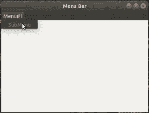

# Python–在 wx 中启用功能。菜单栏

> 原文:[https://www . geesforgeks . org/python-enable-function-in-wx-menu bar/](https://www.geeksforgeeks.org/python-enable-function-in-wx-menubar/)

在本文中，我们将了解 wx 中的 Enable()函数。wxPython 的菜单栏类。有时我们希望菜单项变得不可选择或可点击，在这种情况下，我们使用 Enable()函数。Enable()函数接受一个布尔参数，如果它为 True，那么该项目是可点击的，否则它是灰色的并且是不可点击的。

> **语法:**
> 
> ```
> wx.MenuBar.Enable(self, id, enable)
> 
> ```
> 
> **参数:**
> 
> | 参数 | 输入类型 | 描述 |
> | --- | --- | --- |
> | 身份证明（identification） | （同 Internationalorganizations）国际组织 | 菜单项标识符。 |
> | 使能够 | 弯曲件 | 如果为真，则启用该项；如果为假，则禁用该项。 |

**代码示例:**

```
import wx

class Example(wx.Frame):

    def __init__(self, *args, **kwargs):
        super(Example, self).__init__(*args, **kwargs)

        self.InitUI()

    def InitUI(self):
        # create MenuBar using MenuBar() function
        menubar = wx.MenuBar()
        # add menu to MenuBar
        fileMenu = wx.Menu()
        # add submenu item
        fileItem = fileMenu.Append(20, 'SubMenu')
        menubar.Append(fileMenu, '&Menu# 1')
        self.SetMenuBar(menubar)
        self.SetSize((300, 200))
        self.SetTitle('Menu Bar')

        # disable menu item using Enable() function
        menubar.Enable(20, False)

def main():

    app = wx.App()
    ex = Example(None)
    ex.Show()
    app.MainLoop()

if __name__ == '__main__':
    main()
```

**输出:**
