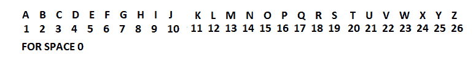

# Python |使用矩阵编码解码

> 原文:[https://www . geesforgeks . org/python-编码-解码-使用-矩阵/](https://www.geeksforgeeks.org/python-encoding-decoding-using-matrix/)

这篇文章是关于我们如何使用矩阵来编码和解码文本消息和简单的字符串。
**编码过程:**

1.  取一个字符串转换为相应的数字，如下图所示
    
2.  转换为 2D 矩阵(数组)。现在我们有了 2×2 矩阵！
3.  当我们将这个矩阵与编码矩阵相乘时，我们得到编码的 2×2 矩阵。
4.  现在转换成矢量(1D 阵列)并显示给用户

**解码过程**

*   取编码数转换成 2D 矩阵(数组)*   逆矩阵编码！*   将编码矩阵与编码矩阵的逆矩阵相乘。*   convert to 1D Matrix(array).then convert to corresponding Alphabets.
    

    ### **代码:Encode.py**

    ```
    # loading libraries
    import numpy as np

    a  =  [0,0,0,0,0,0,0,0,0,0,0,0,0,0,0,0,0,0,0,0]
    c  =  [[0,0,0,0,0,0,0,0,0,0],
           [0,0,0,0,0,0,0,0,0,0]]

    # encode matrix
    ecm = [[3,4], [3,6]]
    i = 0
    l = 0

    # Lists of Alphabets and its values
    smallalpha = [" ","a", "b", "c", "d", "e", "f", "g", "h",
                  "i", "j", "k", "l", "m", "n", "o", "p", "q",
                  "r", "s", "t", "u", "v", "w", "x", "y", "z"]
    capitalalpha = [" ","A", "B", "C", "D", "E", "F", "G", "H",
                    "I", "J", "K", "L", "M", "N", "O", "P", "Q",
                    "R", "S", "T", "U", "V", "W", "X", "Y", "Z"]
    alphavalues = [0, 1, 2, 3, 4, 5, 6, 7, 8, 9, 10, 11, 12,
                   13, 14, 15, 16, 17, 18, 19, 20, 21, 22,
                   23, 24, 25, 26, 27]

    # string to convert 
    b = "India"
    listb = list(b)
    lenb = len(listb)

    # Loop to convert Word to Values that 
    # are further useful for Encoding
    for i in range(lenb):
        for j in range(27):
            if(listb[i]  == smallalpha[j]):
                a[i] = alphavalues[j]
                if(j  == 23):
                    j = 0
                break
            if(j  == 23):
                for k in range(27):
                    if(listb[i]  == capitalalpha[k]):
                        a[i] = alphavalues[k]
                        break

    if(lenb%2 == 1):
        lenb = lenb+1
    a = a[0:lenb]
    tb = b

    # convert this array to 2D array for further 
    # multiplication with encoding matrix

    j = 0
    k = 0

    # b[m][n] m is always 2
    n = int(lenb/2)
    for i in range(0,lenb):
        if(j<n):
            c[k][j] = a[i]
            j = j+1
        else:
            k = k+1
            j = 0
            c[k][j] = a[i]
            j = j+1

    # Multiplay matrix by Encoding 2x2 matrix 
    c = np.matmul(ecm, c)

    # Convert to 1D array for displaying 
    i = 0
    j = 0
    k = 0
    for i in range(2):
        for j  in range(int(lenb/2)):
            a[k] = c[i][j]
            k = k+1

    a = a[0:lenb]
    print("Encoding matrix  =  ", ecm)
    print("encrypted form =  ", a)
    ```

    **时间复杂度:** O(n)(其中 n 为消息长度)
    T3】空间复杂度: O(n)

    **输出:**

    ```
    *Encoding matrix =  [[3, 4], [3, 6]]
    Encrypted form =  [63, 46, 12, 81, 48, 12]*

    ```

    ### **代码:Decode.py**

    ```
    # importing libraries
    import numpy as np
    from numpy.linalg import inv

    # Initial values
    a =[0, 0, 0, 0, 0, 0, 0, 0, 0, 0, 0, 0,
        0, 0, 0, 0, 0, 0, 0, 0]

    tdm =[[0, 0, 0, 0, 0, 0, 0, 0, 0, 0], 
          [0, 0, 0, 0, 0, 0, 0, 0, 0, 0]]

    # encoding matrix
    ecm =[[3, 4],
         [3, 6]]

    # Lists of Alphabets and its values
    smallalpha = [" ","a", "b", "c", "d", "e", "f", "g", "h",
                  "i", "j", "k", "l", "m", "n", "o", "p", "q",
                  "r", "s", "t", "u", "v", "w", "x", "y", "z"]
    capitalalpha = [" ","A", "B", "C", "D", "E", "F", "G", "H",
                    "I", "J", "K", "L", "M", "N", "O", "P", "Q",
                    "R", "S", "T", "U", "V", "W", "X", "Y", "Z"]
    alphavalues = [0, 1, 2, 3, 4, 5, 6, 7, 8, 9, 10, 11, 12,
                   13, 14, 15, 16, 17, 18, 19, 20, 21, 22,
                   23, 24, 25, 26, 27]

    # Take inputs
    # elements in Encrypted Matrix
    lenb = 6
    a = [63, 46, 12, 81, 48, 12]

    sobj = slice(lenb)
    a = a[sobj]

    # convert array to 2d matrix to further 
    # multiplication with inverse of 2d matrix
    j = 0
    k = 0

    # b[m][n] m is always 2
    n = int(lenb / 2)
    for i in range(0, lenb):
        if(j<n):
            tdm[k][j]= a[i]
            j = j + 1
        else:
            k = k + 1
            j = 0
            tdm[k][j]= a[i]
            j = j + 1

    # Multiply by inverse matrix
    dcm = inv(ecm)
    dcm = np.matmul(dcm, tdm)

    # Convert to 1d array for extracting word
    i = 0
    j = 0
    k = 0
    for i in range(2):
        for j in range(int(lenb / 2)):
            a[k]= dcm[i][j]
            k = k + 1

    # Creating a decoded word
    text = ""
    for i in range(0, lenb):
        for j in range(0, 27):
            if(a[i]== alphavalues[j]):
                text =''.join([text, smallalpha[j]])

    print("Decoded message = "+text)
    ```

     **时间复杂度:** O(n)(其中 n 为元素个数)
    **空间复杂度:** O(n)

    **输出:**

    ```
    Decoded message = india 
    ```