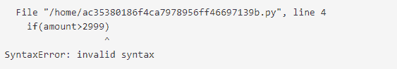
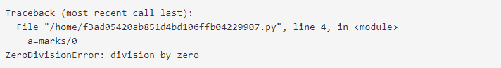

# Python 异常处理

> 原文:[https://www.geeksforgeeks.org/python-exception-handling/](https://www.geeksforgeeks.org/python-exception-handling/)

从第 1 集到第 4 集(第 1 集[第 1 集](https://www.geeksforgeeks.org/python-the-new-generation-language/) | [第 2 集](http://quiz.geeksforgeeks.org/python-set-2-variables-expressions-conditions-and-functions/) | [第 3 集](http://quiz.geeksforgeeks.org/python-set-3-strings-lists-tuples-iterations/) | [第 4 集](http://quiz.geeksforgeeks.org/python-set-4-dictionary-keywords-python/))我们一直在探索基础 python。

在本文中，我们将讨论如何使用 try 在 Python 中处理异常。抓住，最后借助恰当的例子陈述。

Python 中的错误有两种类型，即[语法错误和异常](https://www.geeksforgeeks.org/errors-and-exceptions-in-python/)。错误是程序中的问题，由于这些问题，程序将停止执行。另一方面，当一些改变程序正常流程的内部事件发生时，就会引发异常。

## 语法错误和异常的区别

**语法错误:**顾名思义，这个错误是由代码中错误的语法引起的。它导致程序的终止。

**示例:**

## 蟒蛇 3

```
# initialize the amount variable
amount = 10000

# check that You are eligible to
#  purchase Dsa Self Paced or not
if(amount > 2999)
print("You are eligible to purchase Dsa Self Paced")
```

**输出:**



**异常:**当程序语法正确，但代码导致错误时，会引发异常。这个错误不会停止程序的执行，但是，它会改变程序的正常流程。

**示例:**

## 蟒蛇 3

```
# initialize the amount variable
marks = 10000

# perform division with 0
a = marks / 0
print(a)
```

**输出:**



在上面的例子中，当我们试图用 0 除一个数时，我们引发了零除错误。

**注意:**异常是 Python 中所有异常的基类。您可以在这里查看异常层次结构[。](https://docs.python.org/2/library/exceptions.html#exception-hierarchy)

## 尝试和例外语句–捕捉例外

在 Python 中，Try 和 except 语句用于捕获和处理异常。可以引发异常的语句保存在 try 子句中，处理异常的语句写在 except 子句中。

**示例:**让我们尝试访问索引越界的数组元素，并处理相应的异常。

## 蟒蛇 3

```
# Python program to handle simple runtime error
#Python 3

a = [1, 2, 3]
try:
    print ("Second element = %d" %(a[1]))

    # Throws error since there are only 3 elements in array
    print ("Fourth element = %d" %(a[3]))

except:
    print ("An error occurred")
```

**Output**

```
Second element = 2
An error occurred
```

在上面的例子中，可能导致错误的语句被放在 try 语句中(在我们的例子中是第二个 print 语句)。第二个 print 语句试图访问列表中不存在的第四个元素，这将引发异常。然后这个异常被 except 语句捕获。

## 捕捉特定异常

try 语句可以有多个 except 子句，以便为不同的异常指定处理程序。请注意，最多将执行一个处理程序。例如，我们可以在上面的代码中添加 IndexError。添加特定异常的一般语法是–

```
try:
    # statement(s)
except IndexError:
    # statement(s)
except ValueError:
    # statement(s)
```

**示例:**捕捉 Python 中的特定异常

## 蟒蛇 3

```
# Program to handle multiple errors with one
# except statement
# Python 3

def fun(a):
    if a < 4:

        # throws ZeroDivisionError for a = 3
        b = a/(a-3)

    # throws NameError if a >= 4
    print("Value of b = ", b)

try:
    fun(3)
    fun(5)

# note that braces () are necessary here for
# multiple exceptions
except ZeroDivisionError:
    print("ZeroDivisionError Occurred and Handled")
except NameError:
    print("NameError Occurred and Handled")
```

**Output**

```
ZeroDivisionError Occurred and Handled
```

如果你评论一下 fun(3)这一行，输出会是

```
NameError Occurred and Handled
```

上面的输出是这样的，因为一旦 python 试图访问 b 的值，就会出现 NameError。

## 尝试使用其他子句

在 python 中，您还可以在 try-except 块上使用 else 子句，该子句必须出现在所有 except 子句之后。只有当 try 子句没有引发异常时，代码才会进入 else 块。

**示例:**尝试使用 else 子句

## 蟒蛇 3

```
# Program to depict else clause with try-except
# Python 3
# Function which returns a/b
def AbyB(a , b):
    try:
        c = ((a+b) / (a-b))
    except ZeroDivisionError:
        print ("a/b result in 0")
    else:
        print (c)

# Driver program to test above function
AbyB(2.0, 3.0)
AbyB(3.0, 3.0)
```

**输出:**

```
-5.0
a/b result in 0 
```

## Python 中的 Finally 关键字

Python 最后提供了一个关键字，总是在 try 和 except 块之后执行。最终块总是在正常终止尝试块之后执行，或者在尝试块由于某种异常而终止之后执行。

**语法:**

```
try:
    # Some Code.... 

except:
    # optional block
    # Handling of exception (if required)

else:
    # execute if no exception

finally:
    # Some code .....(always executed)
```

**示例:**

## 蟒蛇 3

```
# Python program to demonstrate finally

# No exception Exception raised in try block
try:
    k = 5//0  # raises divide by zero exception.
    print(k)

# handles zerodivision exception
except ZeroDivisionError:
    print("Can't divide by zero")

finally:
    # this block is always executed
    # regardless of exception generation.
    print('This is always executed')
```

**输出:**

```
Can't divide by zero
This is always executed
```

## 引发异常

[raise 语句](https://www.geeksforgeeks.org/python-raising-an-exception-to-another-exception/)允许程序员强制发生特定的异常。raise 中的唯一参数指示要引发的异常。这必须是异常实例或异常类(从异常派生的类)。

## 蟒蛇 3

```
# Program to depict Raising Exception

try:
    raise NameError("Hi there")  # Raise Error
except NameError:
    print ("An exception")
    raise  # To determine whether the exception was raised or not
```

上面代码的输出将被简单地打印为“异常”，但是由于最后一行中的 raise 语句，最后一行中也会出现运行时错误。因此，命令行上的输出如下所示

```
Traceback (most recent call last):
  File "/home/d6ec14ca595b97bff8d8034bbf212a9f.py", line 5, in <module>
    raise NameError("Hi there")  # Raise Error
NameError: Hi there
```

https://youtu.be/fCRB8ADbBSc

本文由[尼克尔·库马尔·辛格](https://www.facebook.com/nikhilkumar.singh.don) (nickzuck_007)投稿

如果你发现任何不正确的地方，或者你想分享更多关于上面讨论的话题的信息，请写评论。