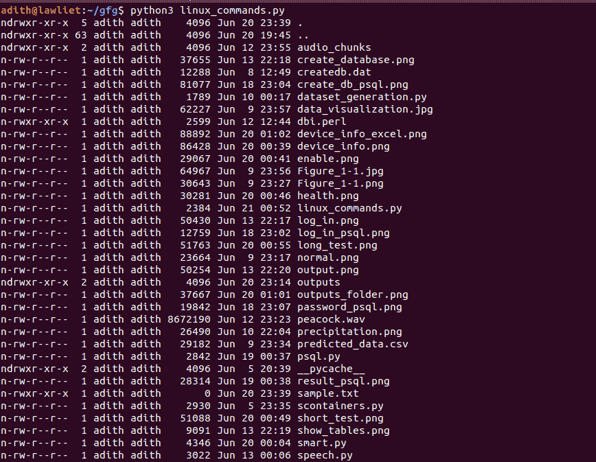
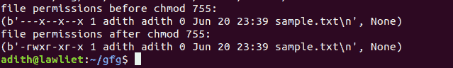

# Python |执行并解析 Linux 命令

> 原文:[https://www . geesforgeks . org/python-执行和解析-linux-commands/](https://www.geeksforgeeks.org/python-execute-and-parse-linux-commands/)

**先决条件:**[Linux Shell 和 Shell 脚本介绍](https://www.geeksforgeeks.org/introduction-linux-shell-shell-scripting/) 

**Linux** 是目前最流行的操作系统之一，也是开发者的常用选择。它受欢迎是因为它是开源的，它是免费的和可定制的，它非常健壮和适应性强。

操作系统主要由两部分组成:内核和外壳。内核基本上处理软件和硬件之间的通信。外壳接受用户的输入或命令，并产生输出。现在大多数 Linux 发行版都使用 BASH 外壳(伯恩外壳)。Shell 命令和脚本非常强大，通常被开发人员使用。

在本文中，我们将研究使用 python 执行和解析 Linux 命令。

### 子流程–

子流程是 Python 中的一个模块，允许我们在 Python 中启动新的应用程序或流程。本模块旨在取代 python 中的几个旧模块。我们可以使用这个模块运行其他程序或者执行 Linux 命令。

### 开始一个过程–

使用子流程模块中定义的 Popen 函数可以产生一个新流程。它是 Popen 类的构造函数，接受参数来设置新的进程。本模块中的底层流程创建和管理由 Popen 类处理。

**论据:**

> 1.  The first parameter is a list of commands and their options, if any.
>     For example, `['ls', '-l']`
>     The above example is equivalent to the terminal.
> 
> 中输入‘ls-l’

*   The second parameter is the stdout value. it specifies the standard output.
    ex: `stdout = subprocess.PIPE`
    This indicates that a new pipe or redirection should be created. The default value is
    “None”, which means that no redirection will occur.

    我们可以通过使用**通信**功能来检索命令的输出。它从 stdout 和 stderr 读取数据，直到到达文件结尾，并等待进程终止。它返回一个包含输出数据和错误(如果有)的元组。

    **语法:**

    ```py
    data = subprocess.Popen(['ls', '-l', filename], stdout = subprocess.PIPE)
    output = data.communicate()
    ```

    执行命令的输出存储在数据中。使用这些函数，我们可以执行 Linux 命令并获取它们的输出。

    ## 列出目录–

    我们可以使用' ls '命令和选项，如'-l '，'-al '等来列出当前目录中的所有文件。然后，我们可以解析这个输出，并以可呈现的格式打印它。`get_permissions()`函数解析 list 命令的输出，只检索文件的名称及其对应的权限。

    ```py
    # importing libraries
    import subprocess
    import os

    # a function to list the files in
    # the current directory and 
    # parse the output.
    def list_command(args = '-l'):

        # the ls command
        cmd = 'ls'

        # using the Popen function to execute the
        # command and store the result in temp.
        # it returns a tuple that contains the 
        # data and the error if any.
        temp = subprocess.Popen([cmd, args], stdout = subprocess.PIPE)

        # we use the communicate function
        # to fetch the output
        output = str(temp.communicate())

        # splitting the output so that
        # we can parse them line by line
        output = output.split("\n")

        output = output[0].split('\\')

        # a variable to store the output
        res = []

        # iterate through the output
        # line by line
        for line in output:
            res.append(line)

        # print the output
        for i in range(1, len(res) - 1):
            print(res[i])

        return res

    # parse the output of the ls 
    # command and fetch the permissions
    # of the files and store them in 
    # a text file .
    def get_permissions():

        # get the output of the 
        # list command
        res = list_command('-l')

        permissions = {}

        # iterate through all the rows
        # and retrieve the name of the file
        # and its permission.
        for i in range(1, len(res) - 1):
            line = res[i]

            line = line.split(' ')

            folder_name = line[len(line) - 1]
            permission_value = line[0]

            permissions[folder_name] = permission_value

        # create a directory called
        # outputs to store the output files
        try:
            os.mkdir('outputs')

        except:

            pass

        os.chdir('outputs')

        # open the output file
        out = open('permissions.txt', 'w')

        out.write('Folder Name   Permissions\n\n')

        # write to the output file
        for folder in permissions:

            out.write(folder + ' : ' + permissions[folder] + '\n')

        os.chdir('..')
        return permissions

    if __name__ == '__main__':
        list_command('-al')
    ```

    **输出:**
    

    ## Ping 命令–

    ping 命令代表数据包互联网协议。它最常用于检查两个系统或节点之间的连通性。使用 ping 命令，我们可以检查一个节点和另一个节点之间的连接是否正常。它在两个节点之间交换数据包，并计算往返时间。

    ```py
    # importing libraries
    import subprocess
    import os

    # a function to ping given host
    def ping(host):

        # command is pong
        cmd = 'ping'

        # send two packets of data to the host
        # this is specified by '-c 2' in the 
        # args list
        temp = subprocess.Popen([cmd, '-c 2', host], stdout = subprocess.PIPE)

        # get the output of ping
        output = str(temp.communicate())

        output = output.split("\n")

        output = output[0].split('\\')

        # variable to store the result
        res = []

        for line in output:
            res.append(line)

        # print the results
        print('ping results: ')
        print('\n'.join(res[len(res) - 3:len(res) - 1]))

        return res

    if __name__ == '__main__':

        # ping google
        ping('www.google.com')
    ```

    **输出:**
    

    ## 更改权限–

    `chmod` 命令可用于更改文件权限。它是变更模式的缩写。更多信息可以在这里找到

    ```py
    # importing libraries
    import subprocess
    import os

    # functio to change the permissions
    # of a given file
    def change_permissions(args, filename):

        # command name
        cmd = 'chmod'

        # getting the permissions of
        # the file before chmod
        ls = 'ls'

        data = subprocess.Popen([ls, '-l', filename], stdout = subprocess.PIPE)

        output = str(data.communicate())

        print('file permissions before chmod % s: ' %(args))
        print(output)

        # executing chmod on the specified file
        temp = subprocess.Popen([cmd, args, filename], stdout = subprocess.PIPE)

        # getting the permissions of the 
        # file after chmod
        data = subprocess.Popen([ls, '-l', filename], stdout = subprocess.PIPE)

        output = str(data.communicate())

        # printing the permissions after chmod
        print('file permissions after chmod % s: ' %(args))
        print(output)

    if __name__ == '__main__':

        # changing the permissions of 'sample.txt' 
        change_permissions('755', 'sample.txt')
    ```

    **输出:**
    