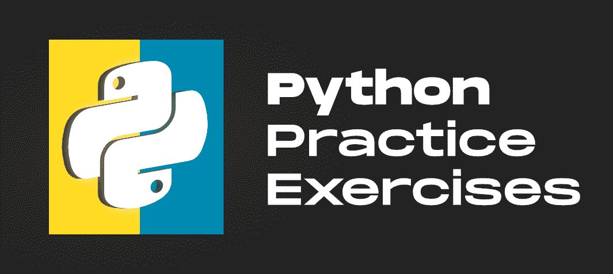

# Python 练习、练习题和解答

> 原文:[https://www . geesforgeks . org/python-练习-练习-问题和解决方案/](https://www.geeksforgeeks.org/python-exercises-practice-questions-and-solutions/)

[**【Python】**](https://www.geeksforgeeks.org/python-programming-language/)**是一种广泛使用的通用高级语言，可用于创建 GUI、web scratch、web 开发等多种用途。您可能已经看过各种详细解释概念的 [Python 教程](https://www.geeksforgeeks.org/python-programming-language/)，但这可能不足以掌握这种语言。最好的学习方法就是多练习。**

**这个 Python 练习帮助您从基础到高级使用一组详细的编程问题来学习 Python。它涵盖了关于 Python 核心概念的问题，以及 Python 在不同领域的应用。**

****

****

## **[蟒蛇列表练习](https://www.geeksforgeeks.org/python-list-exercise/)**

**

*   [Python 程序交换列表中的第一个和最后一个元素](https://www.geeksforgeeks.org/python-program-to-interchange-first-and-last-elements-in-a-list/)
*   [Python 程序交换列表中的两个元素](https://www.geeksforgeeks.org/python-program-to-swap-two-elements-in-a-list/)
*   [Python |查找列表长度的方法](https://www.geeksforgeeks.org/python-ways-to-find-length-of-list/)
*   [Python 中最多两个数字](https://www.geeksforgeeks.org/maximum-of-two-numbers-in-python/?ref=leftbar-rightbar)
*   [Python 中最少两个数字](https://www.geeksforgeeks.org/minimum-of-two-numbers-in-python/)

> >[列表中的更多节目](https://www.geeksforgeeks.org/python-list-exercise/)

## [蟒蛇串练习](https://www.geeksforgeeks.org/python-string-exercise/)

*   [Python 程序检查字符串是对称还是回文](https://www.geeksforgeeks.org/python-program-to-check-whether-the-string-is-symmetrical-or-palindrome/?ref=leftbar-rightbar)
*   [在 Python 中反转给定字符串中的单词](https://www.geeksforgeeks.org/reverse-words-given-string-python/)
*   [Python 中从字符串中删除第 I 个字符的方法](https://www.geeksforgeeks.org/ways-to-remove-ith-character-from-string-in-python/)
*   [用 python 查找字符串长度(4 种方式)](https://www.geeksforgeeks.org/find-length-of-a-string-in-python-4-ways/)
*   [Python 程序打印字符串中的偶数长度单词](https://www.geeksforgeeks.org/python-program-to-print-even-length-words-in-a-string/)

> >[字符串上的更多程序](https://www.geeksforgeeks.org/python-string-exercise/)

## [Python 元组练习](https://www.geeksforgeeks.org/python-tuple-exercise/)

*   [寻找元组大小的 Python 程序](https://www.geeksforgeeks.org/find-the-size-of-a-tuple-in-python/)
*   [Python–元组中的最大和最小 K 个元素](https://www.geeksforgeeks.org/python-maximum-and-minimum-k-elements-in-tuple/)
*   [Python–元组元素之和](https://www.geeksforgeeks.org/python-sum-of-tuple-elements/)
*   [Python–元组矩阵中的逐行元素添加](https://www.geeksforgeeks.org/python-row-wise-element-addition-in-tuple-matrix/)
*   [从给定的列表中创建一个元组列表，该列表在每个元组中都有数字及其立方体](https://www.geeksforgeeks.org/python-program-to-create-a-list-of-tuples-from-given-list-having-number-and-its-cube-in-each-tuple/)

> >[元组上的更多程序](https://www.geeksforgeeks.org/python-tuple-exercise/)

## [蟒蛇字典练习](https://www.geeksforgeeks.org/python-dictionary-exercise/)

*   [Python |按键或值对 Python 词典进行排序](https://www.geeksforgeeks.org/python-sort-python-dictionaries-by-key-or-value/)
*   [处理 Python 字典中丢失的键](https://www.geeksforgeeks.org/handling-missing-keys-python-dictionaries/)
*   [带多输入键的 Python 字典](https://www.geeksforgeeks.org/python-dictionary-with-keys-having-multiple-inputs/)
*   [Python 程序在字典中查找所有项目的总和](https://www.geeksforgeeks.org/python-program-to-find-the-sum-of-all-items-in-a-dictionary/)
*   [Python 程序查找字典的大小](https://www.geeksforgeeks.org/find-the-size-of-a-dictionary-in-python/)

> >[字典上的更多程序](https://www.geeksforgeeks.org/python-dictionary-exercise/)

## [蟒组练习](https://www.geeksforgeeks.org/python-set-exercise/)

*   [在 Python 中找到集合的大小](https://www.geeksforgeeks.org/find-the-size-of-a-set-in-python/)
*   [在 Python 中迭代一个集合](https://www.geeksforgeeks.org/iterate-over-a-set-in-python/)
*   [Python–集合中的最大值和最小值](https://www.geeksforgeeks.org/python-maximum-minimum-set/)
*   [Python–从集合中移除项目](https://www.geeksforgeeks.org/python-remove-items-set/)
*   [Python–检查两个列表是否至少有一个公共元素](https://www.geeksforgeeks.org/python-check-two-lists-least-one-element-common/)

> >[器械包上的更多程序](https://www.geeksforgeeks.org/python-set-exercise/)

## [巨蟒矩阵练习](https://www.geeksforgeeks.org/tag/python-matrix-program/)

*   [Python–将后续行分配给矩阵第一行元素](https://www.geeksforgeeks.org/python-assigning-subsequent-rows-to-matrix-first-row-elements/)
*   [Python 中的加减矩阵](https://www.geeksforgeeks.org/adding-and-subtracting-matrices-in-python/)
*   [Python–将相似元素分组到矩阵中](https://www.geeksforgeeks.org/python-group-similar-elements-into-matrix/)
*   [Python–元组矩阵中的逐行元素添加](https://www.geeksforgeeks.org/python-row-wise-element-addition-in-tuple-matrix/)
*   [创建一个 n×n 的正方形矩阵，其中所有子矩阵的对角元素之和为偶数](https://www.geeksforgeeks.org/create-an-n-x-n-square-matrix-where-all-the-sub-matrix-have-the-sum-of-opposite-corner-elements-as-even/)

> >[矩阵上的更多程序](https://www.geeksforgeeks.org/tag/python-matrix-program/)

## [Python 函数练习](https://www.geeksforgeeks.org/tag/python-function-programs/)

*   [如何在 Python 中从函数中获取参数名称列表？](https://www.geeksforgeeks.org/how-to-get-list-of-parameters-name-from-a-function-in-python/)
*   [如何用 Python 打印多个参数？](https://www.geeksforgeeks.org/how-to-print-multiple-arguments-in-python/)
*   [Python 程序利用递归求一个数的幂](https://www.geeksforgeeks.org/python-program-to-find-the-power-of-a-number-using-recursion/)
*   [对 Python 中自定义类的对象进行排序](https://www.geeksforgeeks.org/sorting-objects-of-user-defined-class-in-python/)
*   [接受可变长度键值对作为参数的函数](https://www.geeksforgeeks.org/functions-that-accept-variable-length-key-value-pair-as-arguments/)

> >[更多功能程序](https://www.geeksforgeeks.org/tag/python-function-programs/)

## [蟒蛇λ演习](https://www.geeksforgeeks.org/tag/python-lambda/)

*   [Python 中带 if 但不带 else 的 Lambda](https://www.geeksforgeeks.org/lambda-with-if-but-without-else-in-python/)
*   [Python |使用另一个字符串定义的顺序对字符串进行排序](https://www.geeksforgeeks.org/python-sorting-string-using-order-defined-by-another-string/)
*   [Python |使用 lambda](https://www.geeksforgeeks.org/python-find-fibonacci-series-upto-n-using-lambda/) 查找斐波那契数列 up n
*   [Python 程序统计列表中的偶数和奇数](https://www.geeksforgeeks.org/python-program-to-count-even-and-odd-numbers-in-a-list/)
*   [Python |使用 Lambda 表达式查找出现奇数次的次数并减少函数](https://www.geeksforgeeks.org/python-find-number-occurring-odd-number-times-using-lambda-expression-reduce-function/)

> >[Lambda 上的更多程序](https://www.geeksforgeeks.org/tag/python-lambda/)

## [蟒蛇图案印刷练习](https://www.geeksforgeeks.org/tag/python-pattern-printing/)

*   [程序打印半菱形星形图案](https://www.geeksforgeeks.org/program-to-print-half-diamond-star-pattern/)
*   [用 Python 打印金字塔图案的程序](https://www.geeksforgeeks.org/programs-printing-pyramid-patterns-python/)
*   [程序打印菱形](https://www.geeksforgeeks.org/c-program-print-diamond-shape/)
*   [Python |打印倒星形图案](https://www.geeksforgeeks.org/python-print-inverted-star-pattern/)
*   [Python 程序打印数字图案](https://www.geeksforgeeks.org/python-program-to-print-digit-pattern/)

> >[更多 Python 模式打印程序](https://www.geeksforgeeks.org/tag/python-pattern-printing/)

## Python 日期时间练习

*   [Python 程序获取当前时间](https://www.geeksforgeeks.org/python-program-to-get-current-time/)
*   [使用 Python 获取昨天的日期](https://www.geeksforgeeks.org/get-yesterdays-date-using-python/)
*   [Python 程序打印当前年、月、日](https://www.geeksforgeeks.org/python-program-to-print-current-year-month-and-day/)
*   [Python–将日期转换为特定年份的日期](https://www.geeksforgeeks.org/python-convert-day-number-to-date-in-particular-year/)
*   [使用 Python 获取不同时区的当前时间](https://www.geeksforgeeks.org/get-current-time-in-different-timezone-using-python/)

> >[日期时间上的更多程序](https://www.geeksforgeeks.org/tag/python-datetime-program/)

## [Python OOPS 练习](https://www.geeksforgeeks.org/tag/python-oops-programs/)

*   [Python 程序使用 Python 中的类构建抽认卡](https://www.geeksforgeeks.org/python-program-to-build-flashcard-using-class-in-python/)
*   [用 Python 中的 OOPS 洗牌一副牌](https://www.geeksforgeeks.org/shuffle-a-deck-of-card-with-oops-in-python/)
*   [如何在 Python 中创建一个空类？](https://www.geeksforgeeks.org/how-to-create-an-empty-class-in-python/)
*   [Python 中的学生管理系统](https://www.geeksforgeeks.org/student-management-system-in-python/)

> >[Python 上的更多程序 OOPS](https://www.geeksforgeeks.org/tag/python-oops-programs/)

## [蟒蛇雷盖练习](https://www.geeksforgeeks.org/tag/python-regex-programs/)

*   [Python 程序使用 Regex](https://www.geeksforgeeks.org/python-program-to-find-the-type-of-ip-address-using-regex/) 查找 IP 地址的类型
*   [寻找重叠子串索引的 Python 程序](https://www.geeksforgeeks.org/python-program-to-find-indices-of-overlapping-substrings/)
*   [Python 程序提取 HTML 标签之间的字符串](https://www.geeksforgeeks.org/python-program-to-extract-strings-between-html-tags/)
*   [Python–使用正则表达式](https://www.geeksforgeeks.org/python-check-if-string-contain-only-defined-characters-using-regex/)检查字符串是否只包含定义的字符
*   [Python 程序使用正则表达式](https://www.geeksforgeeks.org/python-program-to-find-files-having-a-particular-extension-using-regex/)查找具有特定扩展名的文件

> >[Python Regex 上的更多程序](https://www.geeksforgeeks.org/tag/python-regex-programs/)

## [Python 链接列表练习](https://www.geeksforgeeks.org/tag/python-linkedlist-exercises/)

*   [在循环链表中搜索元素的 Python 程序](https://www.geeksforgeeks.org/python-program-to-search-an-element-in-a-circular-linked-list/)
*   [Python 中的漂亮打印链表](https://www.geeksforgeeks.org/pretty-print-linked-list-in-python/)
*   [Python |使用双链表的堆栈](https://www.geeksforgeeks.org/python-stack-using-doubly-linked-list/)
*   [Python |使用双链表的队列](https://www.geeksforgeeks.org/python-queue-using-doubly-linked-list/)
*   [Python 程序使用一次遍历找到链表的中间](https://www.geeksforgeeks.org/python-program-to-find-middle-of-a-linked-list-using-one-traversal/)

> >[链表上的更多程序](https://www.geeksforgeeks.org/tag/python-linkedlist-exercises/)

## Python 搜索练习

*   [线性搜索 Python 程序](https://www.geeksforgeeks.org/python-program-for-linear-search/)
*   [二分搜索法 Python 程序(递归和迭代)](https://www.geeksforgeeks.org/python-program-for-binary-search/)
*   [Python 程序，用于字谜子串搜索(或搜索所有排列)](https://www.geeksforgeeks.org/python-program-for-anagram-substring-search-or-search-for-all-permutations/)

> >[更多 Python 搜索程序](https://www.geeksforgeeks.org/tag/python-searching-exercises/)

## [蟒蛇整理练习](https://www.geeksforgeeks.org/tag/python-sorting-exercises/)

*   [冒泡排序的 Python 程序](https://www.geeksforgeeks.org/python-program-for-bubble-sort/)
*   [快速排序的 Python 程序](https://www.geeksforgeeks.org/python-program-for-quicksort/)
*   [插入排序 Python 程序](https://www.geeksforgeeks.org/python-program-for-insertion-sort/)
*   [选择排序 Python 程序](https://www.geeksforgeeks.org/python-program-for-selection-sort/)
*   [用于堆排序的 Python 程序](https://www.geeksforgeeks.org/python-program-for-heap-sort/)

> >[更多 Python 排序程序](https://www.geeksforgeeks.org/tag/python-sorting-exercises/)

## [蟒蛇 DSA 演习](https://www.geeksforgeeks.org/tag/python-dsa-exercises/)

*   [Python 程序反转一个栈](https://www.geeksforgeeks.org/python-program-to-reverse-a-stack/)
*   [Python 中的多线程优先级队列](https://www.geeksforgeeks.org/multithreaded-priority-queue-in-python/)
*   [使用堆栈](https://www.geeksforgeeks.org/check-whether-the-given-string-is-palindrome-using-stack/)检查给定字符串是否为回文
*   [计算图形边缘覆盖的程序](https://www.geeksforgeeks.org/program-to-calculate-the-edge-cover-of-a-graph/)
*   [N 皇后问题的 Python 程序](https://www.geeksforgeeks.org/python-program-for-n-queen-problem-backtracking-3/)

> >[Python DSA 上的更多程序](https://www.geeksforgeeks.org/tag/python-dsa-exercises/)

## [Python 文件处理练习](https://www.geeksforgeeks.org/tag/python-file-handling-programs/)

*   [从一个文件中读取内容并写入另一个文件](https://www.geeksforgeeks.org/read-content-from-one-file-and-write-it-into-another-file/)
*   [用 Python 给文件写字典](https://www.geeksforgeeks.org/write-a-dictionary-to-a-file-in-python/)
*   [如何在 Python 中检查文件大小？](https://www.geeksforgeeks.org/how-to-check-file-size-in-python/)
*   [查找文本文件中重复次数最多的单词](https://www.geeksforgeeks.org/find-the-most-repeated-word-in-a-text-file/)
*   [如何在 Python 中读取文件中的特定行？](https://www.geeksforgeeks.org/how-to-read-specific-lines-from-a-file-in-python/)

> >[更多 Python 文件处理程序](https://www.geeksforgeeks.org/tag/python-file-handling-programs/)

## [蟒蛇 CSV 演习](https://www.geeksforgeeks.org/tag/python-csv/)

*   [更新 Python 中 CSV 的列值](https://www.geeksforgeeks.org/update-column-value-of-csv-in-python/)
*   [如何在 Python 中给 CSV 文件添加表头？](https://www.geeksforgeeks.org/how-to-add-a-header-to-a-csv-file-in-python/)
*   [使用 Python 从 CSV 中获取列名](https://www.geeksforgeeks.org/get-column-names-from-csv-using-python/)
*   [逐行将数据从 Python 列表写入 CSV](https://www.geeksforgeeks.org/writing-data-from-a-python-list-to-csv-row-wise/)
*   [将多个 JSON 文件转换为 CSV Python](https://www.geeksforgeeks.org/convert-multiple-json-files-to-csv-python/)

> >[Python CSV 上的更多程序](https://www.geeksforgeeks.org/tag/python-csv/)

## [蟒蛇 JSON 练习](https://www.geeksforgeeks.org/tag/python-json-programs/)

*   [将类对象转换为 Python 中的 JSON](https://www.geeksforgeeks.org/convert-class-object-to-json-in-python/)
*   [将 JSON 数据转换成自定义 Python 对象](https://www.geeksforgeeks.org/convert-json-data-into-a-custom-python-object/)
*   [在 Python 中展平 JSON 对象](https://www.geeksforgeeks.org/flattening-json-objects-in-python/)
*   [使用 Python 将 CSV 转换为 JSON】](https://www.geeksforgeeks.org/convert-csv-to-json-using-python/)

> >[Python JSON 上的更多程序](https://www.geeksforgeeks.org/tag/python-json-programs/)

## Python 操作系统模块练习

*   [如何在 Python 中获取文件的创建和修改日期或时间？](https://www.geeksforgeeks.org/how-to-get-file-creation-and-modification-date-or-time-in-python/)
*   [菜单驱动的 Python 程序，用于打开所需的软件应用程序](https://www.geeksforgeeks.org/menu-driven-python-program-for-opening-the-required-software-applictaion/)
*   [Python 脚本将文件名更改为其时间戳](https://www.geeksforgeeks.org/python-script-to-change-name-of-a-file-to-its-timestamp/)
*   [使用 Python 按名称杀死一个进程](https://www.geeksforgeeks.org/kill-a-process-by-name-using-python/)
*   [使用 Python 查找目录中最大的文件](https://www.geeksforgeeks.org/finding-the-largest-file-in-a-directory-using-python/)

> >[操作系统模块上的更多程序](https://www.geeksforgeeks.org/tag/python-os-module-programs/)

## [蟒蛇 Tkinter 练习](https://www.geeksforgeeks.org/tag/python-tkinter-exercises/)

*   [Python |使用 Tkinter 创建图形用户界面标记表](https://www.geeksforgeeks.org/python-create-a-gui-marksheet-using-tkinter/)
*   [Python | ToDo 使用 Tkinter 的 GUI 应用程序](https://www.geeksforgeeks.org/python-todo-gui-application-using-tkinter/)
*   [Python |使用 Tkinter 的 GUI 日历](https://www.geeksforgeeks.org/python-gui-calendar-using-tkinter/)
*   [Python 中使用 Tkinter 的文件资源管理器](https://www.geeksforgeeks.org/file-explorer-in-python-using-tkinter/)
*   [使用 Python 的名片扫描仪图形用户界面应用](https://www.geeksforgeeks.org/visiting-card-scanner-gui-application-using-python/)

> >[Python Tkinter 上的更多程序](https://www.geeksforgeeks.org/tag/python-tkinter-exercises/)

## [NumPy 练习](https://www.geeksforgeeks.org/python-numpy-practice-exercises-questions-and-solutions/)

*   [如何创建空的和满的 NumPy 数组？](https://www.geeksforgeeks.org/how-to-create-an-empty-and-a-full-numpy-array/)
*   [创建一个全零的 Numpy 数组](https://www.geeksforgeeks.org/create-a-numpy-array-filled-with-all-zeros-python/)
*   [创建一个充满所有 1 的 Numpy 数组](https://www.geeksforgeeks.org/create-a-numpy-array-filled-with-all-ones/)
*   [替换不满足给定条件的 NumPy 数组元素](https://www.geeksforgeeks.org/replace-numpy-array-elements-that-doesnt-satisfy-the-given-condition/)
*   [从给定矩阵中获取最大值](https://www.geeksforgeeks.org/python-numpy-matrix-max/)

> >[更多 NumPy 上的节目](https://www.geeksforgeeks.org/python-numpy-practice-exercises-questions-and-solutions/)

## [熊猫演习](https://www.geeksforgeeks.org/pandas-practice-excercises-questions-and-solutions/)

*   [用二维列表制作熊猫数据框| Python](https://www.geeksforgeeks.org/make-a-pandas-dataframe-with-two-dimensional-list-python/)
*   [如何迭代熊猫数据框中的行](https://www.geeksforgeeks.org/how-to-iterate-over-rows-in-pandas-dataframe/)
*   [使用 for 循环](https://www.geeksforgeeks.org/create-a-pandas-column-using-for-loop/)创建熊猫列
*   [从数组](https://www.geeksforgeeks.org/create-a-pandas-series-from-array/)创建熊猫系列
*   [熊猫|时间序列操纵基础](https://www.geeksforgeeks.org/pandas-basic-of-time-series-manipulation/)

> >[更多关于蟒蛇熊猫的节目](https://www.geeksforgeeks.org/pandas-practice-excercises-questions-and-solutions/)

## [蟒蛇刮网练习](https://www.geeksforgeeks.org/tag/python-web-scraping-exercises/)

*   [如何用 Python 提取 youtube 数据？](https://www.geeksforgeeks.org/how-to-extract-youtube-data-in-python/)
*   [如何用 Python 从网页下载所有图片？](https://www.geeksforgeeks.org/how-to-download-all-images-from-a-web-page-in-python/)
*   [使用 Python 测试给定页面在服务器上是否找到](https://www.geeksforgeeks.org/test-the-given-page-is-found-or-not-on-the-server-using-python/)
*   [如何用 Python 提取维基百科数据？](https://www.geeksforgeeks.org/how-to-extract-wikipedia-data-in-python/)
*   [如何从网站中提取段落并保存为文本文件？](https://www.geeksforgeeks.org/how-to-extract-paragraph-from-a-website-and-save-it-as-a-text-file/)

> >[更多网页抓取程序](https://www.geeksforgeeks.org/tag/python-web-scraping-exercises/)

## [蟒蛇硒操](https://www.geeksforgeeks.org/tag/python-selenium-exercises/)

*   [使用 Python 在 Selenium 中下载文件](https://www.geeksforgeeks.org/download-file-in-selenium-using-python/)
*   [使用硒在脸书页面批量发布](https://www.geeksforgeeks.org/bulk-posting-on-facebook-pages-using-selenium/)
*   [谷歌地图硒自动化使用 Python](https://www.geeksforgeeks.org/google-maps-selenium-automation-using-python/)
*   [使用 Python 中的硒计算网页中的链接总数](https://www.geeksforgeeks.org/count-total-number-of-links-in-webpage-using-selenium-in-python/)
*   [使用硒从刚刚拨号中提取数据](https://www.geeksforgeeks.org/extract-data-from-justdial-using-selenium/)

> >[Python Selenium 上的更多程序](https://www.geeksforgeeks.org/tag/python-selenium-exercises/)

## [Python 项目](https://www.geeksforgeeks.org/python-projects-beginner-to-advanced/)

*   [Python 中的猜数字游戏](https://www.geeksforgeeks.org/number-guessing-game-in-python/)
*   [2048 Python 游戏](https://www.geeksforgeeks.org/2048-game-in-python/)
*   [使用 Python 获取实时天气桌面通知](https://www.geeksforgeeks.org/get-live-weather-desktop-notifications-using-python/)
*   [使用 pygame 的 8 位游戏](https://www.geeksforgeeks.org/8-bit-game-using-pygame/)
*   [使用 PyGame 的 Python 井字游戏图形用户界面](https://www.geeksforgeeks.org/tic-tac-toe-gui-in-python-using-pygame/)

> >[Python 中的更多项目](https://www.geeksforgeeks.org/python-projects-beginner-to-advanced/)**