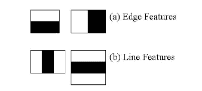
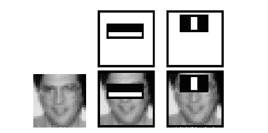
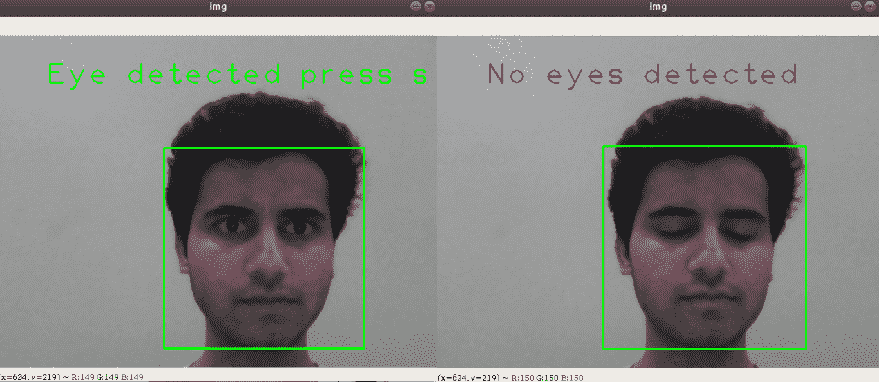

# Python–眨眼检测项目

> 原文:[https://www . geesforgeks . org/python-eye-blink-detection-project/](https://www.geeksforgeeks.org/python-eye-blink-detection-project/)

在本教程中，您将学习如何使用被称为**哈尔级联**的特征映射器检测人类眨眼。在这个项目中，我们将使用 python 语言和 OpenCV 库分别进行算法执行和图像处理。我们将在项目中使用的 haar 级联是预先准备好的，并与 OpenCV 库一起存储为 haarcscade _ frontal face _ default . XML 和 haarcscade _ eye _ tree _ eyes . XML 文件。该项目对驾驶员睡意检测、眨眼锁定、眼睛检测、面部检测等系统以及哈尔级联使用 OpenCV 库有了基本的了解。
**关于哈尔级联:**
基于哈尔特征的级联分类器是保罗·维奥拉和迈克尔·琼斯在 2001 年的论文《利用简单特征的增强级联快速目标检测》中提出的一种有效的目标检测方法。这是一种基于机器学习的方法，其中级联函数是从大量正负图像中训练出来的。这里，正图像是包含目标对象的样本，负图像是不包含目标对象的样本。训练分类器需要大量的正负样本。



哈尔特征，来源–Opencv 文档

现在，我们从给定的输入图像中提取 haar 特征，如上图所示。它们就像卷积核。每个特征是通过从黑色矩形下的像素总和中减去白色矩形下的像素总和而获得的单个值。



haarcascades 的应用，来源–Opencv 文档

**过度计算:**
利用所有可能的分类器大小计算特征，但是计算特征所花费的计算量，一个 *24×24* 窗口产生超过 160000 个特征。同样，对于每个特征计算，也需要像素的总和。为了降低计算成本，哈尔级联的创建者引入了积分图像，这意味着无论图像有多大，它都会将给定像素的计算简化为只涉及四个像素的运算。
**虚假特征**
现在计算的特征中，大部分特征都是虚假的，无关紧要的。现在，应用于图像区域的窗口可能会看到一个不同的区域，该区域看起来与窗口具有相同的特征，但实际上并非如此。因此，有必要去除由 **AdaBoost** 所做的虚假特征，该功能有助于从 160000 多个特征中选择最佳特征。Adaboost 的简称自适应 Boosting 是一种机器学习算法，用于这个唯一的任务。
**算法:**

```
The frame is captured and converted to grayscale.
Bilateral Filtering is applied to remove impurities.
Face is detected with the haarcascade.
The ROI (Region Of Image) of Face is fed to eye detection part of algorithm.
Eyes are detected and resulting list is passed to if-else contruct.
If the length of list is more than two, means that the eyes are there.
Else the program is marked to be eye blinked and restarted.
```

**代码:**
*haarcscade _ frontal face _ default . xml*和*haarcscade _ eye _ tree _ eyes . XML*是存储在与 python 脚本相同目录中的 XML 文件。

## 蟒蛇 3

```
#All the imports go here
import numpy as np
import cv2

#Initializing the face and eye cascade classifiers from xml files
face_cascade = cv2.CascadeClassifier('haarcascade_frontalface_default.xml')
eye_cascade = cv2.CascadeClassifier('haarcascade_eye_tree_eyeglasses.xml')

#Variable store execution state
first_read = True

#Starting the video capture
cap = cv2.VideoCapture(0)
ret,img = cap.read()

while(ret):
    ret,img = cap.read()
    #Converting the recorded image to grayscale
    gray = cv2.cvtColor(img, cv2.COLOR_BGR2GRAY)
    #Applying filter to remove impurities
    gray = cv2.bilateralFilter(gray,5,1,1)

    #Detecting the face for region of image to be fed to eye classifier
    faces = face_cascade.detectMultiScale(gray, 1.3, 5,minSize=(200,200))
    if(len(faces)>0):
        for (x,y,w,h) in faces:
            img = cv2.rectangle(img,(x,y),(x+w,y+h),(0,255,0),2)

            #roi_face is face which is input to eye classifier
            roi_face = gray[y:y+h,x:x+w]
            roi_face_clr = img[y:y+h,x:x+w]
            eyes = eye_cascade.detectMultiScale(roi_face,1.3,5,minSize=(50,50))

            #Examining the length of eyes object for eyes
            if(len(eyes)>=2):
                #Check if program is running for detection
                if(first_read):
                    cv2.putText(img,
                    "Eye detected press s to begin",
                    (70,70), 
                    cv2.FONT_HERSHEY_PLAIN, 3,
                    (0,255,0),2)
                else:
                    cv2.putText(img,
                    "Eyes open!", (70,70),
                    cv2.FONT_HERSHEY_PLAIN, 2,
                    (255,255,255),2)
            else:
                if(first_read):
                    #To ensure if the eyes are present before starting
                    cv2.putText(img,
                    "No eyes detected", (70,70),
                    cv2.FONT_HERSHEY_PLAIN, 3,
                    (0,0,255),2)
                else:
                    #This will print on console and restart the algorithm
                    print("Blink detected--------------")
                    cv2.waitKey(3000)
                    first_read=True

    else:
        cv2.putText(img,
        "No face detected",(100,100),
        cv2.FONT_HERSHEY_PLAIN, 3,
        (0,255,0),2)

    #Controlling the algorithm with keys
    cv2.imshow('img',img)
    a = cv2.waitKey(1)
    if(a==ord('q')):
        break
    elif(a==ord('s') and first_read):
        #This will start the detection
        first_read = False

cap.release()
cv2.destroyAllWindows()
```

**样本输出:**



上述代码的示例运行

源代码和级联分类器可以在这里找到[。](https://github.com/infoaryan/Eye-blink-detection-game)