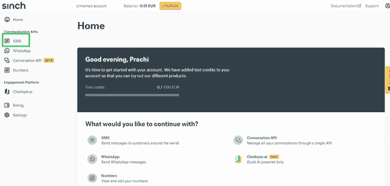
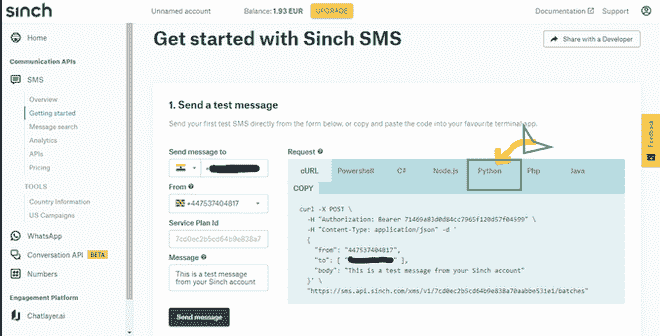
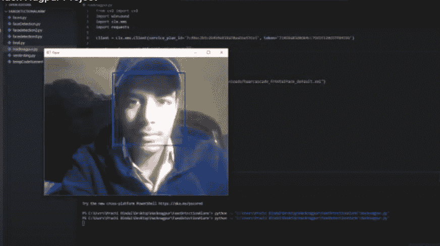
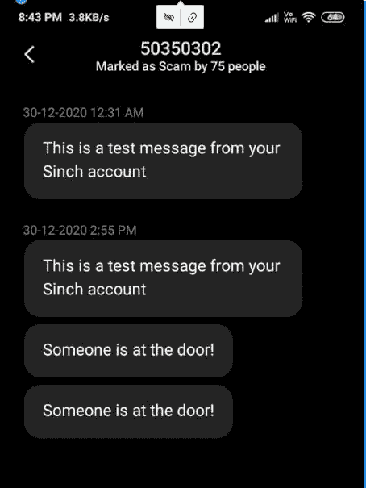

# Python–人脸检测和发送通知

> 原文:[https://www . geesforgeks . org/python-人脸检测和发送通知/](https://www.geeksforgeeks.org/python-face-detection-and-sending-notification/)

如今 [python](https://www.geeksforgeeks.org/python-programming-language/) 已经成为最流行的语言之一，也是开发者最喜欢的编程语言。这种语言的简化语法和模式使得这种语言出现在趋势列表中。

Python 最大的优势是拥有大量标准库，可用于以下目的:

*   机器学习
*   图形用户界面应用程序(如 Kivy、Tkinter、PyQt 等。)
*   像 Django 这样的网络框架(由 YouTube、Instagram、Dropbox 使用)
*   图像处理(如 OpenCV、枕头)
*   刮网(如刮痧、美容、硒)
*   测试框架
*   多媒体
*   科学计算
*   文本处理等等..

对于机器学习和人工智能来说，python 语言是开发人员的首要任务，因为预构建的 python 语言库(如 NumPy、熊猫、Pybrain 和 SciPy)有助于加快人工智能的开发。

在本文中，使用 python 实现了一个简单的方法来检测人脸，并在检测后向用户发送通知。如果面部未被识别，它不会向所有者发送通知。

**使用的技术:**

*   **OpenCV:** OpenCV 是一个巨大的开源库，用于计算机视觉、机器学习和图像处理。OpenCV 支持多种编程语言，如 Python、C++、Java 等。它可以处理图像和视频来识别物体、人脸，甚至是人类的笔迹。当它与各种库集成时，比如 Numpy，这是一个高度优化的数值操作库，那么你的武器库中的武器数量就会增加，也就是说，无论你在 Numpy 中能做什么操作，都可以与 OpenCV 相结合。这个 OpenCV 教程将帮助你学习从基础到高级的图像处理，就像使用大量 Opencv 程序和项目对图像、视频进行操作一样。

**Sinch** : [Sinch](https://www.sinch.com/) 用于在摄像头检测到任何人脸时向用户发送信息。用户必须在 sinch 上建立一个帐户，然后他/她才能从他们那里获得“service_plan_id”和“token”。之后用户可以在代码中输入后者。发件人和收件人号码也需要相应更改。

**短信令牌的步骤:**

1.  在 Sinch 上创建一个新账户(参见[这个](https://www.sinch.com/)链接)


点击注册

2.**点击消息和对话面板:**


点击消息和对话

3.**点击首页窗口的短信选项:**



点击短信

4.**你会从那里得到你的代码。**



我们正在使用 [](//github.com/opencv/opencv/blob/master #/data/haarcascades/haarcascade_frontalface_default.xml) [Harcascade 分类器正面文件](https://github.com/opencv/opencv/blob/master/data/haarcascades/haarcascade_frontalface_default.xml)下载该文件并指定路径。

**Clx-sdk-xms 1.0.0 :** 它是 Clx 通信 REST API(也称为 xms)的 Python SDK，用于发送和接收单个或批量短信。它还支持计划发送，将您的经常收件人组织成组，并使用参数化为每个收件人定制您的邮件。Sinch 使用 clx-sdk-xms 来创建 API 的。

## 蟒蛇 3

```py
# OpenCV program to detect face in real time
# import libraries of python OpenCV
# where its functionality resides

from cv2 import cv2

import clx.xms
import requests
# By creating an account in sinch sms You can get your code.
# code for sms starts here
#client is a object that carries your unique token.
client = clx.xms.Client(service_plan_id='your_service id',
                        token='token_id')

create = clx.xms.api.MtBatchTextSmsCreate()
create.sender = 'sender no.'
create.recipients = {'recipients no.'}
create.body = 'This is a test message from your Sinch account'
# code for sms ends here
# Face Recognition starts from here.
# load the required trained XML classifiers
#https://github.com/opencv/opencv/blob/master
#/data/haarcascades/haarcascade_frontalface_default.xml
# Trained XML classifiers describes some features of some
# object we want to detect a cascade function is trained
# from a lot of positive(faces) and negative(non-faces)
# images.

detector = cv2.CascadeClassifier(
    "path")

# capture frames from a camera

cap = cv2.VideoCapture(0, cv2.CAP_DSHOW)
#We want to send sms only once not untill the face is there and for that we are
#initializing the counter
counter = 0
# loop runs if capturing has been initialized.

while True:
    # reads frames from a camera

    ret, img = cap.read()

    if ret:
        # convert to gray scale of each frames

        gray = cv2.cvtColor(img, cv2.COLOR_BGR2GRAY)
    # Detects faces of different sizes in the input image

        faces = detector.detectMultiScale(gray, 1.1, 4)

        for face in faces:

            x, y, w, h = face
            # if there is any face and counter is zero then only it will send notification to the sender
            if(face.any() and counter ==0):
                try:
                   batch = client.create_batch(create)
                except (requests.exceptions.RequestException, clx.xms.exceptions.ApiException) as ex:
                    print('Failed to communicate with XMS: %s' % str(ex))
                #sms ends here
            # To draw a rectangle in a face
            cv2.rectangle(img, (x, y), (x+w, y+h), (255, 0, 0), 2)

        cv2.imshow("Face", img)
        counter = 1
       # Wait for 'q' key to stop

    key = cv2.waitKey(1)
    if key == ord("q"):
        break
# Close the window
cap.release()
# De-allocate any associated memory usage

cv2.destroyAllWindows()
```

**输出:**

**检测图像:**



**通知:**

